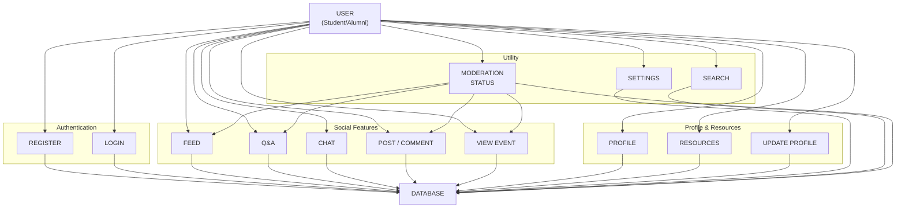
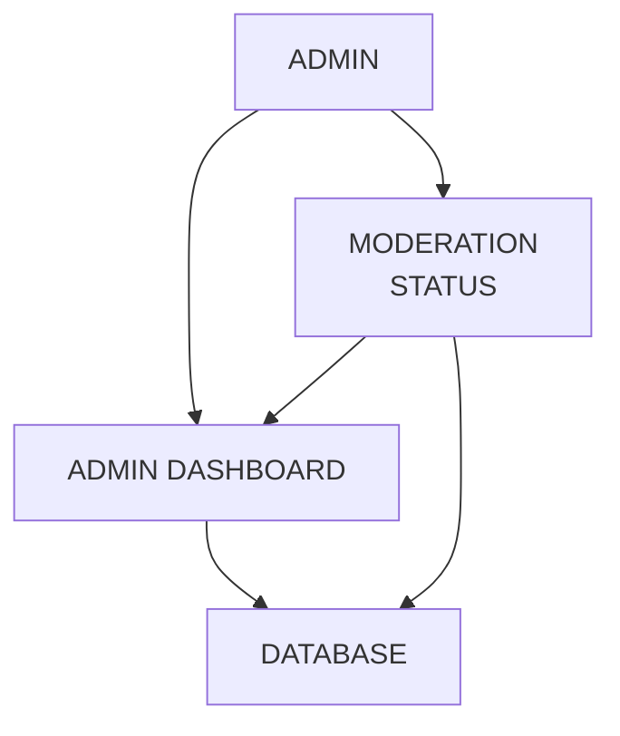

# Focus Hub Methodology

## Project Methodology Overview
Focus Hub is designed with modularity, scalability, and real-time collaboration at its core. The methodology emphasizes:
- **Modular Architecture**: Each feature (Feed, Q&A, Chat, Resources, etc.) is a self-contained module.
- **Real-Time Experience**: Leveraging Supabase for instant updates and collaboration.
- **Security-First**: Role-based access, RLS, and secure authentication.
- **User-Centric Design**: Accessibility, responsive UI, and intuitive workflows.
- **Continuous Integration/Deployment**: Automated testing and deployment pipelines.

## User & Admin Flows

## Module Interaction
Each module interacts with the database and API layer independently, following a clear separation of concerns. Real-time updates are handled via Supabase subscriptions, and all modules respect RLS and user roles.

## Development Practices
- **Component Reuse**: Use of shadcn/ui and custom feature components for consistency.
- **Accessibility**: All UI components are accessible and responsive.
- **Testing**: Automated tests for critical flows and components.
- **Documentation**: Each module and component is documented for maintainability.
- **CI/CD**: Automated pipelines for testing and deployment.

## Summary
The Focus Hub methodology ensures a robust, scalable, and user-friendly platform by combining modular design, real-time features, and best development practices. 