# SDLC Report — focus_hub

This document summarizes the Software Development Life Cycle (SDLC) observed in this repository, maps repository evidence to SDLC phases, lists the development model implications, and provides a Mermaid ER diagram for the main data model.

Checklist
- [x] What is SDLC + short summary for this project
- [x] Which SDLC stages the project follows and how they map to original SDLC principles
- [x] Model implications present in this project
- [x] ER diagram using Mermaid markdown

## 1 — What is SDLC and summary for this project

SDLC (Software Development Life Cycle) is the structured process used to deliver software from idea to production through repeatable phases: requirements, design, implementation, testing, deployment, and maintenance. Its goals are predictability, quality, traceability, and sustainable change.

Project summary (focus_hub):
- Client: React + TypeScript app scaffolded with Vite and Tailwind; Shadcn-based UI components under `src/components/ui` and layout primitives in `src/components/*`.
- Backend/data: Supabase provides Auth, Postgres, Realtime, and Storage; the database is managed as code with timestamped migrations in `supabase/migrations/` (schema, RLS, triggers, and storage policies).
- Features: Authentication and profiles, social feed (posts/likes/follows), chat (1:1 and groups), resources/files, Q&A community (classic + AI-assisted answers), notifications, and realtime UX.
- Tooling & quality: ESLint, TypeScript, Cypress E2E (`cypress/e2e/*.cy.js`), Testing Library dep present; scripts in `package.json` for dev/build/lint/preview.
- Lifecycle choice: Evidence supports an Agile, incremental model with DevOps practices (DB-as-code, environment config) and continuous documentation in `docs/`.

Non-functional focus observed: security-by-default (RLS), realtime responsiveness, modularity, and maintainable migrations.

## 2 — SDLC stages and how this project follows them (mapped to classic SDLC)

### Requirements / Planning
Key activities observed:
- Feature scoping per module (Auth, Feed, Chat, Q&A, Resources, Admin) with living docs in `docs/` and `modules_documentation/`.
- Database requirements captured as SQL DDL + RLS policies in migrations, ensuring unambiguous persistence rules.

Primary artifacts:
- `docs/` chapters (for setup, modules, AI integration) and `docs/Project_Documentation.md` (project-level context).
- Supabase config `supabase/config.toml` and migration set naming that indicates intent (e.g., `20250706073412_qa_schema.sql`).

Mapping to SDLC:
- Iterative requirements: small, feature-scoped documentation and schema increments replace a single monolithic spec.

### Design / Architecture
Key decisions and structure:
- Presentation: Shadcn UI pattern with Tailwind (`tailwind.config.ts`, `index.css`) and reusable components (`src/components/ui/*`).
- State & composition: Context providers (`src/contexts/`), custom hooks (`src/hooks/`), and feature pages (`src/pages/`).
- Data access: Supabase client and types in `src/integrations/supabase/`, thin API utilities in `src/lib/api.ts` and route helpers in `src/api/*`.
- Security & policies: RLS-first design embedded in migrations; triggers and functions for business rules.

Artifacts:
- `vite.config.ts`, `tsconfig*.json`, `eslint.config.js` (tooling), and structured component library.

Mapping to SDLC:
- Architecture is modular and layered, enabling incremental expansion per feature while maintaining separation of concerns.

### Implementation / Development
Evidence in code:
- Feature-first structure in `src/pages/` and `src/components/` (Feed, Chat, Q&A, Admin, Settings, Auth flows).
- Supabase interactions encapsulated in `src/integrations/supabase/*` and `src/api/*` for client/server boundaries.
- Scripts in `package.json`: `dev`, `build`, `lint`, `preview` enable local iteration and guardrails.

Mapping to SDLC:
- Iterative, vertical slices by feature; small DB migrations accompany code changes to keep app and schema in lockstep.

### Testing / QA
What exists:
- Cypress E2E configured in `cypress.config.cjs` (baseUrl `http://localhost:5173`, specs in `cypress/e2e/**/*.cy.js`). Present specs: `login.cy.js`, `post.cy.js`, `comment.cy.js`.
- Testing dependencies include `@testing-library/react` and `supertest`, enabling unit/integration tests (few or none committed yet).
- Security checks embedded as RLS policies and permissioned functions in migrations.

Gaps and pragmatic plan:
- Add unit tests for UI components and hooks; add integration tests for API utilities.
- Expand E2E coverage for auth flows, posting, following, notifications, chat, and Q&A (happy path + 1-2 edge cases each).
- Wire tests into CI once a workflow is added.

### Deployment / Release
Current state:
- Database deployability is strong: migrations, RLS, triggers, and storage policies are captured in SQL.
- No CI/CD manifests found (`.github/workflows/*` absent); deploy steps are likely manual or external.

Recommended release flow (lightweight):
1) Build frontend (Vite) and publish to hosting (e.g., Netlify/Vercel/static bucket).
2) Apply Supabase migrations to staging, run smoke tests (E2E subset), then promote to prod.
3) Automate via a single CI workflow: install deps, lint, build, run unit/E2E headless, apply migrations with approvals.

### Maintenance / Operations
Signals of maintenance:
- Rich migration history and evolving docs indicate continuous improvement.
- Central docs (`docs/*`) and a structured component library reduce onboarding burden.

Operational concerns and suggestions:
- Add basic observability (frontend error reporting, performance logs; DB slow query checks).
- Define a backup/restore note for Supabase (snapshots before major migrations).

## 3 — Model implications present in this project

Observed model: Agile, feature-driven increments with DevOps practices.

Implications and evidence:
- Vertical slices: Features progress end-to-end (UI → API utils → DB migrations) in small steps; `src/pages/*` and `supabase/migrations/*` evolve together.
- Database-as-code: All schema and policies live in SQL migrations, enabling reproducible environments and safe rollouts.
- Design system & reuse: Shadcn UI components minimize divergence and speed delivery.
- Security baked in: RLS policies and role checks in SQL; least-privilege access is enforced at the data layer.
- Realtime UX: Pub/sub triggers and Realtime publications support responsive interfaces (votes, comments, notifications).
- AI augmentation: GROQ integration provides AI answers stored alongside human answers, with ratings/metrics fields supporting feedback loops.

Risks and mitigations:
- Test debt: Start with a unit/E2E baseline to reduce regressions; run Cypress headless in CI.
- Dual Q&A schemas: Consolidate to the newer normalized Q&A to avoid drift; consider deprecating `questionanswers/*`.
- Release risk without CI: Add a minimal CI pipeline (build, lint, unit, E2E subset) before applying migrations to prod.
- Access control drift: Keep RLS policies versioned with any new tables and include policy checks in review.

Next-step recommendations (low-risk, high-value):
- Add `.github/workflows/ci.yml` to lint/build/test on PRs and main.
- Introduce `src/**/*.test.ts(x)` using Testing Library and a few integration tests with `supertest` for API helpers.
- Expand Cypress to cover chat and notifications; tag specs for smoke vs full runs.
- Add `CONTRIBUTING.md`, PR template, and issue templates to codify the workflow.

## 4 — Model ER diagram (Mermaid)

Below is an ER diagram derived from the Supabase migrations: profiles, user_roles, posts, likes, followers, notifications, chats, chat_members, chat_messages, filemodels; a legacy Q&A pair (questionanswers, qanotifications); and the newer normalized Q&A (questions, answers, ai_answers, tags, votes, comments, notifications), plus Supabase `auth.users`.

```mermaid
---
config:
  layout: elk
---
erDiagram
	direction TB
	AUTH_USERS {
		uuid id PK "auth.users"  
		text email  ""  
		timestamptz created_at  ""  
	}
	PROFILES {
		uuid id PK ""  
		UUID id FK "-> AUTH_USERS.id"  
		text email  ""  
		text full_name  ""  
		text avatar_url  ""  
		text bio  ""  
		text location  ""  
		text website  ""  
		jsonb settings  ""  
		timestamptz created_at  ""  
		timestamptz updated_at  ""  
	}
	USER_ROLES {
		uuid id PK ""  
		uuid user_id FK "-> AUTH_USERS.id"  
		text role  "app_role enum: admin|user"  
		timestamptz created_at  ""  
	}
	POSTS {
		uuid id PK ""  
		uuid user_id FK "-> PROFILES.id"  
		text content  ""  
		text media_url  ""  
		timestamptz created_at  ""  
		timestamptz updated_at  ""  
		boolean is_deleted  ""  
	}
	LIKES {
		uuid id PK ""  
		uuid user_id FK "-> PROFILES.id"  
		uuid post_id FK "-> POSTS.id"  
		timestamptz created_at  ""  
	}
	FOLLOWERS {
		uuid id PK ""  
		uuid follower_id FK "-> PROFILES.id"  
		uuid following_id FK "-> PROFILES.id"  
		timestamptz created_at  ""  
	}
	NOTIFICATIONS {
		uuid id PK ""  
		uuid user_id FK "-> PROFILES.id"  
		text type  ""  
		jsonb data  ""  
		boolean is_read  ""  
		timestamptz created_at  ""  
	}
	CHATS {
		uuid id PK ""  
		boolean is_group  ""  
		text name  ""  
		timestamptz created_at  ""  
	}
	CHAT_MEMBERS {
		uuid id PK ""  
		uuid chat_id FK "-> CHATS.id"  
		uuid user_id FK "-> PROFILES.id"  
		timestamptz joined_at  ""  
	}
	CHAT_MESSAGES {
		uuid id PK ""  
		uuid chat_id FK "-> CHATS.id"  
		uuid user_id FK "-> PROFILES.id"  
		text content  ""  
		text media_url  ""  
		timestamptz created_at  ""  
	}
	FILEMODELS {
		uuid id PK ""  
		uuid user_id FK "-> PROFILES.id"  
		text file_url  ""  
		text file_name  ""  
		text file_type  ""  
		int file_size  ""  
		text description  ""  
		boolean is_public  ""  
		timestamptz created_at  ""  
	}
	QUESTIONANSWERS {
		uuid id PK ""  
		uuid user_id FK "-> PROFILES.id"  
		text question  ""  
		text answer  ""  
		timestamptz created_at  ""  
		timestamptz updated_at  ""  
		boolean is_answered  ""  
	}
	QANOTIFICATIONS {
		uuid id PK ""  
		uuid user_id FK "-> PROFILES.id"  
		uuid question_id FK "-> QUESTIONANSWERS.id"  
		text type  ""  
		boolean is_read  ""  
		timestamptz created_at  ""  
	}
	QUESTIONS {
		uuid id PK ""  
		uuid user_id FK "-> AUTH_USERS.id"  
		text title  ""  
		text body  ""  
		text category  ""  
		text status  "open|closed|duplicate"  
		uuid best_answer_id  ""  
		int view_count  ""  
		timestamptz created_at  ""  
		timestamptz updated_at  ""  
	}
	QUESTION_TAGS {
		uuid id PK ""  
		uuid question_id FK "-> QUESTIONS.id"  
		text tag_name  ""  
		timestamptz created_at  ""  
	}
	QUESTION_VOTES {
		uuid id PK ""  
		uuid question_id FK "-> QUESTIONS.id"  
		uuid user_id FK "-> AUTH_USERS.id"  
		smallint vote_value  "1|-1"  
		timestamptz created_at  ""  
		timestamptz updated_at  ""  
	}
	QUESTION_NOTIFICATIONS {
		uuid id PK ""  
		uuid question_id FK "-> QUESTIONS.id"  
		uuid user_id FK "-> AUTH_USERS.id"  
		text notification_type  "answer|comment|vote|best_answer"  
		text message  ""  
		boolean is_read  ""  
		uuid related_id  ""  
		timestamptz created_at  ""  
	}
	ANSWERS {
		uuid id PK ""  
		uuid question_id FK "-> QUESTIONS.id"  
		uuid user_id FK "-> AUTH_USERS.id"  
		text body  ""  
		boolean is_accepted  ""  
		timestamptz created_at  ""  
		timestamptz updated_at  ""  
	}
	AI_ANSWERS {
		uuid id PK ""  
		uuid question_id FK "-> QUESTIONS.id"  
		text answer_text  ""  
		decimal confidence_score  ""  
		text model_used  ""  
		int tokens_used  ""  
		int processing_time_ms  ""  
		decimal relevance_score  ""  
		decimal completeness_score  ""  
		int user_feedback_rating  ""  
		int generation_attempts  ""  
		timestamptz created_at  ""  
	}
	ANSWER_COMMENTS {
		uuid id PK ""  
		uuid answer_id FK "-> ANSWERS.id"  
		uuid user_id FK "-> AUTH_USERS.id"  
		uuid parent_comment_id FK "-> ANSWER_COMMENTS.id"  
		text body  ""  
		timestamptz created_at  ""  
		timestamptz updated_at  ""  
	}
	ANSWER_VOTES {
		uuid id PK ""  
		uuid answer_id FK "-> ANSWERS.id"  
		uuid user_id FK "-> AUTH_USERS.id"  
		smallint vote_value  "1|-1"  
		timestamptz created_at  ""  
		timestamptz updated_at  ""  
	}
	ANSWER_NOTIFICATIONS {
		uuid id PK ""  
		uuid answer_id FK "-> ANSWERS.id"  
		uuid user_id FK "-> AUTH_USERS.id"  
		text notification_type  "comment|vote|acceptance|mention"  
		text message  ""  
		boolean is_read  ""  
		uuid related_id  ""  
		timestamptz created_at  ""  
	}
	ANSWER_TAGS {
		uuid id PK ""  
		uuid answer_id FK "-> ANSWERS.id"  
		text tag_name  ""  
		timestamptz created_at  ""  
	}
	AUTH_USERS||--||PROFILES:"has profile"
	AUTH_USERS||--o{USER_ROLES:"has roles"
	PROFILES||--o{POSTS:"authors"
	POSTS||--o{LIKES:"has"
	PROFILES||--o{LIKES:"likes"
	PROFILES||--o{FOLLOWERS:"as follower"
	PROFILES||--o{FOLLOWERS:"as following"
	PROFILES||--o{NOTIFICATIONS:"receives"
	CHATS||--o{CHAT_MEMBERS:"has"
	PROFILES||--o{CHAT_MEMBERS:"joins"
	CHATS||--o{CHAT_MESSAGES:"has"
	PROFILES||--o{CHAT_MESSAGES:"sends"
	PROFILES||--o{FILEMODELS:"owns"
	PROFILES||--o{QUESTIONANSWERS:"asks"
	QUESTIONANSWERS||--o{QANOTIFICATIONS:"triggers"
	PROFILES||--o{QANOTIFICATIONS:"receives"
	AUTH_USERS||--o{QUESTIONS:"asks"
	QUESTIONS||--o{QUESTION_TAGS:"tagged"
	QUESTIONS||--o{QUESTION_VOTES:"has"
	AUTH_USERS||--o{QUESTION_VOTES:"casts"
	QUESTIONS||--o{QUESTION_NOTIFICATIONS:"notifies"
	AUTH_USERS||--o{QUESTION_NOTIFICATIONS:"receives"
	QUESTIONS||--o{ANSWERS:"has"
	AUTH_USERS||--o{ANSWERS:"answers"
	QUESTIONS||--o{AI_ANSWERS:"AI"
	ANSWERS||--o{ANSWER_COMMENTS:"has"
	AUTH_USERS||--o{ANSWER_COMMENTS:"comments"
	ANSWER_COMMENTS||--o{ANSWER_COMMENTS:"replies"
	ANSWERS||--o{ANSWER_VOTES:"has"
	AUTH_USERS||--o{ANSWER_VOTES:"casts"
	ANSWERS||--o{ANSWER_NOTIFICATIONS:"notifies"
	AUTH_USERS||--o{ANSWER_NOTIFICATIONS:"receives"
	ANSWERS||--o{ANSWER_TAGS:"tagged"

```

Notes on the diagram:
- `AUTH_USERS` represents `auth.users` (managed by Supabase). Business tables reference either `PROFILES.id` (social/chat/files/legacy Q&A) or `AUTH_USERS.id` (new Q&A schema).
- Two Q&A schemas appear: an early `QUESTIONANSWERS/QANOTIFICATIONS` and a newer normalized set (`QUESTIONS`, `ANSWERS`, `AI_ANSWERS`, votes/tags/comments/notifications). Prefer the newer schema in production.

---

## Confidence and next steps

Confidence level: moderate — conclusions are drawn from repo structure, `docs/`, `src/` layout, `src/api/*`, and `supabase/migrations/*` filenames. Exact table columns and constraints were inferred rather than read verbatim from SQL migration content.

If you want, I can:
- Parse the SQL migration files under `supabase/migrations/` to produce an exact ER diagram (will read files and generate a canonical mermaid diagram).
- Add automated CI and test scaffolding suggestions (example GitHub Actions workflow + minimal test harness).

End of report.
