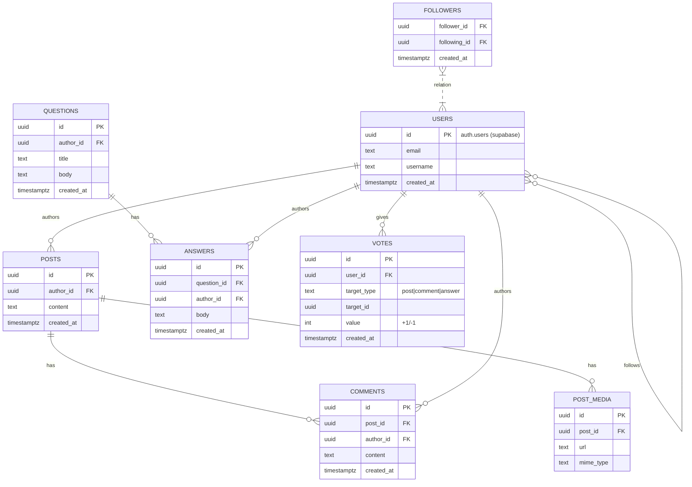

# SDLC Report — focus_hub

This document summarizes the Software Development Life Cycle (SDLC) observed in this repository, maps repository evidence to SDLC phases, lists the development model implications, and provides a Mermaid ER diagram for the main data model.

Checklist
- [x] What is SDLC + short summary for this project
- [x] Which SDLC stages the project follows and how they map to original SDLC principles
- [x] Model implications present in this project
- [x] ER diagram using Mermaid markdown

## 1 — What is SDLC and summary for this project

SDLC (Software Development Life Cycle) is a set of structured phases used to plan, design, build, test, deploy, and maintain software. It ensures predictable delivery, quality control, and traceability from requirements through maintenance.

Summary for this project (`focus_hub`):
- A component-driven TypeScript + React frontend using Vite and Tailwind.
- Supabase-backed backend/database with explicit, timestamped SQL migrations in `supabase/migrations/`.
- Feature-oriented docs in `docs/` (modules: auth, feed, chat, Q&A, resources, etc.).
- Evidence shows iterative feature work, DB versioning, and security/RLS configuration — consistent with an Agile, incremental SDLC with DevOps practices for infrastructure.

## 2 — SDLC stages and how this project follows them (mapped to classic SDLC)

### Requirements / Planning
Evidence:
- `docs/` folder contains per-module documentation (`01_supabase_integration_.md` … `10_q_a_module_.md`) and `Project_Documentation.md`, which indicate feature scoping and living requirements.

How it maps to classic SDLC:
- Requirements are written as modular feature docs rather than a single large requirements specification — aligns with iterative requirement capture.

### Design / Architecture
Evidence:
- Component UI library under `src/components/ui/` and `tailwind.config.ts` show a design system decision.
- Clear separation: `src/contexts/`, `src/integrations/supabase/`, and `src/lib/` indicate architectural patterns and responsibilities.

How it maps:
- Logical and component-level design performed and documented. Design is modular and reusable, consistent with the design phase of classic SDLC.

### Implementation / Development
Evidence:
- Source code in `src/` (pages, components, integrations) and `package.json`/`vite.config.ts` show active implementation.
- Feature-first file organization (pages per feature) shows incremental development.

How it maps:
- Implementation adheres to componentized, iterative feature development instead of a single big-bang implementation.

### Testing / QA
Evidence:
- Minimal direct evidence of automated tests (no obvious `tests/` folder in provided attachments).
- Security-focused validation present: RLS and auth migrations (e.g. `posts_rls_authenticated.sql`) and auth docs imply manual/functional checks and security review.

How it maps:
- Testing appears to be partially manual or ad-hoc. Adding automated unit/E2E tests would better reflect the testing phase of SDLC.

### Deployment / Release
Evidence:
- Supabase configuration and timestamped migrations (`supabase/config.toml`, `supabase/migrations/`) imply scripted DB changes and infra awareness.
- No visible CI/CD workflow files in attachments (e.g., `.github/workflows/`) — deployment may be semi-manual or configured externally.

How it maps:
- Deployment artifacts for database are present; frontend deployment automation is not visible in-repo.

### Maintenance / Operations
Evidence:
- Migration history and `docs/` indicate ongoing maintenance and iterative updates.
- `README.md` (present but not reviewed here) is typically used for onboarding and maintenance notes.

How it maps:
- Continuous maintenance and iterative improvements are evident.

## 3 — Model implications present in this project

Observed development model: Agile / Incremental with DevOps elements.

Concrete implications and repo evidence:
- Feature-driven development: `docs/` with per-module docs and `src/pages/` per feature.
- Incremental releases: Many small, timestamped SQL migrations (`supabase/migrations/`) indicate incremental DB evolution.
- DevOps/Infrastructure-as-Code for DB: explicit migration files and `config.toml` for Supabase.
- Component-driven frontend design: large `src/components/ui/` collection and Tailwind config.
- Security-first database policies: RLS and storage policies exist as migrations, indicating security is baked into design and deployment steps.

Limitations / gaps:
- Missing or not-obvious automated test suites and CI/CD workflow files in-repo.
- No visible issue/pr templates, backlog artifacts, or sprint boards to prove specific Agile ceremonies (Scrum vs Kanban).

Recommendations to reinforce model:
- Add CI workflows to run lint/build/test and apply migrations against preview/staging instances.
- Add a `tests/` folder with unit tests (Jest/Testing Library) and at least one E2E (Playwright/Cypress) script.
- Add CONTRIBUTING and PR/issue templates to codify the process.

## 4 — Model ER diagram (Mermaid)

Below is a concise ER diagram based on observed modules and migration filenames (`posts`, `qna`, `followers`, `post_media`, `comments`, `votes`, plus Supabase `auth.users`). This is an inferred logical model — adjust to match exact SQL schema when needed.

Notes on the diagram:
- `USERS` refers to Supabase-authenticated users (`auth.users`), which is normally managed by Supabase and referenced via foreign keys in application tables.
- `VOTES` is modeled as a simple polymorphic target (type + id). Some schemas normalize votes into separate tables for posts/comments/answers — choose the approach that matches your migration files.

---

## Confidence and next steps

Confidence level: moderate — conclusions are drawn from repo structure, `docs/`, `src/` layout, `src/api/*`, and `supabase/migrations/*` filenames. Exact table columns and constraints were inferred rather than read verbatim from SQL migration content.

If you want, I can:
- Parse the SQL migration files under `supabase/migrations/` to produce an exact ER diagram (will read files and generate a canonical mermaid diagram).
- Add automated CI and test scaffolding suggestions (example GitHub Actions workflow + minimal test harness).

End of report.
