# Focus Hub System Design

## 1. System Architecture

### System Architecture
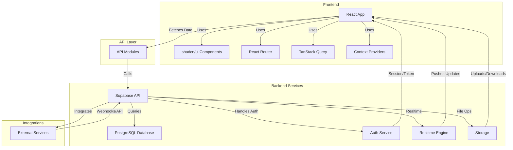

*Visual: [ProjectSystemArchitecture.png](modules_images/ProjectSystemArchitecture.png)*

### Deployment Architecture
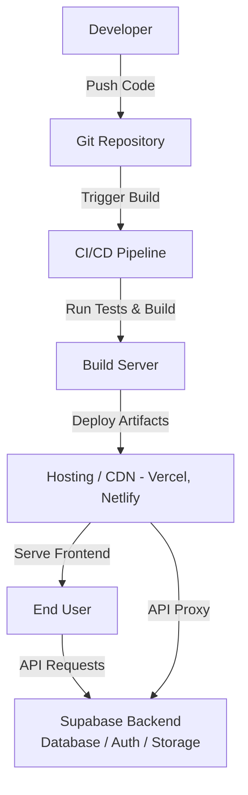

---

## 2. Module Data Flow Diagrams (DFD)

### API Layer
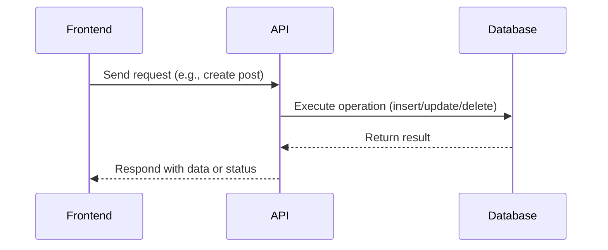
*Visual: [API_DFD.png](modules_images/API_DFD.png)*

### Library Utilities
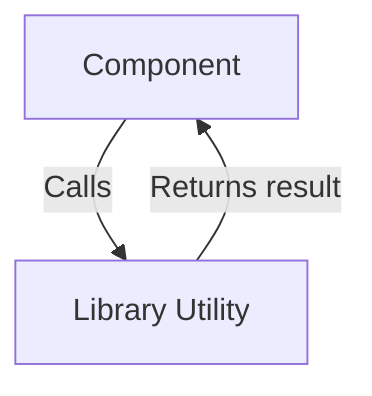
*Visual: [LibraryUtility_DFD.png](modules_images/LibraryUtility_DFD.png)*

### Authentication Context
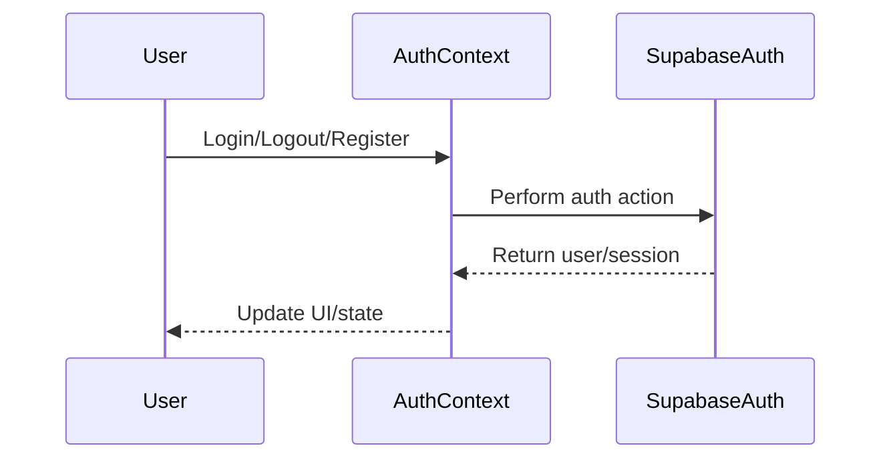
*Visual: [ContextProviders_DFD.png](modules_images/ContextProviders_DFD.png)*

### Custom React Hooks
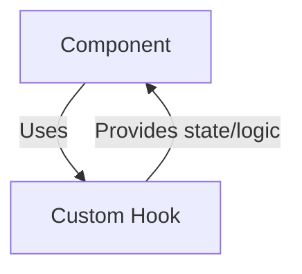
*Visual: [CustomHooks_DFD.png](modules_images/CustomHooks_DFD.png)*

### External Integrations
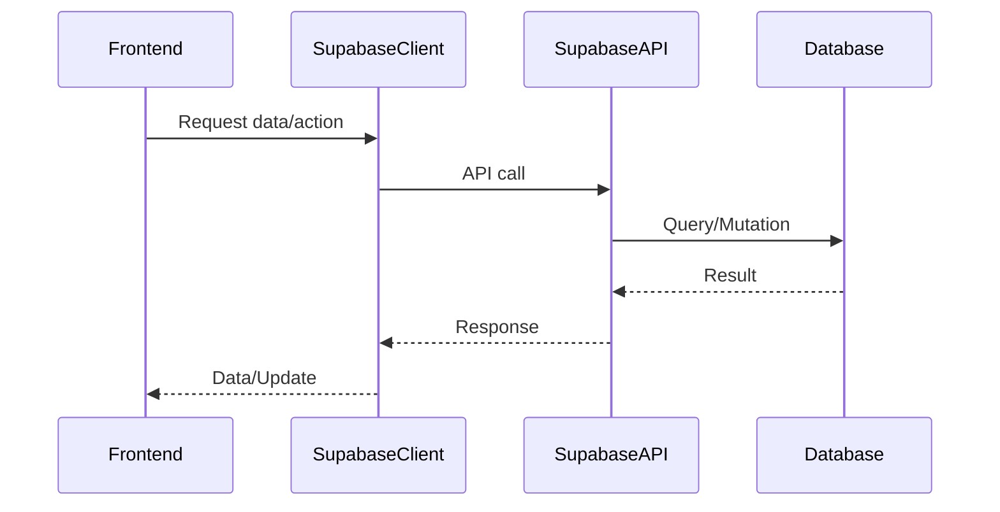
*Visual: [Integration_DFD.png](modules_images/Integration_DFD.png)*

### AI Answers Module
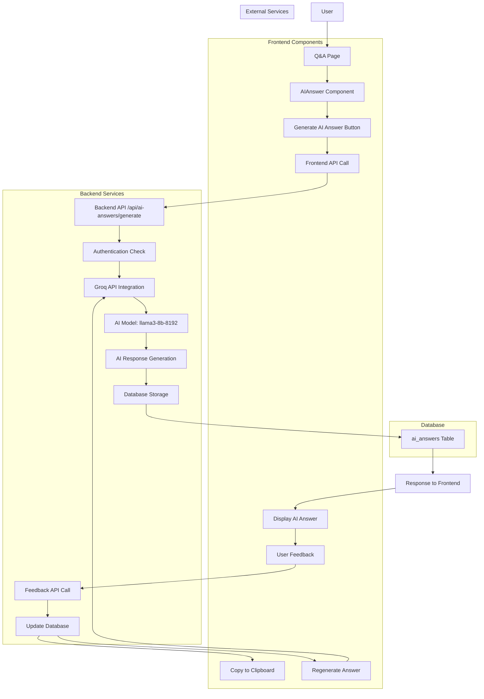
*Visual: [AiAnswers_DFD.png](modules_images/AiAnswers_DFD.png)*

### Main Application Pages
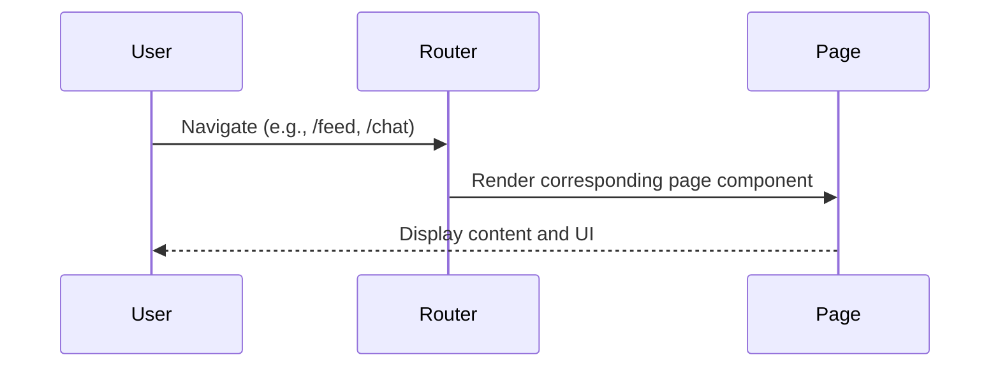
*Visual: [Pages_DFD.png](modules_images/Pages_DFD.png)*

### Q&A
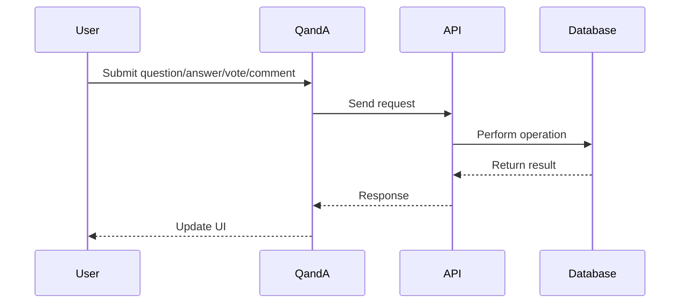
*Visual: [QnA_DFD.png](modules_images/QnA_DFD.png)*

### Feed
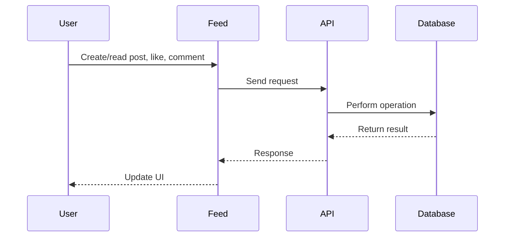
*Visual: [Feed_DFD.png](modules_images/Feed_DFD.png)*

### Chat
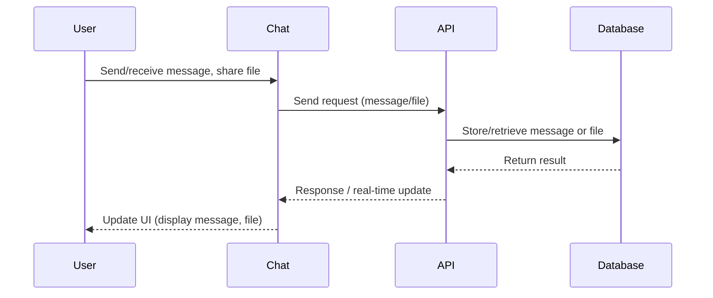
*Visual: [Chat_DFD.png](modules_images/Chat_DFD.png)*

### Profile
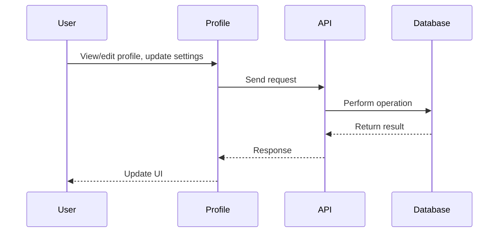
*Visual: [UserProfile_DFD.png](modules_images/UserProfile_DFD.png)*

### Resources
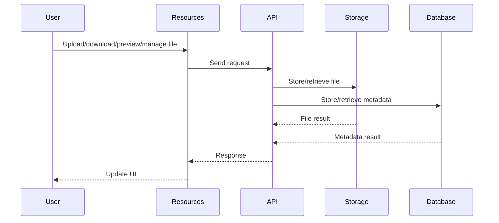
*Visual: [Resources_DFD.png](modules_images/Resources_DFD.png)*

### Settings
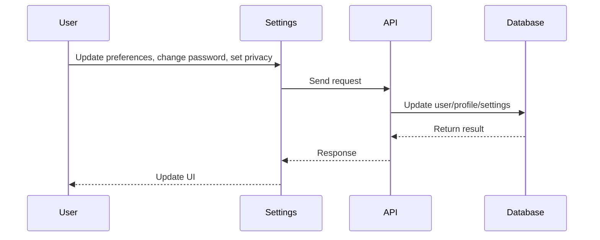
*Visual: [Settings_DFD.png](modules_images/Settings_DFD.png)*

### Login
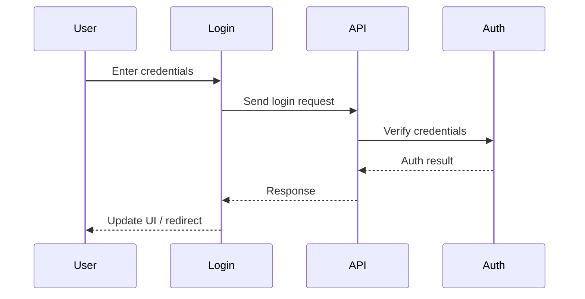
*Visual: [Login_DFD.png](modules_images/Login_DFD.png)*

### Register
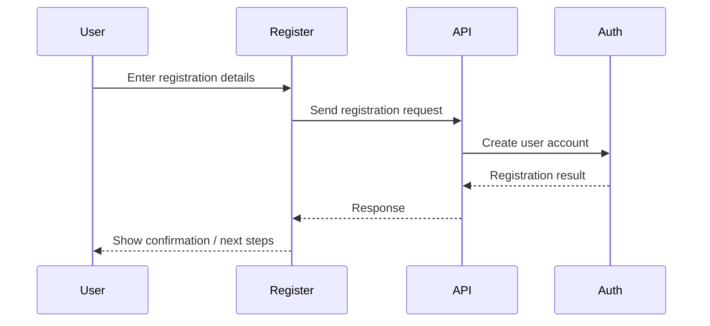
*Visual: [Register_DFD.png](modules_images/Register_DFD.png)*

### Admin Dashboard
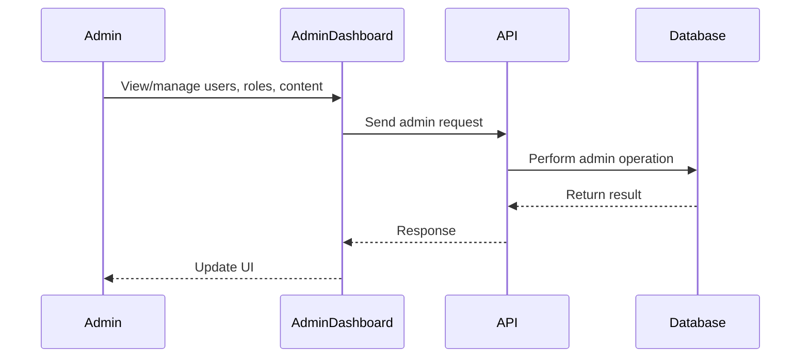
*Visual: [AdminDashboard_DFD.png](modules_images/AdminDashboard_DFD.png)*

### UI Component Library
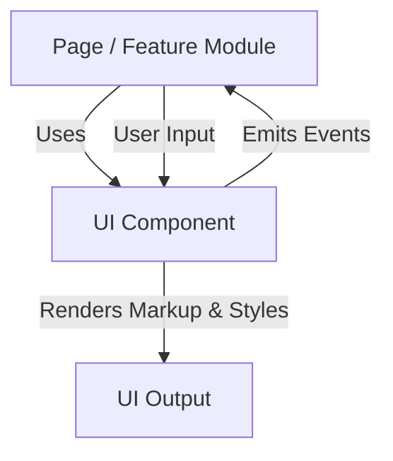
*Visual: [Components_DFD.png](modules_images/Components_DFD.png)*

### Database Design (Overall)
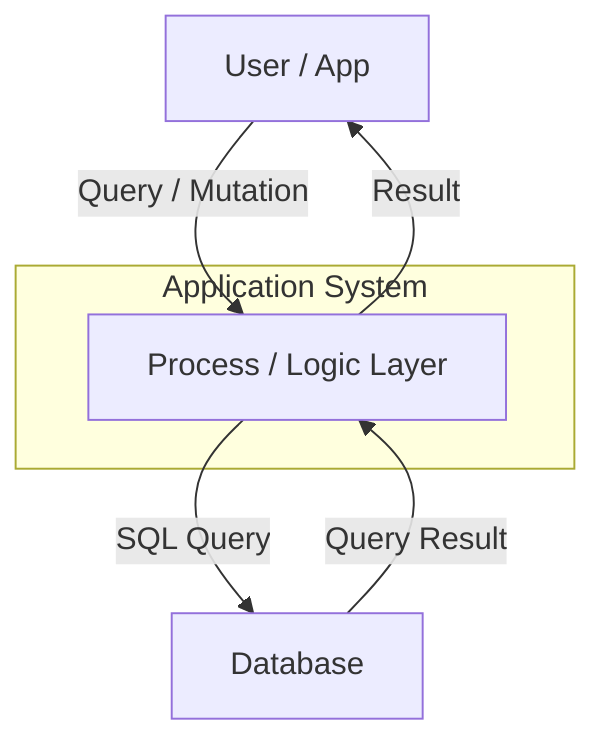
*Visual: [DatabaseDesign_DFD.png](modules_images/DatabaseDesign_DFD.png)*

---

## 3. Module Use Case Diagrams

### API Layer
```mermaid
flowchart TD
  A[Frontend] --> B((Create Resource))
  A --> C((Read Resource))
  A --> D((Update Resource))
  A --> E((Delete Resource))
  A --> F((Integrate with External Service))
  G[External Service] --> H((Send Webhook))
  G --> I((Receive Callback))
```
*Visual: [API_UseCaseDiagram.png](modules_images/API_UseCaseDiagram.png)*

### Library Utilities
```mermaid
flowchart TD
  Component([Component]) --> Format((Format Data))
  Component --> Handle((Handle API Error))
  Component --> Transform((Transform Data))
```
*Visual: [LibraryUtility_UseCaseDiagram.png](modules_images/LibraryUtility_UseCaseDiagram.png)*

### Authentication Context
```mermaid
flowchart TD
  User([User]) --> Login((Login))
  User --> Register((Register))
  User --> Logout((Logout))
  User --> Session((Session Persistence))
  User --> RBAC((Role-based Access))
```
*Visual: [ContextProviders_UseCaseDiagram.png](modules_images/ContextProviders_UseCaseDiagram.png)*

### Custom React Hooks
```mermaid
flowchart TD
  Comp[Component] --> Mobile((Detect Mobile Device))
  Comp --> Toast((Show Toast Notification))
  Comp --> Form((Manage Form State))
```
*Visual: [CustomHook_UseCaseDiagram.png](modules_images/CustomHook_UseCaseDiagram.png)*

### External Integrations
```mermaid
flowchart TD
  Frontend([Frontend]) --> Auth((Authenticate User))
  Frontend --> Subscribe((Subscribe to Real-time Updates))
  Frontend --> Files((Store/Retrieve Files))
  Frontend --> Query((Query Database))
```
*Visual: [Integration_UseCaseDiagram.png](modules_images/Integration_UseCaseDiagram.png)*

### AI Answers Module
```mermaid
graph TD
    subgraph "AI Answers System Use Cases"
        A[User] --> B[Generate AI Answer]
        A --> C[View AI Answer]
        A --> D[Rate AI Answer]
        A --> E[Copy AI Answer]
        A --> F[Regenerate AI Answer]
        A --> G[Provide Feedback]
        subgraph "Primary Use Cases"
            B
            C
            D
        end
        subgraph "Secondary Use Cases"
            E
            F
            G
        end
    end
    subgraph "System Actors"
        A
        H[Groq AI Service]
        I[Database]
    end
    B --> H
    B --> I
    C --> I
    D --> I
    E --> C
    F --> H
    F --> I
    G --> I
```
*Visual: [AiAnswers_UseCaseDiagram.png](modules_images/AiAnswers_UseCaseDiagram.png)*

### Main Application Pages
```mermaid
flowchart TD
  User([User]) --> Feed((Browse Feed))
  User --> Chat((Chat))
  User --> Profile((Update Profile))
  User --> Settings((Change Settings))
  User --> Auth((Login/Register))
```
*Visual: [Pages_UseCaseDiagram.png](modules_images/Pages_UseCaseDiagram.png)*

### Q&A
```mermaid
flowchart TD
  User([User]) --> Post((Post a Question))
  User --> Answer((Answer a Question))
  User --> Vote((Vote on Question/Answer))
  User --> Comment((Comment on Answer))
```
*Visual: [QnA_UseCaseDiagram.png](modules_images/QnA_UseCaseDiagram.png)*

### Feed
```mermaid
flowchart TD
  User([User]) --> Create((Create a Post))
  User --> Like((Like a Post))
  User --> Comment((Comment on a Post))
  User --> View((View Feed))
```
*Visual: [Feed_UseCaseDiagram.png](modules_images/Feed_UseCaseDiagram.png)*

### Chat
```mermaid
flowchart TD
  User([User]) --> UC1((Send Message))
  User --> UC2((Receive Message))
  User --> UC3((Share File))
  User --> UC4((Join Group Chat))
  User --> UC5((Leave Group Chat))
  User --> UC6((See Online Status))
```
*Visual: [Chat_UseCaseDiagram.png](modules_images/Chat_UseCaseDiagram.png)*

### Profile
```mermaid
flowchart TD
  User([User]) --> View((View Profile))
  User --> Edit((Edit Profile))
  User --> Privacy((Change Privacy Settings))
  User --> Avatar((Upload Avatar))
```
*Visual: [UserProfile_UseCaseDiagram.png](modules_images/UserProfile_UseCaseDiagram.png)*

### Resources
```mermaid
flowchart TD
  User([User]) --> Upload((Upload File))
  User --> Preview((Preview Resource))
  User --> Download((Download Resource))
  User --> Edit((Edit File Metadata))
  User --> Delete((Delete File))
  User --> Search((Search/Filter Resources))
```
*Visual: [Resources_UseCaseDiagram.png](modules_images/Resources_UseCaseDiagram.png)*

### Settings
```mermaid
flowchart TD
  User([User]) --> Update((Update Account Info))
  User --> Password((Change Password))
  User --> Notify((Set Notification Preferences))
  User --> Privacy((Manage Privacy Settings))
  User --> TwoFA((Enable 2FA))
```
*Visual: [Settings_UseCaseDiagram.png](modules_images/Settings_UseCaseDiagram.png)*

### Login
```mermaid
flowchart TD
  User([User]) --> Login((Login with Email/Password))
  User --> Feedback((Receive Feedback))
  User --> Redirect((Redirect to App))
```
*Visual: [Login_UseCaseDiagram.png](modules_images/Login_UseCaseDiagram.png)*

### Register
```mermaid
flowchart TD
  User([User]) --> Register((Register with Email/Password))
  User --> Confirm((Receive Confirmation Email))
  User --> Setup((Complete Profile Setup))
```
*Visual: [Register_UseCaseDiagram.png](modules_images/Register_UseCaseDiagram.png)*

### Admin Dashboard
```mermaid
graph TD
  Admin[Admin] --> UC1(View User Accounts)
  Admin --> UC2(Assign/Modify Roles)
  Admin --> UC3(Moderate Content)
  Admin --> UC4(View Analytics)
  Admin --> UC5(Monitor System Health)
  Admin --> UC6(Review Audit Logs)
```
*Visual: [AdminDashboard_UseCaseDiagram.png](modules_images/AdminDashboard_UseCaseDiagram.png)*

### UI Component Library
```mermaid
flowchart TD
  Developer([Developer]) --> Form((Build Form))
  Developer --> List((Display List/Grid))
  Developer --> Modal((Show Modal/Dialog))
  Developer --> Nav((Render Navigation Bar))
  Developer --> Feedback((Display Validation Feedback))
  Developer --> Reuse((Reuse Button, Input, etc.))
```
*Visual: [Components_UseCaseDiagram.png](modules_images/Components_UseCaseDiagram.png)*

### Database Design (Overall)
```mermaid
graph TB
  designer([<<actor>> DB Designer])
  developer([<<actor>> Developer])
  admin([<<actor>> DBA])
  designSchema((Design Schema))
  createTables((Create Tables))
  defineRelationships((Define Relationships))
  writeQueries((Write SQL Queries))
  optimizeQueries((Optimize Queries))
  backupDatabase((Backup Database))
  restoreDatabase((Restore Database))
  manageUsers((Manage DB Users))
  designer --> designSchema
  designer --> defineRelationships
  designer --> createTables
  developer --> writeQueries
  developer --> optimizeQueries
  developer --> defineRelationships
  admin --> backupDatabase
  admin --> restoreDatabase
  admin --> manageUsers
  admin --> optimizeQueries
```
*Visual: [DatabaseDesign_UseCaseDiagram.png](modules_images/DatabaseDesign_UseCaseDiagram.png)*

---

## 4. Module Database Designs (ERD)

### API Layer
```mermaid
erDiagram
  chats {
    uuid id PK "Primary Key"
    boolean is_group "Is Group Chat"
    text name "Chat name"
    timestamptz created_at "Created Timestamp"
    uuid created_by FK "Creator (user_id)"
  }
  chat_members {
    uuid id PK
    uuid chat_id FK
    uuid user_id FK
    timestamptz joined_at
    boolean is_admin
    boolean typing
  }
  chat_messages {
    uuid id PK
    uuid chat_id FK
    uuid user_id FK
    text content
    text media_url
    timestamptz created_at
  }
  profiles {
    uuid id PK
    text email
    text full_name
    text avatar_url
    text bio
    text location
    text website
    jsonb settings
    member_type_enum member_type
    text status
    timestamptz created_at
    timestamptz updated_at
    timestamptz last_seen
  }
  chats ||--o{ chat_members : "has"
  chats ||--o{ chat_messages : "includes"
  chat_members }o--|| profiles : "has user"
  chat_messages }o--|| profiles : "sent by"
  chats }o--|| profiles : "created by"
```
*Visual: [API_ERD.png](modules_images/API_ERD.png)*

### Library Utilities
_No direct database tables; utilities are used across modules._
*Visual: [LibraryUtility_ERD.png](modules_images/LibraryUtility_ERD.png)*

### Authentication Context
```mermaid
erDiagram
  users ||--o{ profiles : has
  users ||--o{ user_roles : assigned
  profiles }|..|{ user_roles : links
```
*Visual: [ContextProviders_ERD.png](modules_images/ContextProviders_ERD.png)*

### Custom React Hooks
_No direct database tables; hooks encapsulate logic, not direct data storage._
*Visual: [CustomHooks_ERD.png](modules_images/CustomHooks_ERD.png)*

### External Integrations
```mermaid
erDiagram
  supabase_client ||--o{ users : ""
  supabase_client ||--o{ posts : ""
  supabase_client ||--o{ files : ""
  supabase_client ||--o{ messages : ""
```
*Visual: [Integration_ERD.png](modules_images/Integration_ERD.png)*

### AI Answers Module
```mermaid
erDiagram
    ai_answers {
        
    }
    questions {
        
    }
    profiles {
        
    }
    ai_answers ||--|| questions : "belongs_to"
    ai_answers ||--|| profiles : "generated_by_user"
    questions ||--|| profiles : "asked_by"
```
*Visual: [AiAnswers_ERD.png](modules_images/AiAnswers_ERD.png)*

### Main Application Pages
```mermaid
erDiagram
  users ||--o{ posts : ""
  users ||--o{ chats : ""
  users ||--o{ profiles : ""
  users ||--o{ settings : ""
  posts ||--o{ comments : ""
  chats ||--o{ messages : ""
```
*Visual: [Pages_ERD.png](modules_images/Pages_ERD.png)*

### Q&A
```mermaid
erDiagram
  questionanswers ||--o{ answer_votes : ""
  questionanswers ||--o{ question_votes : ""
  questionanswers ||--o{ answer_comments : ""
  questionanswers }|..|{ profiles : ""
```
*Visual: [QnA_ERD.png](modules_images/QnA_ERD.png)*

### Feed
```mermaid
erDiagram
  posts ||--o{ comments : ""
  posts ||--o{ likes : ""
  posts }|..|{ profiles : ""
  comments }|..|{ profiles : ""
  likes }|..|{ profiles : ""
```
*Visual: [Feed_ERD.png](modules_images/Feed_ERD.png)*

### Chat
```mermaid
erDiagram
  profiles {
    INT id
    STRING username
    STRING avatar_url
  }
  chats {
    INT id
    STRING type "direct/group"
    STRING name
    DATETIME created_at
  }
  chat_members {
    INT chat_id
    INT profile_id
    BOOLEAN is_admin
  }
  chat_messages {
    INT id
    INT chat_id
    INT sender_id
    TEXT message
    STRING file_url
    DATETIME timestamp
  }
  chats ||--o{ chat_members : "has"
  chats ||--o{ chat_messages : "contains"
  chat_members }|..|{ profiles : "belongs to"
  chat_messages }|..|| profiles : "sent by"
```
*Visual: [Chat_ERD.png](modules_images/Chat_ERD.png)*

### Profile
```mermaid
erDiagram
  profiles ||--o{ user_roles : ""
  profiles ||--o{ followers : ""
  profiles }|..|{ users : ""
  followers }|..|{ profiles : ""
```
*Visual: [UserProfile_ERD.png](modules_images/UserProfile_ERD.png)*

### Resources
```mermaid
erDiagram
  filemodels }|..|{ profiles : ""
  filemodels ||--o{ storage_objects : ""
  storage_objects }|..|{ filemodels : ""
```
*Visual: [Resources_ERD.png](modules_images/Resources_ERD.png)*

### Settings
```mermaid
erDiagram
  users ||--o{ profiles : ""
  profiles ||--o{ user_roles : ""
```
*Visual: [Settings_ERD.png](modules_images/Settings_ERD.png)*

### Login
```mermaid
erDiagram
  users ||--o{ profiles : ""
  users ||--o{ sessions : ""
```
*Visual: [Login_ERD.png](modules_images/Login_ERD.png)*

### Register
```mermaid
erDiagram
  users ||--o{ profiles : ""
  users ||--o{ user_roles : ""
  profiles }|..|{ user_roles : ""
```
*Visual: [Register_ERD.png](modules_images/Register_ERD.png)*

### Admin Dashboard
```mermaid
erDiagram
  users ||--o{ user_roles : ""
  users ||--o{ profiles : ""
  users ||--o{ audit_logs : ""
  posts ||--o{ flagged_content : ""
  flagged_content }|..|{ users : ""
```
*Visual: [AdminDashboard_ERD.png](modules_images/AdminDashboard_ERD.png)*

### UI Component Library
_Not applicable: UI components do not directly interact with the database._
*Visual: [Components_ERD.png](modules_images/Components_ERD.png)*

### Database Design (Overall)
```mermaid
erDiagram
  users ||--o{ posts : "has"
  users ||--o{ comments : "writes"
  users ||--o{ votes : "casts"
  users ||--o{ questions : "asks"
  users ||--o{ answers : "answers"
  users ||--o{ resources : "uploads"
  users ||--o{ messages : "sends"
  posts ||--o{ comments : "receives"
  posts ||--o{ votes : "receives"
  questions ||--o{ answers : "receives"
  questions ||--o{ comments : "receives"
  answers ||--o{ votes : "receives"
  answers ||--o{ comments : "receives"
  followers {
    INT follower_id
    INT followed_id
  }
  users ||--o{ followers : "follows"
  followers }o--|| users : "followed by"
  chats ||--o{ messages : "contains"
  resources ||--|| users : "belongs to"
```
*Visual: [DatabaseDesign_ERD.png](modules_images/DatabaseDesign_ERD.png)*

---

# End of System Design 