# Focus Hub System Design

## 1. System Architecture

### System Architecture
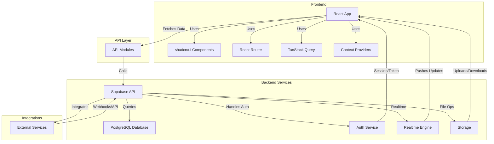

*Visual: [ProjectSystemArchitecture.png](modules_images/ProjectSystemArchitecture.png)*

**Description:**  
This System Architecture diagram provides a high-level overview of the Focus Hub platform, showing how the frontend, API layer, backend services, and external integrations interact. It highlights the modular structure and the flow of data between major system components.

### Deployment Architecture
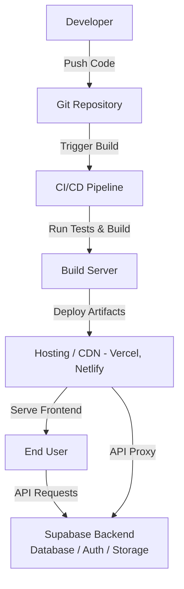

**Description:**  
This Deployment Architecture diagram illustrates the CI/CD workflow, from code commit to deployment and user access. It shows how the application is built, tested, deployed to cloud hosting, and how users interact with the frontend and backend services.

---

## 2. Component Architecture

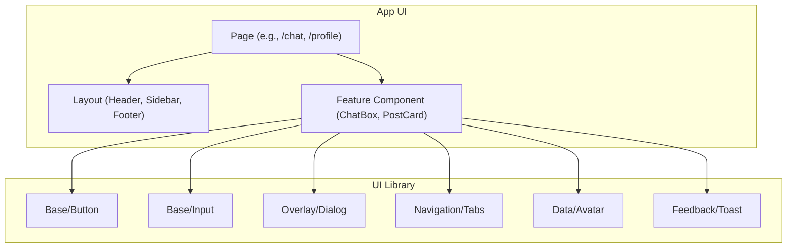

*Visual: [ComponentsArchitecture.png](modules_images/ComponentsArchitecture.png)*

**Description:**  
This Component Architecture diagram shows the hierarchical structure of UI components, from page-level components down to base UI elements. It illustrates how feature components use base UI components and how pages are composed of layouts and features.

---

## 3. Module Data Flow Diagrams (DFD)

### UI Component Library
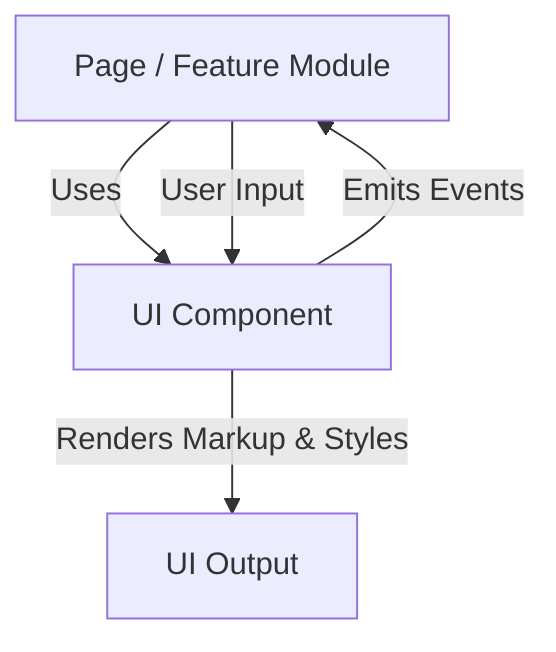
*Visual: [Components_DFD.png](modules_images/Components_DFD.png)*

**Description:**  
This diagram shows how UI components receive user input, process it through their internal logic, and render the appropriate markup and styles. It demonstrates the event-driven nature of component communication and how components interact with the DOM.

### Authentication Context
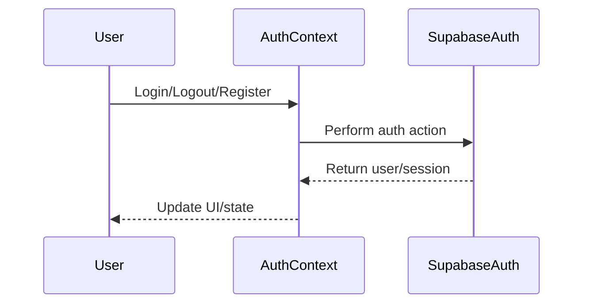
*Visual: [ContextProviders_DFD.png](modules_images/ContextProviders_DFD.png)*

**Description:**  
This diagram illustrates the authentication flow where user actions trigger the AuthContext to communicate with Supabase Auth service. It shows how authentication state is managed and propagated throughout the application to update the UI accordingly.

### Custom React Hooks
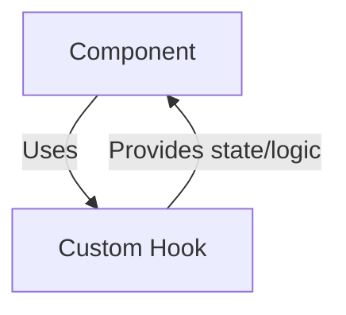
*Visual: [CustomHooks_DFD.png](modules_images/CustomHooks_DFD.png)*

**Description:**  
This diagram demonstrates how custom hooks encapsulate reusable logic and state management. It shows the relationship between components and hooks, where hooks provide state and logic that components can consume and use.

### External Integrations
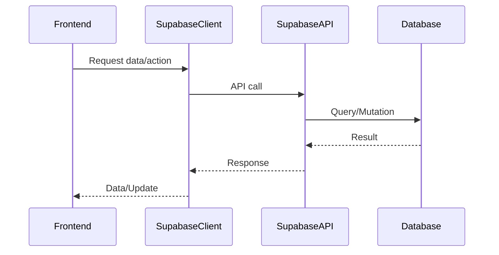
*Visual: [Integration_DFD.png](modules_images/Integration_DFD.png)*

**Description:**  
This diagram shows how the frontend communicates with external services through the Supabase client. It illustrates the complete data flow from frontend requests through the API layer to the database and back, enabling real-time data synchronization.

### Library Utilities
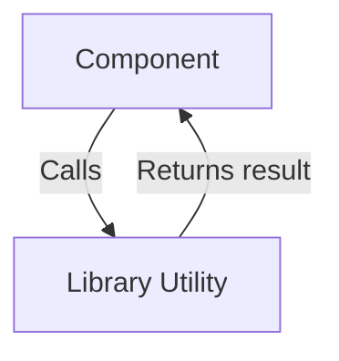
*Visual: [LibraryUtility_DFD.png](modules_images/LibraryUtility_DFD.png)*

**Description:**  
This diagram shows how components call utility functions to perform common tasks like data formatting, error handling, and data transformation. It demonstrates the helper function pattern where utilities provide reusable functionality across the application.

### API Layer
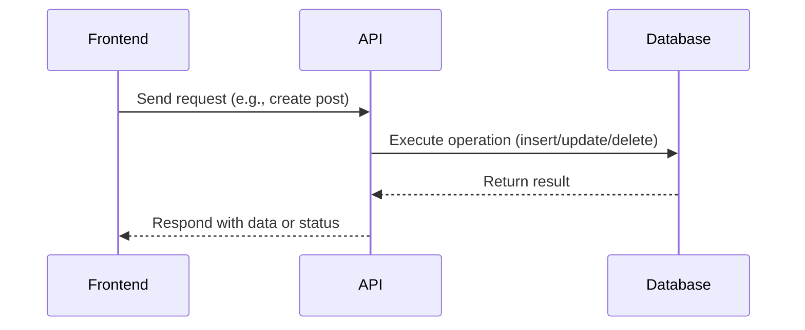
*Visual: [API_DFD.png](modules_images/API_DFD.png)*

**Description:**  
This diagram illustrates the API layer's role as a bridge between frontend and database. It shows how API endpoints receive requests, execute database operations, and return results, ensuring proper data handling and business logic enforcement.

### AI Answers Module
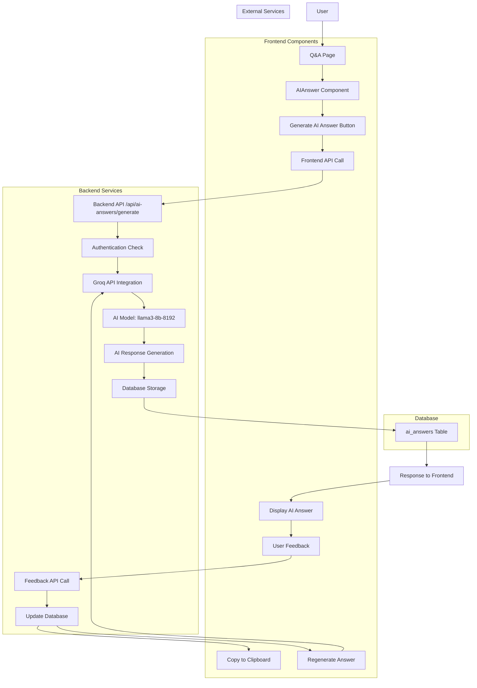
*Visual: [AiAnswers_DFD.png](modules_images/AiAnswers_DFD.png)*

**Description:**  
This diagram shows the complete AI answer generation workflow, from user request through Groq API integration to database storage and user feedback. It illustrates how AI responses are generated, stored, and managed with user interaction capabilities.

### Database Design (Overall)
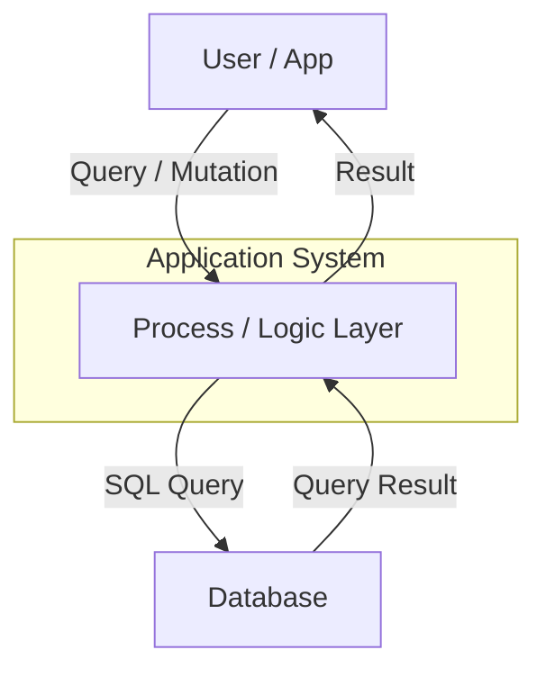
*Visual: [DatabaseDesign_DFD.png](modules_images/DatabaseDesign_DFD.png)*

**Description:**  
This diagram provides a high-level view of how the application interacts with the database. It shows the separation between user interface, business logic layer, and data storage, illustrating the typical CRUD operations flow.

### Main Application Pages
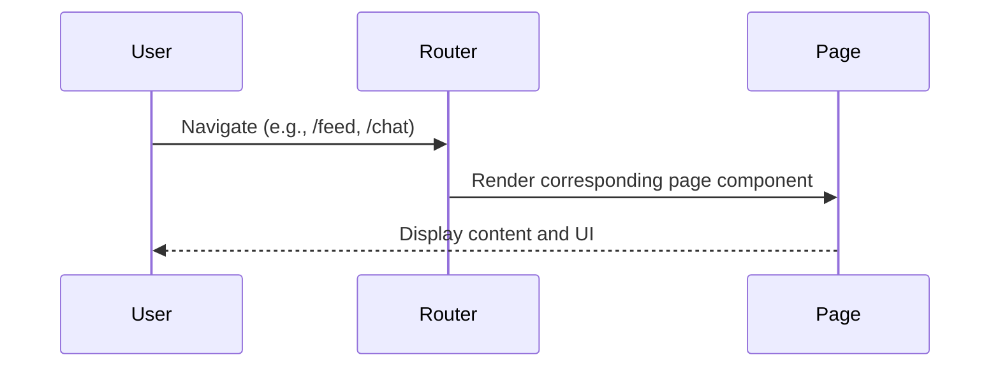
*Visual: [Pages_DFD.png](modules_images/Pages_DFD.png)*

**Description:**  
This diagram shows how the routing system handles user navigation and renders the appropriate page components. It illustrates the client-side routing flow and how different pages are loaded and displayed to users.

### Login
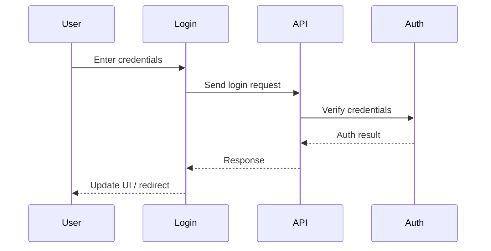
*Visual: [Login_DFD.png](modules_images/Login_DFD.png)*

**Description:**  
This diagram illustrates the login authentication flow, showing how user credentials are validated through the API and authentication service. It demonstrates the secure credential verification process and subsequent UI updates.

### Forgot Password
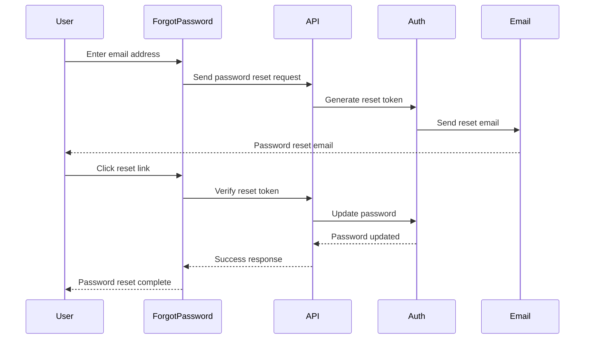
*Visual: [ForgotPassword_DFD.png](modules_images/ForgotPassword_DFD.png)*

**Description:**  
This diagram shows the complete password reset workflow, including email token generation, email delivery, token verification, and password update. It illustrates the secure password recovery process with proper token management.

### Register
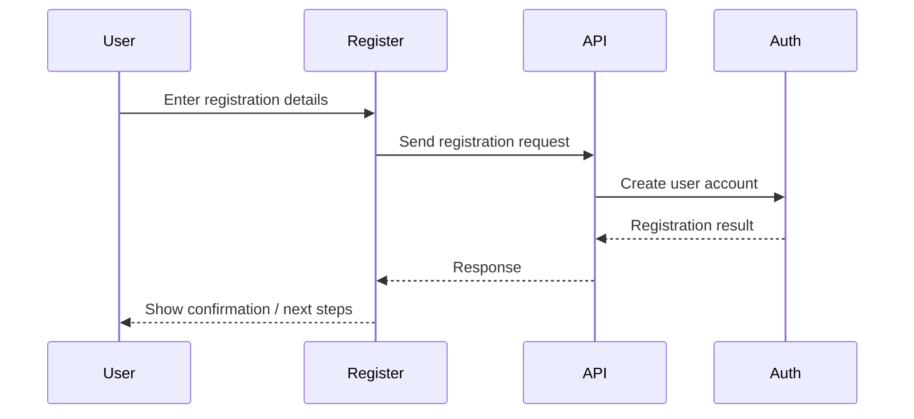
*Visual: [Register_DFD.png](modules_images/Register_DFD.png)*

**Description:**  
This diagram illustrates the user registration process, showing how new user accounts are created through the API and authentication service. It demonstrates the account creation flow and subsequent user onboarding steps.

### Feed
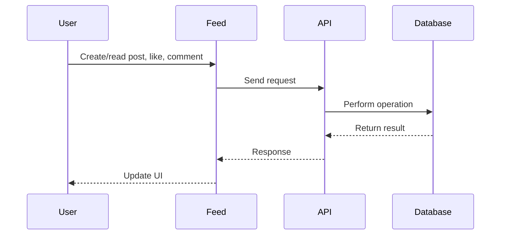
*Visual: [Feed_DFD.png](modules_images/Feed_DFD.png)*

**Description:**  
This diagram shows how users interact with the social feed, including creating posts, liking, and commenting. It illustrates the real-time data flow for social interactions and how the feed updates dynamically.

### Q&A
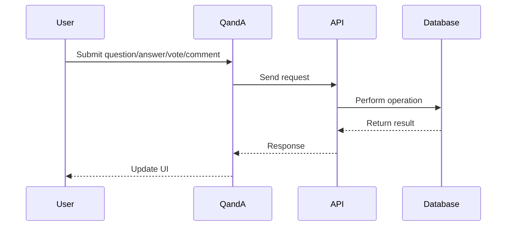
*Visual: [QnA_DFD.png](modules_images/QnA_DFD.png)*

**Description:**  
This diagram illustrates the Q&A community interaction flow, showing how users submit questions, provide answers, vote, and comment. It demonstrates the collaborative knowledge-sharing process and voting system.

### Resources
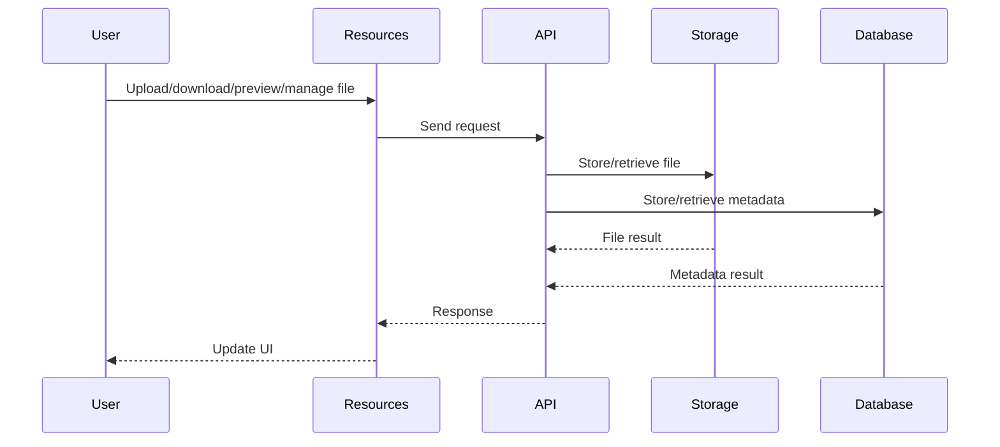
*Visual: [Resources_DFD.png](modules_images/Resources_DFD.png)*

**Description:**  
This diagram shows the file management workflow, including upload, download, and preview operations. It illustrates how files are stored in cloud storage while metadata is managed in the database, enabling efficient file operations.

### Chat
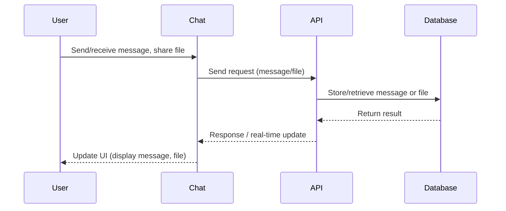
*Visual: [Chat_DFD.png](modules_images/Chat_DFD.png)*

**Description:**  
This diagram illustrates the real-time messaging system, showing how messages and files are sent, stored, and delivered in real-time. It demonstrates the instant communication flow and file sharing capabilities.

### Profile
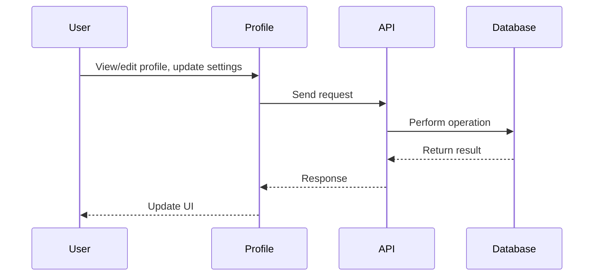
*Visual: [UserProfile_DFD.png](modules_images/UserProfile_DFD.png)*

**Description:**  
This diagram shows how users manage their profile information, including viewing, editing, and updating personal details. It illustrates the profile management workflow and data persistence.

### Settings
```mermaid
sequenceDiagram
    participant User
    participant Settings
    participant API
    participant Database
    User->>Settings: Update preferences, change password, set privacy
    Settings->>API: Send request
    API->>Database: Update user/profile/settings
    Database-->>API: Return result
    API-->>Settings: Response
    Settings-->>User: Update UI
```
*Visual: [Settings_DFD.png](modules_images/Settings_DFD.png)*

**Description:**  
This diagram illustrates the settings management flow, showing how users update their account preferences, security settings, and privacy controls. It demonstrates the configuration management process.

### Admin Dashboard
```mermaid
sequenceDiagram
    participant Admin
    participant AdminDashboard
    participant API
    participant Database
    Admin->>AdminDashboard: View/manage users, roles, content
    AdminDashboard->>API: Send admin request
    API->>Database: Perform admin operation
    Database-->>API: Return result
    API-->>AdminDashboard: Response
    AdminDashboard-->>Admin: Update UI
```
*Visual: [AdminDashboard_DFD.png](modules_images/AdminDashboard_DFD.png)*

**Description:**  
This diagram shows the administrative workflow, including user management, role assignment, and content moderation. It illustrates the admin control panel operations and system management capabilities.

---

## 4. Module Use Case Diagrams

### UI Component Library
```mermaid
flowchart TD
  Developer([Developer]) --> Form((Build Form))
  Developer --> List((Display List/Grid))
  Developer --> Modal((Show Modal/Dialog))
  Developer --> Nav((Render Navigation Bar))
  Developer --> Feedback((Display Validation Feedback))
  Developer --> Reuse((Reuse Button, Input, etc.))
```
*Visual: [Components_UseCaseDiagram.png](modules_images/Components_UseCaseDiagram.png)*

**Description:**  
This diagram shows the various ways developers can use the UI component library to build interfaces. It covers form creation, data display, modal dialogs, navigation, and component reuse patterns for consistent UI development.

### Authentication Context
```mermaid
flowchart TD
  User([User]) --> Login((Login))
  User --> Register((Register))
  User --> Logout((Logout))
  User --> Session((Session Persistence))
  User --> RBAC((Role-based Access))
```
*Visual: [ContextProviders_UseCaseDiagram.png](modules_images/ContextProviders_UseCaseDiagram.png)*

**Description:**  
This diagram outlines the core authentication use cases including login, registration, logout, session management, and role-based access control. It shows how users interact with the authentication system.

### Custom React Hooks
```mermaid
flowchart TD
  Comp[Component] --> Mobile((Detect Mobile Device))
  Comp --> Toast((Show Toast Notification))
  Comp --> Form((Manage Form State))
```
*Visual: [CustomHook_UseCaseDiagram.png](modules_images/CustomHook_UseCaseDiagram.png)*

**Description:**  
This diagram shows the specific use cases for custom hooks, including mobile device detection, toast notifications, and form state management. It illustrates how hooks provide reusable functionality across components.

### External Integrations
```mermaid
flowchart TD
  Frontend([Frontend]) --> Auth((Authenticate User))
  Frontend --> Subscribe((Subscribe to Real-time Updates))
  Frontend --> Files((Store/Retrieve Files))
  Frontend --> Query((Query Database))
```
*Visual: [Integration_UseCaseDiagram.png](modules_images/Integration_UseCaseDiagram.png)*

**Description:**  
This diagram shows how the frontend integrates with external services for authentication, real-time subscriptions, file storage, and database queries. It illustrates the key integration points with Supabase services.

### Library Utilities
```mermaid
flowchart TD
  Component([Component]) --> Format((Format Data))
  Component --> Handle((Handle API Error))
  Component --> Transform((Transform Data))
```
*Visual: [LibraryUtility_UseCaseDiagram.png](modules_images/LibraryUtility_UseCaseDiagram.png)*

**Description:**  
This diagram shows the utility functions available to components, including data formatting, error handling, and data transformation. It illustrates the helper functions that support component development.

### API Layer
```mermaid
flowchart TD
  A[Frontend] --> B((Create Resource))
  A --> C((Read Resource))
  A --> D((Update Resource))
  A --> E((Delete Resource))
  A --> F((Integrate with External Service))
  G[External Service] --> H((Send Webhook))
  G --> I((Receive Callback))
```
*Visual: [API_UseCaseDiagram.png](modules_images/API_UseCaseDiagram.png)*

**Description:**  
This diagram shows the CRUD operations and external service integrations available through the API layer. It illustrates how the API handles resource management and external service communication.

### AI Answers Module
```mermaid
graph TD
    subgraph "AI Answers System Use Cases"
        A[User] --> B[Generate AI Answer]
        A --> C[View AI Answer]
        A --> D[Rate AI Answer]
        A --> E[Copy AI Answer]
        A --> F[Regenerate AI Answer]
        A --> G[Provide Feedback]
        subgraph "Primary Use Cases"
            B
            C
            D
        end
        subgraph "Secondary Use Cases"
            E
            F
            G
        end
    end
    subgraph "System Actors"
        A
        H[Groq AI Service]
        I[Database]
    end
    B --> H
    B --> I
    C --> I
    D --> I
    E --> C
    F --> H
    F --> I
    G --> I
```
*Visual: [AiAnswers_UseCaseDiagram.png](modules_images/AiAnswers_UseCaseDiagram.png)*

**Description:**  
This diagram shows the AI answer generation use cases, including generating, viewing, rating, copying, and regenerating AI responses. It illustrates the interaction between users, AI services, and the database for AI-powered Q&A.

### Database Design (Overall)
```mermaid
graph TB
  designer([<<actor>> DB Designer])
  developer([<<actor>> Developer])
  admin([<<actor>> DBA])
  designSchema((Design Schema))
  createTables((Create Tables))
  defineRelationships((Define Relationships))
  writeQueries((Write SQL Queries))
  optimizeQueries((Optimize Queries))
  backupDatabase((Backup Database))
  restoreDatabase((Restore Database))
  manageUsers((Manage DB Users))
  designer --> designSchema
  designer --> defineRelationships
  designer --> createTables
  developer --> writeQueries
  developer --> optimizeQueries
  developer --> defineRelationships
  admin --> backupDatabase
  admin --> restoreDatabase
  admin --> manageUsers
  admin --> optimizeQueries
```
*Visual: [DatabaseDesign_UseCaseDiagram.png](modules_images/DatabaseDesign_UseCaseDiagram.png)*

**Description:**  
This diagram shows the database management use cases for different roles including designers, developers, and administrators. It illustrates the database lifecycle from design to maintenance and administration.

### Main Application Pages
```mermaid
flowchart TD
  User([User]) --> Feed((Browse Feed))
  User --> Chat((Chat))
  User --> Profile((Update Profile))
  User --> Settings((Change Settings))
  User --> Auth((Login/Register))
```
*Visual: [Pages_UseCaseDiagram.png](modules_images/Pages_UseCaseDiagram.png)*

**Description:**  
This diagram shows the main user interactions with different application pages including social feed browsing, chatting, profile management, settings configuration, and authentication flows.

### Login
```mermaid
flowchart TD
  User([User]) --> Login((Login with Email/Password))
  User --> Feedback((Receive Feedback))
  User --> Redirect((Redirect to App))
```
*Visual: [Login_UseCaseDiagram.png](modules_images/Login_UseCaseDiagram.png)*

**Description:**  
This diagram shows the login process use cases including credential entry, feedback reception, and successful redirection to the main application. It illustrates the user authentication workflow.

### Forgot Password
```mermaid
flowchart TD
  User([User]) --> Request((Request Password Reset))
  User --> Email((Receive Reset Email))
  User --> Reset((Reset Password))
  User --> Confirm((Confirm New Password))
  User --> Login((Login with New Password))
```
*Visual: [ForgotPassword_UseCaseDiagram.png](modules_images/ForgotPassword_UseCaseDiagram.png)*

**Description:**  
This diagram shows the password recovery use cases from initial request through email delivery, password reset, confirmation, and successful login with the new password.

### Register
```mermaid
flowchart TD
  User([User]) --> Register((Register with Email/Password))
  User --> Confirm((Receive Confirmation Email))
  User --> Setup((Complete Profile Setup))
```
*Visual: [Register_UseCaseDiagram.png](modules_images/Register_UseCaseDiagram.png)*

**Description:**  
This diagram shows the user registration use cases including account creation, email confirmation, and profile setup completion. It illustrates the new user onboarding process.

### Feed
```mermaid
flowchart TD
  User([User]) --> Create((Create a Post))
  User --> Like((Like a Post))
  User --> Comment((Comment on a Post))
  User --> View((View Feed))
```
*Visual: [Feed_UseCaseDiagram.png](modules_images/Feed_UseCaseDiagram.png)*

**Description:**  
This diagram shows the social feed interaction use cases including post creation, liking, commenting, and feed viewing. It illustrates the core social media functionality.

### Q&A
```mermaid
flowchart TD
  User([User]) --> Post((Post a Question))
  User --> Answer((Answer a Question))
  User --> Vote((Vote on Question/Answer))
  User --> Comment((Comment on Answer))
```
*Visual: [QnA_UseCaseDiagram.png](modules_images/QnA_UseCaseDiagram.png)*

**Description:**  
This diagram shows the Q&A community use cases including question posting, answer provision, voting, and commenting. It illustrates the collaborative knowledge-sharing functionality.

### Resources
```mermaid
flowchart TD
  User([User]) --> Upload((Upload File))
  User --> Preview((Preview Resource))
  User --> Download((Download Resource))
  User --> Edit((Edit File Metadata))
  User --> Delete((Delete File))
  User --> Search((Search/Filter Resources))
```
*Visual: [Resources_UseCaseDiagram.png](modules_images/Resources_UseCaseDiagram.png)*

**Description:**  
This diagram shows the resource management use cases including file upload, preview, download, metadata editing, deletion, and search functionality. It illustrates the file sharing and management capabilities.

### Chat
```mermaid
flowchart TD
  User([User]) --> UC1((Send Message))
  User --> UC2((Receive Message))
  User --> UC3((Share File))
  User --> UC4((Join Group Chat))
  User --> UC5((Leave Group Chat))
  User --> UC6((See Online Status))
```
*Visual: [Chat_UseCaseDiagram.png](modules_images/Chat_UseCaseDiagram.png)*

**Description:**  
This diagram shows the chat system use cases including message sending/receiving, file sharing, group chat management, and online status visibility. It illustrates the real-time communication features.

### Profile
```mermaid
flowchart TD
  User([User]) --> View((View Profile))
  User --> Edit((Edit Profile))
  User --> Privacy((Change Privacy Settings))
  User --> Avatar((Upload Avatar))
```
*Visual: [UserProfile_UseCaseDiagram.png](modules_images/UserProfile_UseCaseDiagram.png)*

**Description:**  
This diagram shows the profile management use cases including profile viewing, editing, privacy settings management, and avatar upload. It illustrates the user identity management features.

### Settings
```mermaid
flowchart TD
  User([User]) --> Update((Update Account Info))
  User --> Password((Change Password))
  User --> Notify((Set Notification Preferences))
  User --> Privacy((Manage Privacy Settings))
  User --> TwoFA((Enable 2FA))
```
*Visual: [Settings_UseCaseDiagram.png](modules_images/Settings_UseCaseDiagram.png)*

**Description:**  
This diagram shows the settings management use cases including account information updates, password changes, notification preferences, privacy controls, and two-factor authentication setup.

### Admin Dashboard
```mermaid
graph TD
  Admin[Admin] --> UC1(View User Accounts)
  Admin --> UC2(Assign/Modify Roles)
  Admin --> UC3(Moderate Content)
  Admin --> UC4(View Analytics)
  Admin --> UC5(Monitor System Health)
  Admin --> UC6(Review Audit Logs)
```
*Visual: [AdminDashboard_UseCaseDiagram.png](modules_images/AdminDashboard_UseCaseDiagram.png)*

**Description:**  
This diagram shows the administrative use cases including user management, role assignment, content moderation, analytics viewing, system monitoring, and audit log review. It illustrates the platform administration capabilities.

---

## 5. Module Database Designs (ERD)

### UI Component Library
_Not applicable: UI components do not directly interact with the database._
*Visual: [Components_ERD.png](modules_images/Components_ERD.png)*

**Description:**  
UI components are presentation layer elements that don't directly interact with the database. They receive data through props and emit events, but don't have their own database tables or relationships.

### Authentication Context
```mermaid
erDiagram
  users ||--o{ profiles : has
  users ||--o{ user_roles : assigned
  profiles }|..|{ user_roles : links
```
*Visual: [ContextProviders_ERD.png](modules_images/ContextProviders_ERD.png)*

**Description:**  
This ERD shows the authentication-related database structure with users, profiles, and user roles tables. It illustrates how user accounts are linked to profile information and role assignments for access control.

### Custom React Hooks
_No direct database tables; hooks encapsulate logic, not direct data storage._
*Visual: [CustomHooks_ERD.png](modules_images/CustomHooks_ERD.png)*

**Description:**  
Custom hooks are JavaScript functions that encapsulate reusable logic and state management. They don't have direct database tables as they work with data passed from components or external APIs.

### External Integrations
```mermaid
erDiagram
  supabase_client ||--o{ users : ""
  supabase_client ||--o{ posts : ""
  supabase_client ||--o{ files : ""
  supabase_client ||--o{ messages : ""
```
*Visual: [Integration_ERD.png](modules_images/Integration_ERD.png)*

**Description:**  
This ERD shows how the Supabase client integrates with various database tables for users, posts, files, and messages. It illustrates the external service integration points and data access patterns.

### Library Utilities
_No direct database tables; utilities are used across modules._
*Visual: [LibraryUtility_ERD.png](modules_images/LibraryUtility_ERD.png)*

**Description:**  
Library utilities are helper functions that provide common functionality across the application. They don't have direct database tables as they operate on data passed to them rather than storing data themselves.

### API Layer
```mermaid
erDiagram
  chats {
    uuid id PK "Primary Key"
    boolean is_group "Is Group Chat"
    text name "Chat name"
    timestamptz created_at "Created Timestamp"
    uuid created_by FK "Creator (user_id)"
  }
  chat_members {
    uuid id PK
    uuid chat_id FK
    uuid user_id FK
    timestamptz joined_at
    boolean is_admin
    boolean typing
  }
  chat_messages {
    uuid id PK
    uuid chat_id FK
    uuid user_id FK
    text content
    text media_url
    timestamptz created_at
  }
  profiles {
    uuid id PK
    text email
    text full_name
    text avatar_url
    text bio
    text location
    text website
    jsonb settings
    member_type_enum member_type
    text status
    timestamptz created_at
    timestamptz updated_at
    timestamptz last_seen
  }
  chats ||--o{ chat_members : "has"
  chats ||--o{ chat_messages : "includes"
  chat_members }o--|| profiles : "has user"
  chat_messages }o--|| profiles : "sent by"
  chats }o--|| profiles : "created by"
```
*Visual: [API_ERD.png](modules_images/API_ERD.png)*

**Description:**  
This ERD shows the chat system database structure with chats, chat members, and chat messages tables. It illustrates how group and direct chats are managed with member associations and message storage.

### AI Answers Module
```mermaid
erDiagram
    ai_answers {
        
    }
    questions {
        
    }
    profiles {
        
    }
    ai_answers ||--|| questions : "belongs_to"
    ai_answers ||--|| profiles : "generated_by_user"
    questions ||--|| profiles : "asked_by"
```
*Visual: [AiAnswers_ERD.png](modules_images/AiAnswers_ERD.png)*

**Description:**  
This ERD shows the AI answers database structure linking AI-generated responses to questions and users. It illustrates how AI answers are associated with specific questions and track which user requested the generation.

### Database Design (Overall)
```mermaid
erDiagram
  users ||--o{ posts : "has"
  users ||--o{ comments : "writes"
  users ||--o{ votes : "casts"
  users ||--o{ questions : "asks"
  users ||--o{ answers : "answers"
  users ||--o{ resources : "uploads"
  users ||--o{ messages : "sends"
  posts ||--o{ comments : "receives"
  posts ||--o{ votes : "receives"
  questions ||--o{ answers : "receives"
  questions ||--o{ comments : "receives"
  answers ||--o{ votes : "receives"
  answers ||--o{ comments : "receives"
  followers {
    INT follower_id
    INT followed_id
  }
  users ||--o{ followers : "follows"
  followers }o--|| users : "followed by"
  chats ||--o{ messages : "contains"
  resources ||--|| users : "belongs to"
```
*Visual: [DatabaseDesign_ERD.png](modules_images/DatabaseDesign_ERD.png)*

**Description:**  
This comprehensive ERD shows the complete database schema with all major entities and their relationships. It illustrates how users interact with posts, comments, votes, questions, answers, resources, messages, and follows, providing a complete view of the data model.

### Main Application Pages
```mermaid
erDiagram
  users ||--o{ posts : ""
  users ||--o{ chats : ""
  users ||--o{ profiles : ""
  users ||--o{ settings : ""
  posts ||--o{ comments : ""
  chats ||--o{ messages : ""
```
*Visual: [Pages_ERD.png](modules_images/Pages_ERD.png)*

**Description:**  
This ERD shows the database relationships for main application pages, illustrating how users are connected to their posts, chats, profiles, and settings. It demonstrates the data structure supporting the core application functionality.

### Login
```mermaid
erDiagram
  users ||--o{ profiles : ""
  users ||--o{ sessions : ""
```
*Visual: [Login_ERD.png](modules_images/Login_ERD.png)*

**Description:**  
This ERD shows the login-related database structure with users linked to profiles and sessions. It illustrates how user authentication data is stored and managed for secure login functionality.

### Forgot Password
```mermaid
erDiagram
  users ||--o{ password_resets : ""
  password_resets {
    uuid id PK
    uuid user_id FK
    text token
    timestamptz expires_at
    boolean used
    timestamptz created_at
  }
  users {
    uuid id PK
    text email
    text encrypted_password
  }
```
*Visual: [ForgotPassword_ERD.png](modules_images/ForgotPassword_ERD.png)*

**Description:**  
This ERD shows the password reset database structure with a dedicated password_resets table linked to users. It illustrates how reset tokens are generated, stored, and managed with expiration and usage tracking.

### Register
```mermaid
erDiagram
  users ||--o{ profiles : ""
  users ||--o{ user_roles : ""
  profiles }|..|{ user_roles : ""
```
*Visual: [Register_ERD.png](modules_images/Register_ERD.png)*

**Description:**  
This ERD shows the registration database structure linking new users to profiles and role assignments. It illustrates how user accounts are created with associated profile information and default role assignments.

### Feed
```mermaid
erDiagram
  posts ||--o{ comments : ""
  posts ||--o{ likes : ""
  posts }|..|{ profiles : ""
  comments }|..|{ profiles : ""
  likes }|..|{ profiles : ""
```
*Visual: [Feed_ERD.png](modules_images/Feed_ERD.png)*

**Description:**  
This ERD shows the social feed database structure with posts, comments, and likes tables linked to user profiles. It illustrates how social interactions are stored and associated with specific users and content.

### Q&A
```mermaid
erDiagram
  questionanswers ||--o{ answer_votes : ""
  questionanswers ||--o{ question_votes : ""
  questionanswers ||--o{ answer_comments : ""
  questionanswers }|..|{ profiles : ""
```
*Visual: [QnA_ERD.png](modules_images/QnA_ERD.png)*

**Description:**  
This ERD shows the Q&A database structure with questions/answers, votes, and comments tables linked to user profiles. It illustrates how the community knowledge base is structured with voting and commenting capabilities.

### Resources
```mermaid
erDiagram
  filemodels }|..|{ profiles : ""
  filemodels ||--o{ storage_objects : ""
  storage_objects }|..|{ filemodels : ""
```
*Visual: [Resources_ERD.png](modules_images/Resources_ERD.png)*

**Description:**  
This ERD shows the resource management database structure linking file metadata to user profiles and storage objects. It illustrates how file information is stored separately from the actual file storage for efficient management.

### Chat
```mermaid
erDiagram
  profiles {
    INT id
    STRING username
    STRING avatar_url
  }
  chats {
    INT id
    STRING type "direct/group"
    STRING name
    DATETIME created_at
  }
  chat_members {
    INT chat_id
    INT profile_id
    BOOLEAN is_admin
  }
  chat_messages {
    INT id
    INT chat_id
    INT sender_id
    TEXT message
    STRING file_url
    DATETIME timestamp
  }
  chats ||--o{ chat_members : "has"
  chats ||--o{ chat_messages : "contains"
  chat_members }|..|{ profiles : "belongs to"
  chat_messages }|..|| profiles : "sent by"
```
*Visual: [Chat_ERD.png](modules_images/Chat_ERD.png)*

**Description:**  
This ERD shows the chat system database structure with chats, chat members, and chat messages tables. It illustrates how group and direct chats are managed with member associations and message storage.

### Profile
```mermaid
erDiagram
  profiles ||--o{ user_roles : ""
  profiles ||--o{ followers : ""
  profiles }|..|{ users : ""
  followers }|..|{ profiles : ""
```
*Visual: [UserProfile_ERD.png](modules_images/UserProfile_ERD.png)*

**Description:**  
This ERD shows the profile management database structure linking user profiles to roles and followers. It illustrates how user identity, role assignments, and social connections are managed in the database.

### Settings
```mermaid
erDiagram
  users ||--o{ profiles : ""
  profiles ||--o{ user_roles : ""
```
*Visual: [Settings_ERD.png](modules_images/Settings_ERD.png)*

**Description:**  
This ERD shows the settings database structure linking users to profiles and role assignments. It illustrates how user preferences and account settings are stored and managed in the database.

### Admin Dashboard
```mermaid
erDiagram
  users ||--o{ user_roles : ""
  users ||--o{ profiles : ""
  users ||--o{ audit_logs : ""
  posts ||--o{ flagged_content : ""
  flagged_content }|..|{ users : ""
```
*Visual: [AdminDashboard_ERD.png](modules_images/AdminDashboard_ERD.png)*

**Description:**  
This ERD shows the admin dashboard database structure with user management, audit logs, and content moderation tables. It illustrates how administrative functions are supported with proper data relationships and audit trails.

---

# End of System Design 