# Focus Hub System Design

## System Architecture

### High-Level Architecture
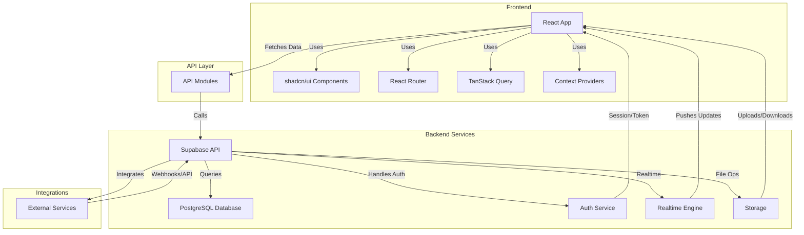

## Deployment Architecture

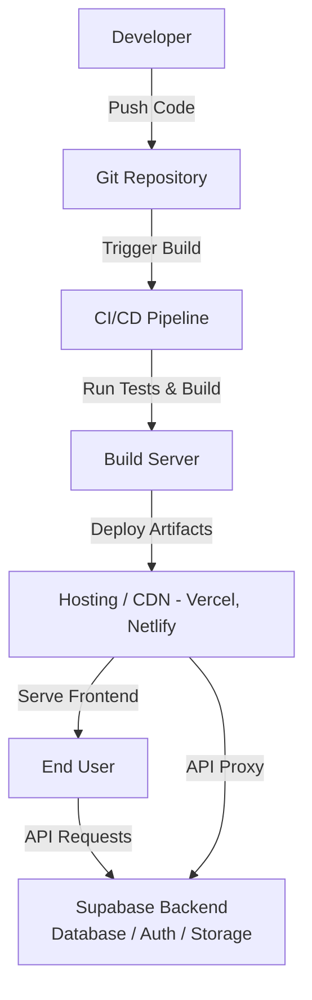

## Database Design

### Data Flow Diagram
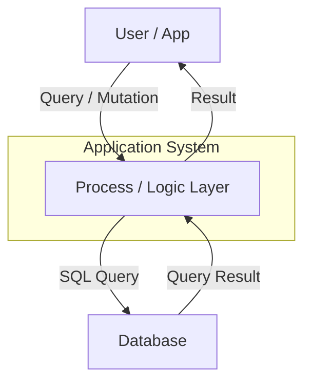

### Entity-Relationship Diagram (ERD)
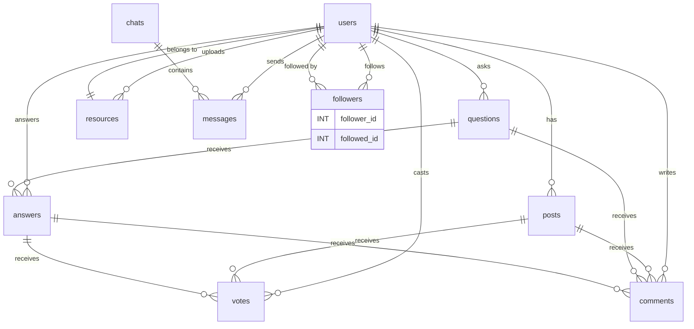

### Table Descriptions
| Table         | Description                                 |
|---------------|---------------------------------------------|
| users         | Stores user account information             |
| posts         | Social feed posts linked to users           |
| comments      | Comments on posts and Q&A                   |
| votes         | Upvotes/downvotes on posts and answers      |
| questions     | Q&A module questions                        |
| answers       | Q&A module answers                          |
| followers     | User follow relationships                   |
| resources     | Shared files and resources                  |
| chats         | Chat conversations                          |
| messages      | Individual chat messages                    |

## Component Architecture

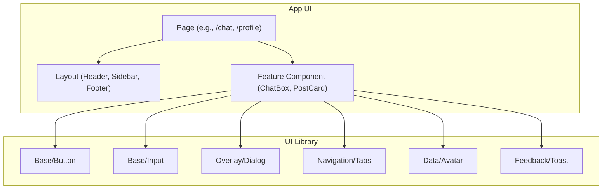

## Module-Level Flows

### Feed
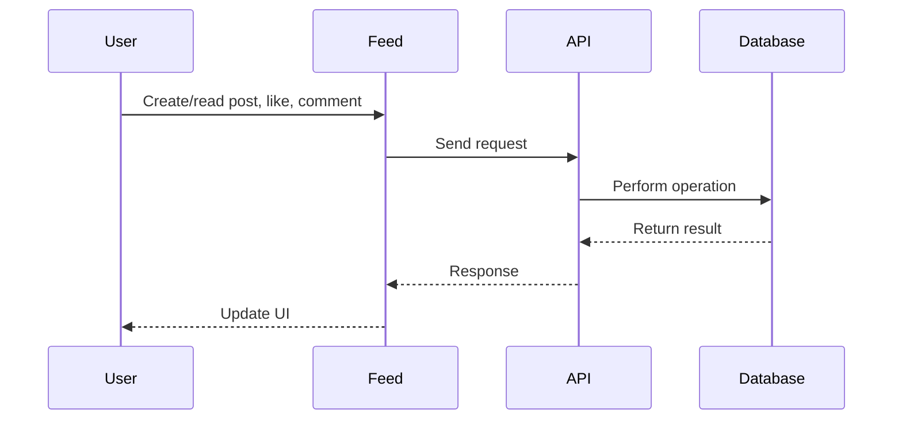

### Q&A
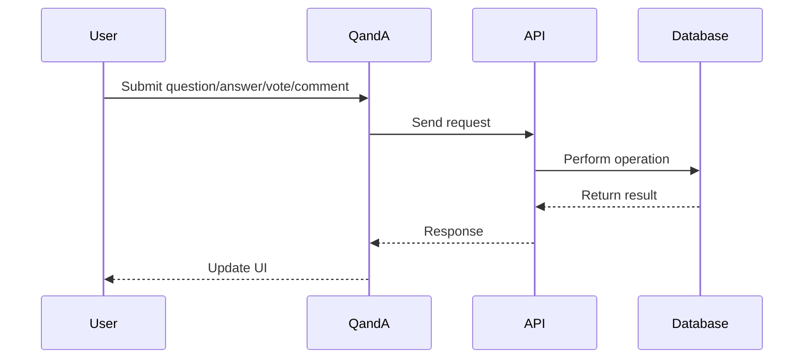

### Chat
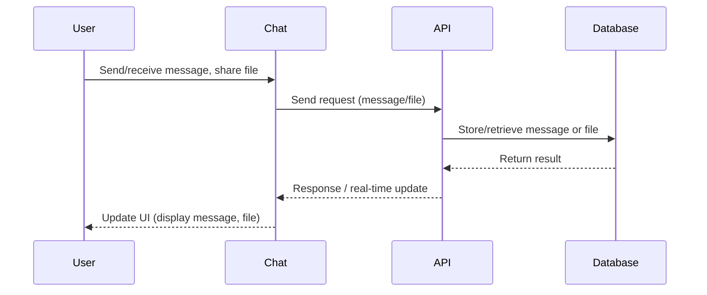

### Resources
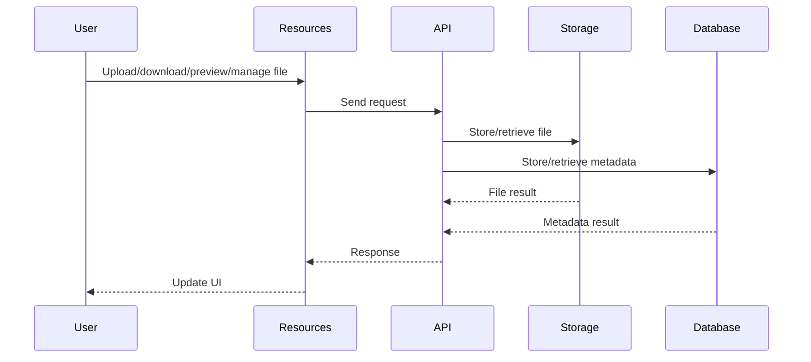

### Profile
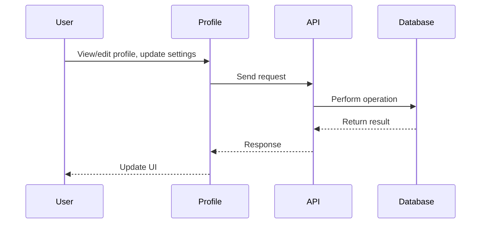

### Settings
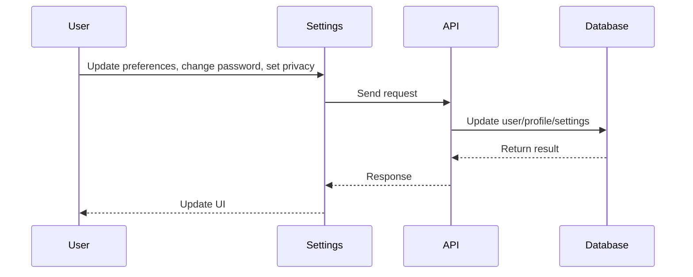

### Admin Dashboard
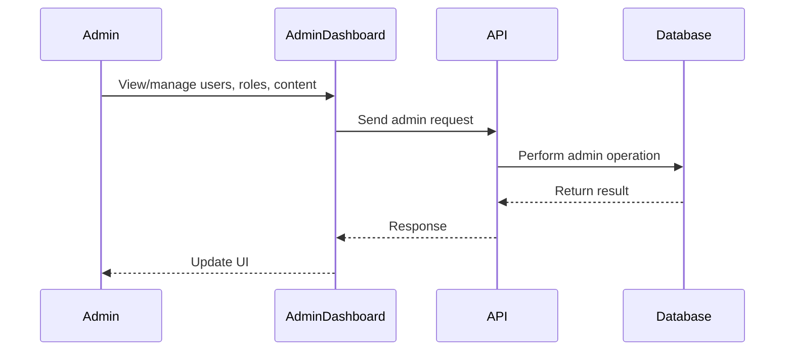

## Security & RLS
- **Authentication**: Supabase Auth with JWT/session tokens
- **Row Level Security (RLS)**: Enforced at the database level for all tables
- **Role-Based Access**: Admin/user roles with granular permissions
- **Frontend Security**: Protected routes, input validation, XSS/CSRF prevention

## Summary
Focus Hub's system design enables a secure, scalable, and real-time platform by combining modular frontend, robust backend, and best-in-class security and deployment practices. 