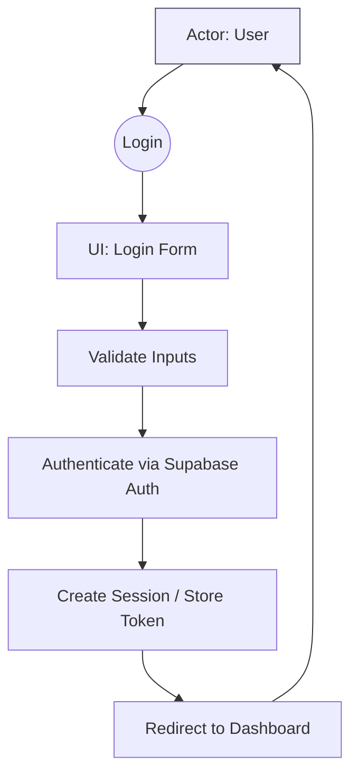
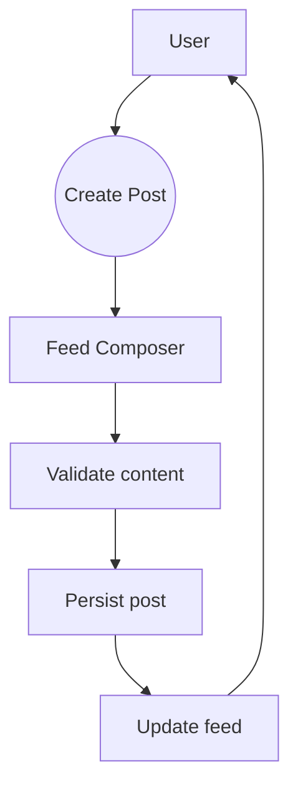
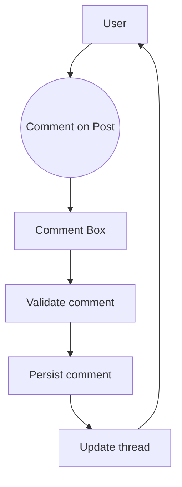

# Focus Hub – Software Testing Documentation

## 1. Introduction & Scope
This document outlines the software testing approach and detailed test cases for the Focus Hub project. It covers all major modules, user flows, and includes both positive and negative/edge case scenarios to ensure robust quality assurance.

---

## 2. Test Strategy
- **Manual Testing** for UI and user flows
- **Automated Testing** for API endpoints and core logic (if test framework present)
- **Regression Testing** after each major update
- **Smoke Testing** for critical path
- **Risk-based prioritization:** Auth, posting, and commenting are P0; resources, profile, and Q&A are P1.
- **Entry criteria:** App builds without errors; Supabase env reachable; seeded user exists (or registration enabled).
- **Exit criteria:** All P0 scenarios pass; no critical/blocker defects open; smoke E2E run green.

---

## 3. Test Types
- **Functional Testing**
- **Integration Testing**
- **UI/UX Testing**
- **Security Testing** (esp. for Auth, File Upload)
- **Performance Testing** (for real-time/chat features)

---

## 4. Test Environment
- **Frontend:** React (Vite)
- **Backend/API:** Node.js (Express) for helpers; Supabase as backend platform
- **Database:** Supabase (Postgres)
- **Other:** Realtime features, AI integration (Groq)
- **Local E2E baseUrl:** http://localhost:5173 (see `cypress.config.cjs`)
- **Tooling versions (from `package.json`):** Node 18+, TypeScript ~5.5, Vite ~5.4, Cypress ~14.5

---

## 5. Test Cases

### Legend
| Field           | Description                                  |
|-----------------|----------------------------------------------|
| Test Case ID    | Unique identifier for the test case          |
| Title           | Brief description of the test                |
| Preconditions   | State required before test                   |
| Steps           | Steps to execute the test                    |
| Expected Result | Expected outcome                             |
| Status          | Pass/Fail (to be filled during execution)    |

---

## 5.1 Authentication

### Positive
| Test Case ID | Title | Preconditions | Steps | Expected Result | Status |
|--------------|-------|---------------|-------|-----------------|--------|
| AUTH-REG-01 | Register with valid credentials | User is on Register page | 1. Enter valid email, username, password 2. Click Register | User is registered and redirected to dashboard/home | Pass/Fail |
| AUTH-LOGIN-01 | Login with valid credentials | User is registered | 1. Enter valid email and password 2. Click Login | User is logged in and redirected to dashboard/home | Pass |

### Negative / Edge Cases
| Test Case ID | Title | Preconditions | Steps | Expected Result | Status |
|--------------|-------|---------------|-------|-----------------|--------|
| AUTH-REG-02 | Register with existing email | Email already registered | 1. Enter existing email 2. Fill other fields 3. Click Register | Error message: Email already in use | Pass/Fail |
| AUTH-REG-03 | Register with weak password | User is on Register page | 1. Enter weak password (e.g., '123') 2. Click Register | Error message: Password too weak | Pass/Fail |
| AUTH-LOGIN-02 | Login with invalid password | User is registered | 1. Enter valid email, wrong password 2. Click Login | Error message: Invalid credentials | Pass/Fail |
| AUTH-LOGIN-03 | Login with unregistered email | None | 1. Enter unregistered email 2. Enter any password 3. Click Login | Error message: User not found | Pass/Fail |
| AUTH-RESET-01 | Reset password with invalid email | None | 1. Enter invalid email 2. Click Reset | Error message: Email not found | Pass/Fail |
| AUTH-REG-04 | Register with empty fields | None | 1. Leave all fields empty 2. Click Register | Error message: Required fields missing | Pass/Fail |

---

## 5.2 Social Feed

### Positive
| Test Case ID | Title | Preconditions | Steps | Expected Result | Status |
|--------------|-------|---------------|-------|-----------------|--------|
| FEED-POST-01 | Create a new post | User is logged in, on Feed page | 1. Enter post content 2. Click Post | Post appears in feed, visible to others | Pass |
| FEED-COMMENT-01 | Add comment to a post | User is logged in, post exists | 1. Click on post 2. Enter comment 3. Submit | Comment appears under post | Pass |

### Negative / Edge Cases
| Test Case ID | Title | Preconditions | Steps | Expected Result | Status |
|--------------|-------|---------------|-------|-----------------|--------|
| FEED-POST-02 | Create post with empty content | User is logged in | 1. Leave post content empty 2. Click Post | Error message: Content required | Pass/Fail |
| FEED-POST-03 | Create post as unauthenticated user | User is logged out | 1. Try to access Feed page 2. Attempt to post | Redirected to login or error shown | Pass/Fail |
| FEED-COMMENT-02 | Add comment with special characters | User is logged in, post exists | 1. Enter comment with only special characters 2. Submit | Error or comment sanitized/accepted as per policy | Pass/Fail |
| FEED-POST-04 | Post extremely long content | User is logged in | 1. Enter content > max allowed length 2. Click Post | Error message: Content too long | Pass/Fail |

---

## 5.3 Chat System

### Positive
| Test Case ID | Title | Preconditions | Steps | Expected Result | Status |
|--------------|-------|---------------|-------|-----------------|--------|
| CHAT-SEND-01 | Send a chat message | User is logged in, chat open | 1. Enter message 2. Click Send | Message appears in chat, visible to recipient(s) | Pass/Fail |

### Negative / Edge Cases
| Test Case ID | Title | Preconditions | Steps | Expected Result | Status |
|--------------|-------|---------------|-------|-----------------|--------|
| CHAT-SEND-02 | Send empty chat message | User is logged in, chat open | 1. Leave message field empty 2. Click Send | Error message: Message required | Pass/Fail |
| CHAT-SEND-03 | Send message as unauthenticated user | User is logged out | 1. Try to open chat 2. Enter message 3. Click Send | Redirected to login or error shown | Pass/Fail |
| CHAT-SEND-04 | Send message with unsupported file type | User is logged in, chat open | 1. Attach unsupported file 2. Click Send | Error message: File type not supported | Pass/Fail |
| CHAT-SEND-05 | Send extremely long message | User is logged in, chat open | 1. Enter message > max allowed length 2. Click Send | Error message: Message too long | Pass/Fail |

---

## 5.4 Q&A Module

### Positive
| Test Case ID | Title | Preconditions | Steps | Expected Result | Status |
|--------------|-------|---------------|-------|-----------------|--------|
| QA-POST-01 | Post a new question | User is logged in, on Q&A page | 1. Enter question 2. Submit | Question appears in Q&A list | Pass/Fail |
| QA-ANSWER-01 | Post an answer to a question | User is logged in, question exists | 1. Enter answer 2. Submit | Answer appears under question | Pass/Fail |

### Negative / Edge Cases
| Test Case ID | Title | Preconditions | Steps | Expected Result | Status |
|--------------|-------|---------------|-------|-----------------|--------|
| QA-POST-02 | Post question with empty content | User is logged in | 1. Leave question field empty 2. Submit | Error message: Content required | Pass/Fail |
| QA-POST-03 | Post duplicate question | User is logged in | 1. Enter question identical to existing 2. Submit | Error or duplicate warning (if implemented) | Pass/Fail |
| QA-ANSWER-02 | Post answer as unauthenticated user | User is logged out | 1. Try to answer question 2. Submit | Redirected to login or error shown | Pass/Fail |
| QA-POST-04 | Post question with excessive length | User is logged in | 1. Enter question > max allowed length 2. Submit | Error message: Content too long | Pass/Fail |

---

## 5.5 Resource Sharing

### Positive
| Test Case ID | Title | Preconditions | Steps | Expected Result | Status |
|--------------|-------|---------------|-------|-----------------|--------|
| RES-UPLOAD-01 | Upload a new resource file | User is logged in, on Resources page | 1. Click Upload 2. Select file 3. Confirm | File appears in resource list, accessible to others | Pass/Fail |

### Negative / Edge Cases
| Test Case ID | Title | Preconditions | Steps | Expected Result | Status |
|--------------|-------|---------------|-------|-----------------|--------|
| RES-UPLOAD-02 | Upload unsupported file type | User is logged in | 1. Click Upload 2. Select unsupported file 3. Confirm | Error message: File type not supported | Pass/Fail |
| RES-UPLOAD-03 | Upload file exceeding size limit | User is logged in | 1. Click Upload 2. Select large file (>max size) 3. Confirm | Error message: File too large | Pass/Fail |
| RES-UPLOAD-04 | Upload resource as unauthenticated user | User is logged out | 1. Try to access upload 2. Select file 3. Confirm | Redirected to login or error shown | Pass/Fail |
| RES-UPLOAD-05 | Upload file with malicious content | User is logged in | 1. Click Upload 2. Select file with script/malware 3. Confirm | Error message: File rejected or sanitized | Pass/Fail |

---

## 5.6 Admin Dashboard

### Positive
| Test Case ID | Title | Preconditions | Steps | Expected Result | Status |
|--------------|-------|---------------|-------|-----------------|--------|
| ADMIN-FLAG-01 | View flagged content as admin | User is admin, on Admin Dashboard | 1. Navigate to flagged content section | List of flagged posts/resources shown | Pass/Fail |
| ADMIN-USER-01 | Ban a user | User is admin | 1. Select user 2. Click Ban | User is banned, confirmation shown | Pass/Fail |

### Negative / Edge Cases
| Test Case ID | Title | Preconditions | Steps | Expected Result | Status |
|--------------|-------|---------------|-------|-----------------|--------|
| ADMIN-FLAG-02 | Non-admin tries to access admin dashboard | User is not admin | 1. Try to access Admin Dashboard | Access denied or redirected | Pass/Fail |
| ADMIN-USER-02 | Ban already banned user | User is admin | 1. Select already banned user 2. Click Ban | Error message: User already banned | Pass/Fail |

---

## 5.7 Profile & Settings

### Positive
| Test Case ID | Title | Preconditions | Steps | Expected Result | Status |
|--------------|-------|---------------|-------|-----------------|--------|
| PROFILE-UPDATE-01 | Update user profile info | User is logged in, on Profile page | 1. Edit profile fields 2. Save | Profile info updated, confirmation shown | Pass/Fail |
| SETTINGS-UPDATE-01 | Change password | User is logged in, on Settings page | 1. Enter old password 2. Enter new password 3. Save | Password updated, confirmation shown | Pass/Fail |

### Negative / Edge Cases
| Test Case ID | Title | Preconditions | Steps | Expected Result | Status |
|--------------|-------|---------------|-------|-----------------|--------|
| PROFILE-UPDATE-02 | Update profile with invalid data | User is logged in | 1. Enter invalid email/username 2. Save | Error message: Invalid data | Pass/Fail |
| SETTINGS-UPDATE-02 | Change password with wrong old password | User is logged in | 1. Enter incorrect old password 2. Enter new password 3. Save | Error message: Incorrect old password | Pass/Fail |
| PROFILE-UPDATE-03 | Update profile as unauthenticated user | User is logged out | 1. Try to access Profile page 2. Edit fields 3. Save | Redirected to login or error shown | Pass/Fail |

---

## 5.8 AI Integration

### Positive
| Test Case ID | Title | Preconditions | Steps | Expected Result | Status |
|--------------|-------|---------------|-------|-----------------|--------|
| AI-ANSWER-01 | Request AI-generated answer | User is logged in, on Q&A or AI page | 1. Enter question 2. Click "Get AI Answer" | AI-generated answer appears | Pass/Fail |

### Negative / Edge Cases
| Test Case ID | Title | Preconditions | Steps | Expected Result | Status |
|--------------|-------|---------------|-------|-----------------|--------|
| AI-ANSWER-02 | Request AI answer with empty input | User is logged in | 1. Leave question field empty 2. Click "Get AI Answer" | Error message: Input required | Pass/Fail |
| AI-ANSWER-03 | Request AI answer as unauthenticated user | User is logged out | 1. Enter question 2. Click "Get AI Answer" | Redirected to login or error shown | Pass/Fail |
| AI-ANSWER-04 | Request AI answer with unsupported language | User is logged in | 1. Enter question in unsupported language 2. Click "Get AI Answer" | Error or fallback message | Pass/Fail |

---

## 6. Traceability Matrix (Optional)
| Requirement/Feature | Test Case IDs |
|---------------------|---------------|
| User Registration   | AUTH-REG-01, AUTH-REG-02, AUTH-REG-03, AUTH-REG-04 |
| Login               | AUTH-LOGIN-01, AUTH-LOGIN-02, AUTH-LOGIN-03 |
| Social Feed         | FEED-POST-01, FEED-POST-02, FEED-POST-03, FEED-POST-04, FEED-COMMENT-01, FEED-COMMENT-02 |
| Chat System         | CHAT-SEND-01, CHAT-SEND-02, CHAT-SEND-03, CHAT-SEND-04, CHAT-SEND-05 |
| Q&A Module          | QA-POST-01, QA-POST-02, QA-POST-03, QA-POST-04, QA-ANSWER-01, QA-ANSWER-02 |
| Resource Sharing    | RES-UPLOAD-01, RES-UPLOAD-02, RES-UPLOAD-03, RES-UPLOAD-04, RES-UPLOAD-05 |
| Admin Dashboard     | ADMIN-FLAG-01, ADMIN-FLAG-02, ADMIN-USER-01, ADMIN-USER-02 |
| Profile & Settings  | PROFILE-UPDATE-01, PROFILE-UPDATE-02, PROFILE-UPDATE-03, SETTINGS-UPDATE-01, SETTINGS-UPDATE-02 |
| AI Integration      | AI-ANSWER-01, AI-ANSWER-02, AI-ANSWER-03, AI-ANSWER-04 |

---

## 7. Test Execution Summary (Cypress)
- Passed specs (no failure screenshots observed):
	- `cypress/e2e/login.cy.js` → AUTH-LOGIN-01
	- `cypress/e2e/post.cy.js` → FEED-POST-01
	- `cypress/e2e/comment.cy.js` → FEED-COMMENT-01
- Failures observed (screenshots exist under `cypress/screenshots/`):
	- Registration flow (registration.cy.js) — screenshot: `Registration Flow -- registers a new user (failed).png`
	- Profile edit flow (profileEdit.cy.js) — screenshot: `Profile Update via Settings -- updates profile info (failed).png`
	- Q&A ask flow (qa.cy.js) — screenshot: `Q&A Flow -- posts a new question (failed).png`
	- Resource upload flow (resource.cy.js) — screenshot: `Resource Upload -- uploads a resource file (failed).png`

Status mapping updated: AUTH-LOGIN-01, FEED-POST-01, FEED-COMMENT-01 are marked Pass. Others remain pending until investigation.

## 8. Test Data & Accounts
- Recommended seeded user for E2E: `test_user@example.com` with a strong password (store securely via env/secrets).
- Test content: short lorem text for posts/comments; keep under validation limits.
- Resource uploads: include a small valid file (see `cypress/fixtures/testfile.txt`) and at least one oversized/unsupported file for negative tests.

## 9. Execution How-To (local)
- Start the app (Vite dev server) and ensure Supabase env vars are set.
- Run Cypress E2E (headed/headless) pointing to baseUrl `http://localhost:5173`.

Note: In CI, prefer headless mode and tag smoke tests (login, post, comment) for fast gating.

## 10. CI/CD and Reporting Recommendations
- Add a CI workflow to run: install → lint → build → unit tests → Cypress (smoke on PRs, full on main).
- Export Cypress JUnit/HTML reports; archive screenshots/videos on failures.
- Gate deployments on green smoke tests; run full E2E on nightly or pre-release.

## 11. Security & Performance Testing Outline
- Security: verify RLS policies with positive/negative data access tests; attempt unauthorized writes to posts/likes/follows/Q&A; test upload policy enforcement.
- Performance: check feed render under 50 posts; chat message throughput (send 20 msgs in 10s); Q&A list search response times.

## 12. Notes
- Expand test cases as new features are added.
- Automate regression and smoke tests where possible.
- Update documentation with each release.

---

## 13. Use Case Diagrams (Mermaid)

### 13.1 AUTH-LOGIN-01 — Login with valid credentials

Notes:
- Preconditions: Registered user exists; app reachable.
- Postconditions: Auth session established; user lands on home/dashboard.

### 13.2 FEED-POST-01 — Create a new post

Notes:
- Preconditions: User authenticated.
- Postconditions: Post stored; appears on feed; side effects (notifications) may occur.

### 13.3 FEED-COMMENT-01 — Add comment to a post

Notes:
- Preconditions: User authenticated; target post exists.
- Postconditions: Comment stored; visible under the post; notifications may be triggered.