# Focus Hub Implementation

## 1. Authentication Module

### 1.1 Frontend Structure (Mermaid)

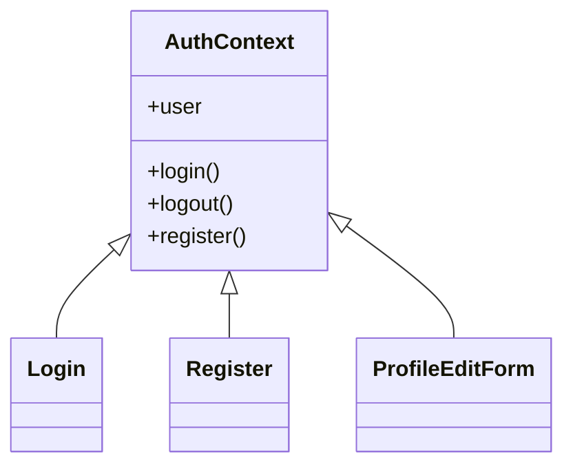

### 1.2 Key Frontend Code (React/TS)

```tsx
// src/contexts/AuthContext.tsx
import React, { createContext, useState, useContext } from "react";
const AuthContext = createContext(null);
export const useAuth = () => useContext(AuthContext);

export const AuthProvider = ({ children }) => {
  const [user, setUser] = useState(null);
  const login = async (email, password) => { /* ... */ };
  const logout = () => { /* ... */ };
  const register = async (data) => { /* ... */ };
  return (
    <AuthContext.Provider value={{ user, login, logout, register }}>
      {children}
    </AuthContext.Provider>
  );
};
```

### 1.3 Backend Structure (Mermaid)

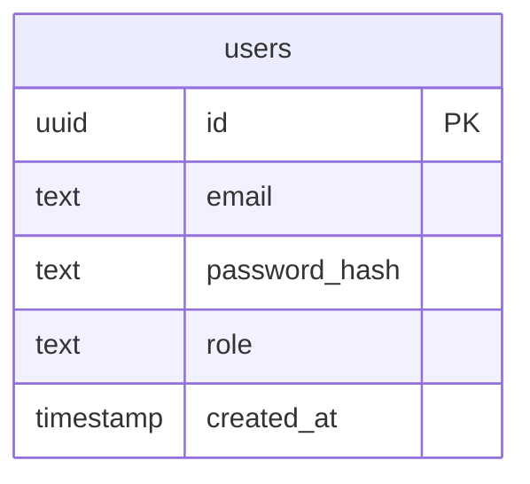

### 1.4 Example SQL Table

```sql
CREATE TABLE users (
    id uuid PRIMARY KEY,
    email text UNIQUE NOT NULL,
    password_hash text NOT NULL,
    role text NOT NULL,
    created_at timestamp DEFAULT now()
);
```

---

## 2. Social Feed Module

### 2.1 Frontend Structure (Mermaid)

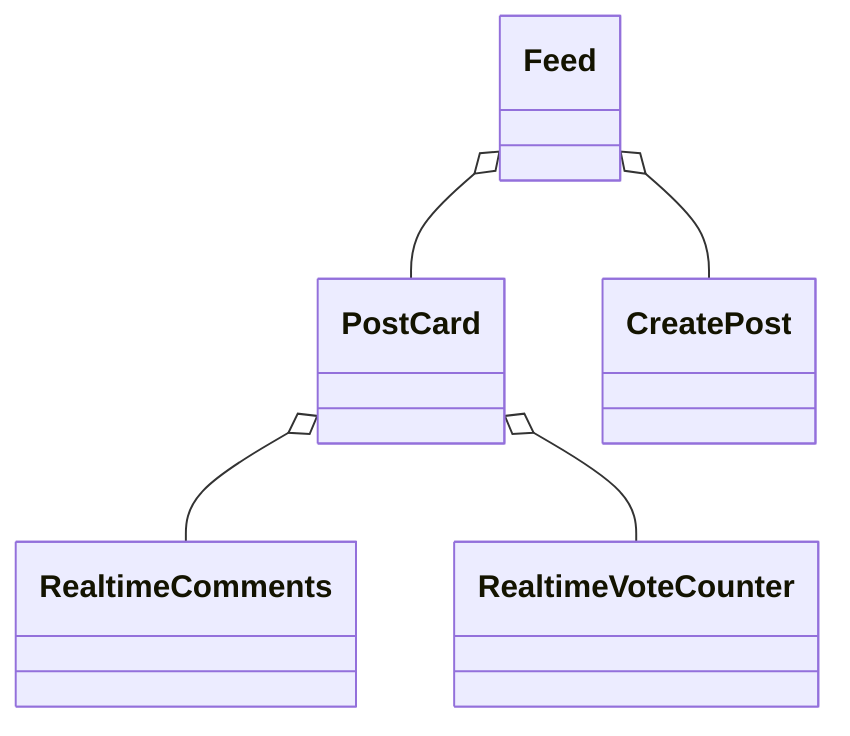

### 2.2 Key Frontend Code

```tsx
// src/components/Feed.tsx
import React, { useEffect, useState } from "react";
import PostCard from "./PostCard";
import { fetchPosts } from "../lib/api";
const Feed = () => {
  const [posts, setPosts] = useState([]);
  useEffect(() => { fetchPosts().then(setPosts); }, []);
  return (
    <div>
      {posts.map(post => <PostCard key={post.id} post={post} />)}
    </div>
  );
};
export default Feed;
```

### 2.3 Backend Structure (Mermaid)

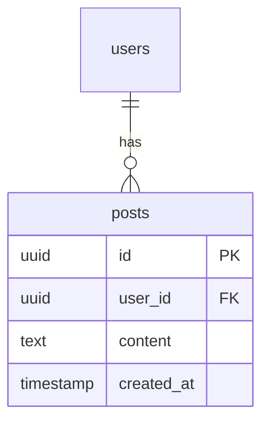

### 2.4 Example SQL Table

```sql
CREATE TABLE posts (
    id uuid PRIMARY KEY,
    user_id uuid REFERENCES users(id),
    content text NOT NULL,
    created_at timestamp DEFAULT now()
);
```

---

## 3. Q&A Module

### 3.1 Frontend Structure (Mermaid)

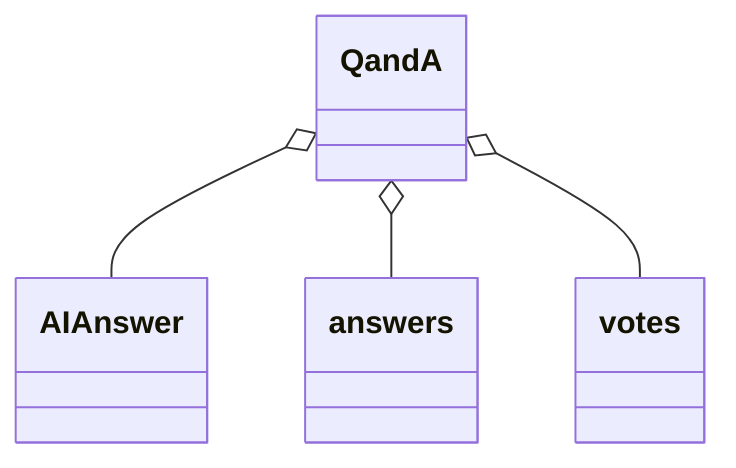

### 3.2 Key Frontend Code

```tsx
// src/components/QandA.tsx
import React, { useState } from "react";
import AIAnswer from "./AIAnswer";
const QandA = () => {
  const [question, setQuestion] = useState("");
  const [aiAnswer, setAIAnswer] = useState("");
  const askAI = async () => {
    const res = await fetch("/api/ai-answers", { method: "POST", body: JSON.stringify({ question }) });
    const data = await res.json();
    setAIAnswer(data.answer);
  };
  return (
    <div>
      <input value={question} onChange={e => setQuestion(e.target.value)} />
      <button onClick={askAI}>Ask AI</button>
      <AIAnswer answer={aiAnswer} />
    </div>
  );
};
export default QandA;
```

### 3.3 Backend Structure (Mermaid)

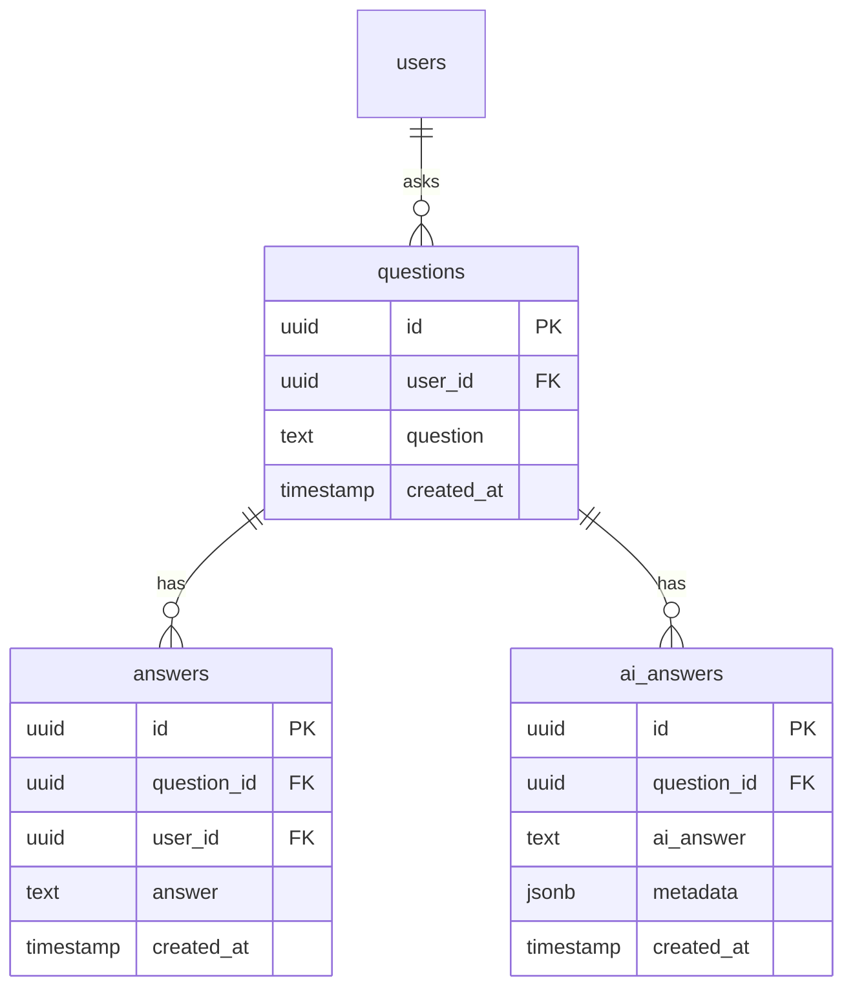

### 3.4 Example SQL Table

```sql
CREATE TABLE questions (
    id uuid PRIMARY KEY,
    user_id uuid REFERENCES users(id),
    question text NOT NULL,
    created_at timestamp DEFAULT now()
);

CREATE TABLE ai_answers (
    id uuid PRIMARY KEY,
    question_id uuid REFERENCES questions(id),
    ai_answer text NOT NULL,
    metadata jsonb,
    created_at timestamp DEFAULT now()
);
```

---

## 4. Chat Module

### 4.1 Frontend Structure (Mermaid)

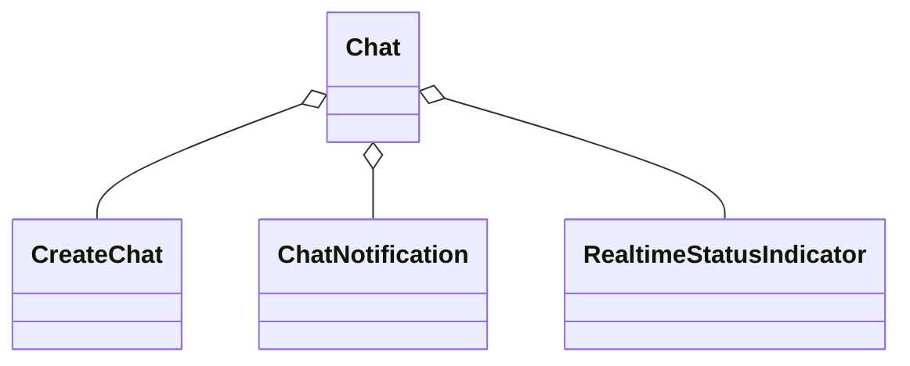

### 4.2 Key Frontend Code

```tsx
// src/components/Chat.tsx
import React, { useEffect, useState } from "react";
const Chat = () => {
  const [messages, setMessages] = useState([]);
  useEffect(() => {
    // subscribe to real-time messages
  }, []);
  return (
    <div>
      {messages.map(msg => <div key={msg.id}>{msg.text}</div>)}
    </div>
  );
};
export default Chat;
```

### 4.3 Backend Structure (Mermaid)

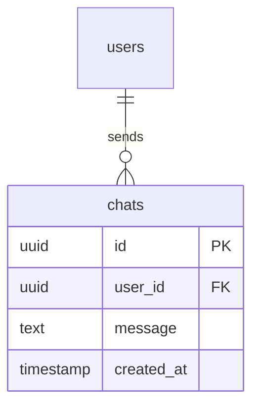

### 4.4 Example SQL Table

```sql
CREATE TABLE chats (
    id uuid PRIMARY KEY,
    user_id uuid REFERENCES users(id),
    message text NOT NULL,
    created_at timestamp DEFAULT now()
);
```

---

## 5. Resource Sharing Module

### 5.1 Frontend Structure (Mermaid)

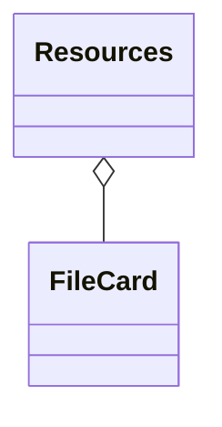

### 5.2 Key Frontend Code

```tsx
// src/components/Resources.tsx
import React, { useState } from "react";
const Resources = () => {
  const [files, setFiles] = useState([]);
  // fetch and upload logic here
  return (
    <div>
      {files.map(file => <div key={file.id}>{file.name}</div>)}
    </div>
  );
};
export default Resources;
```

### 5.3 Backend Structure (Mermaid)

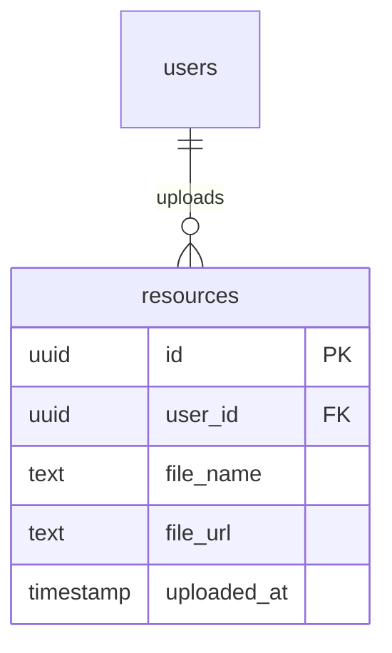

### 5.4 Example SQL Table

```sql
CREATE TABLE resources (
    id uuid PRIMARY KEY,
    user_id uuid REFERENCES users(id),
    file_name text NOT NULL,
    file_url text NOT NULL,
    uploaded_at timestamp DEFAULT now()
);
```

---

## 6. Admin Dashboard Module

### 6.1 Frontend Structure (Mermaid)

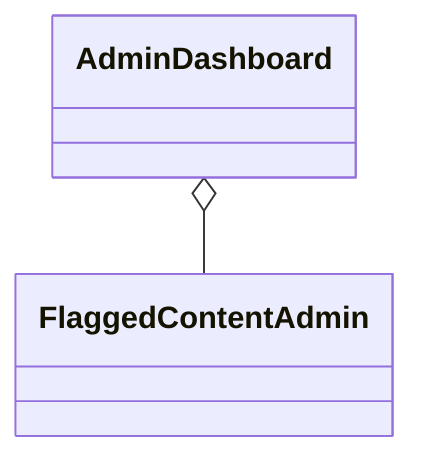

### 6.2 Key Frontend Code

```tsx
// src/pages/AdminDashboard.tsx
import React from "react";
const AdminDashboard = () => (
  <div>
    <h1>Admin Dashboard</h1>
    {/* User and content management components */}
  </div>
);
export default AdminDashboard;
```

### 6.3 Backend Structure (Mermaid)

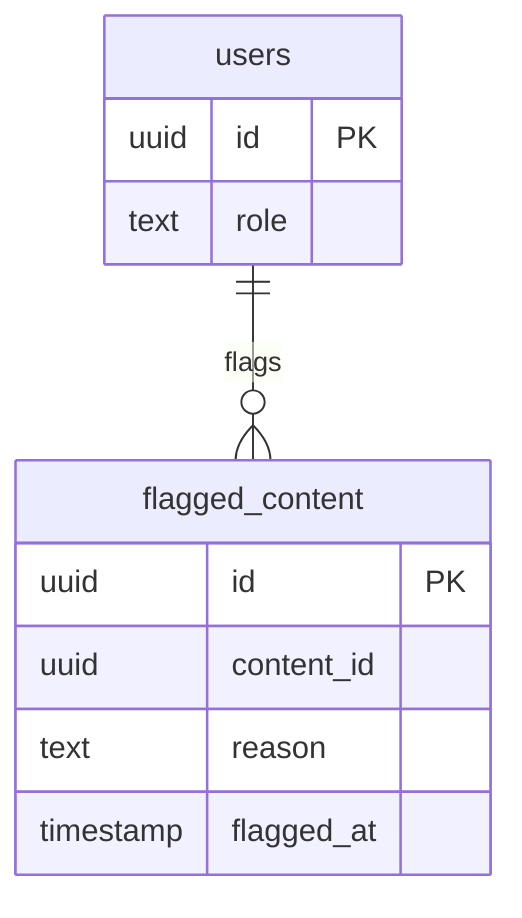

### 6.4 Example SQL Table

```sql
CREATE TABLE flagged_content (
    id uuid PRIMARY KEY,
    content_id uuid NOT NULL,
    reason text NOT NULL,
    flagged_at timestamp DEFAULT now()
);
```

---

## 7. API Layer Example (Node/Express)

```js
// src/api/answers.js
const express = require("express");
const router = express.Router();
router.post("/", async (req, res) => {
  // handle AI answer generation
});
module.exports = router;
```

---

## 8. General Database Relationships (Mermaid)

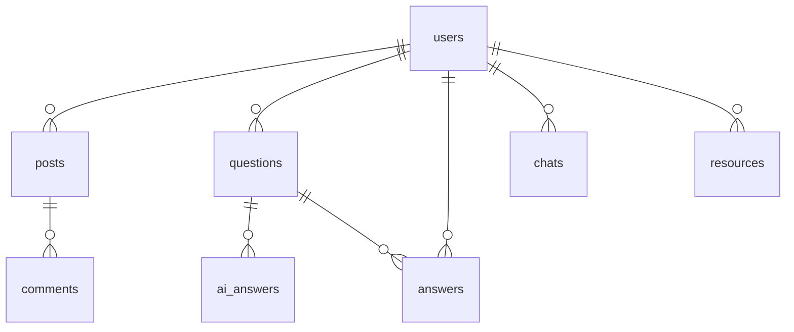

---

**You can copy this markdown into your documentation.**
If you want more detailed code for any module, just specify which one. 