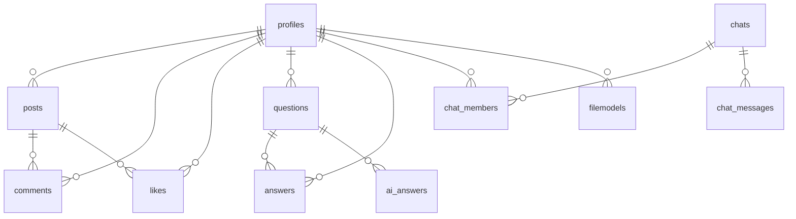

# Focus Hub Full Implementation Documentation

---

## Module: 00_OVERVIEW.md

*See [00_OVERVIEW.md](./implementation/00_OVERVIEW.md) for full project structure, stack, and quick start.*

---

## 1. Database Schema

**Overview:**
The Focus Hub database is built on PostgreSQL via Supabase, featuring a comprehensive schema for social networking, Q&A, chat, AI-powered answers, resource sharing, notifications, and moderation. The schema includes robust relationships, row-level security (RLS), triggers, and performance indexes.

**See:** [01_DATABASE_SCHEMA.md](./implementation/01_DATABASE_SCHEMA.md)

### 1.1 Mermaid ER Diagram (Example)



### 1.2 Table Format

*See [01_DATABASE_SCHEMA_TABLE_FORMAT.md](./implementation/01_DATABASE_SCHEMA_TABLE_FORMAT.md) for all tables in markdown table format.*

---

## 2. Authentication & User Management

**Overview:**
Supabase Auth with custom user management, role-based access control, and profile management.

**See:** [02_AUTHENTICATION.md](./implementation/02_AUTHENTICATION.md)

- Supabase client setup
- Auth context/provider (React)
- Protected routes
- Login/Register pages
- Role-based access control (admin/user)
- Profile management (update, avatar upload)
- Security features (account status, session management)
- Error handling and testing

**Key Code Example:**
```typescript
// src/contexts/AuthContext.tsx
export const AuthProvider: React.FC<{ children: React.ReactNode }> = ({ children }) => {
  // ... see full implementation in 02_AUTHENTICATION.md ...
};
```

---

## 3. Frontend Architecture

**Overview:**
Modern React 18 + TypeScript app with Vite, Tailwind, shadcn/ui, context-based state, and modular component structure.

**See:** [03_FRONTEND_ARCHITECTURE.md](./implementation/03_FRONTEND_ARCHITECTURE.md)

- Entry point (`main.tsx`)
- App routing and providers
- Layout, sidebar, header
- Page and reusable components
- State management (context, hooks)
- Styling (Tailwind, global styles)
- Build and TypeScript config

**Key Code Example:**
```typescript
// src/App.tsx
const App = () => (
  <QueryClientProvider client={queryClient}>
    {/* ... see full implementation in 03_FRONTEND_ARCHITECTURE.md ... */}
  </QueryClientProvider>
);
```

---

## 4. API Integration

**Overview:**
Supabase as backend-as-a-service: PostgreSQL, auth, real-time, storage. Type-safe API utilities, error handling, and real-time subscriptions.

**See:** [04_API_INTEGRATION.md](./implementation/04_API_INTEGRATION.md)

- Supabase client and types
- API utilities (fetch, error handling)
- Auth, profile, posts, comments, files API
- Real-time subscriptions (posts, chat, notifications)
- Custom React hooks for API data

**Key Code Example:**
```typescript
// src/lib/api.ts
export const apiFetch = async <T>(query: Promise<{ data: T | null; error: any }>): Promise<ApiResponse<T>> => {
  // ... see full implementation in 04_API_INTEGRATION.md ...
};
```

---

## 5. Social Feed Module

**Overview:**
Create, edit, delete posts with media, likes, comments, real-time updates, and moderation.

**See:** [05_SOCIAL_FEED.md](./implementation/05_SOCIAL_FEED.md)

- Feed page, CreatePost, PostCard components
- Real-time updates (Supabase subscriptions)
- Likes, comments, optimistic UI
- Content flagging and admin moderation
- Pagination and performance

**Key Code Example:**
```typescript
// src/pages/Feed.tsx
const Feed = () => {
  // ... see full implementation in 05_SOCIAL_FEED.md ...
};
```

---

## 6. Q&A Module

**Overview:**
Comprehensive Q&A system with AI-powered answers, voting, tags, and reputation.

**See:** [06_QA_MODULE.md](./implementation/06_QA_MODULE.md)

- QandA page, QuestionCard, CreateQuestion, AIAnswer components
- Voting, tags, answer acceptance
- AI answer generation (Groq API)
- Real-time updates
- SQL schema for questions, answers, votes, AI answers

**Key Code Example:**
```typescript
// src/components/AIAnswer.tsx
export const AIAnswer = ({ questionId, question }: AIAnswerProps) => {
  // ... see full implementation in 06_QA_MODULE.md ...
};
```

---

## 7. Chat System

**Overview:**
Real-time messaging, group chat, file sharing, typing indicators, and member management.

**See:** [07_CHAT_SYSTEM.md](./implementation/07_CHAT_SYSTEM.md)

- Chat page, CreateChat, ChatNotification, RealtimeStatusIndicator components
- Real-time chat messages (Supabase subscriptions)
- Group chat, file sharing
- SQL schema for chats, chat_members, chat_messages

---

## 8. Resource Sharing

**Overview:**
File upload, sharing, public/private visibility, categorization, and download tracking.

**See:** [08_RESOURCE_SHARING.md](./implementation/08_RESOURCE_SHARING.md)

- Resources page, FileCard component
- File upload (Supabase storage)
- SQL schema for filemodels

---

## 9. Admin Dashboard

**Overview:**
User/content management, flag review, analytics, and role management.

**See:** [09_ADMIN_DASHBOARD.md](./implementation/09_ADMIN_DASHBOARD.md)

- AdminDashboard, FlaggedContentAdmin components
- User/content moderation
- Analytics and monitoring

---

## 10. UI Components

**Overview:**
Reusable, accessible UI components built with shadcn/ui and Tailwind.

**See:** [10_UI_COMPONENTS.md](./implementation/10_UI_COMPONENTS.md)

- Button, Card, Input, Modal, Avatar, etc.
- Custom hooks and context providers

---

## 11. Deployment

**Overview:**
Deployment and configuration for Vercel (frontend), Supabase (backend), and environment setup.

**See:** [11_DEPLOYMENT.md](./implementation/11_DEPLOYMENT.md)

- Environment variables
- Build and deploy steps
- Production best practices

---

## 12. Security

**Overview:**
Security best practices: RLS, policies, password security, session management, and error handling.

**See:** [12_SECURITY.md](./implementation/12_SECURITY.md)

- Row Level Security (RLS) and policies
- Secure authentication and session handling
- Input validation and error handling

---

## 13. AI Integration

**Overview:**
Groq API integration for AI-powered Q&A, answer generation, and feedback.

**See:** [13_AI_INTEGRATION.md](./implementation/13_AI_INTEGRATION.md)

- AI answer API (Groq + Express)
- AIAnswer frontend component
- SQL schema for ai_answers

---

**For full code and details, see each referenced file in the implementation directory.**

If you want to expand any section with more code or explanation, let me know the module or topic! 