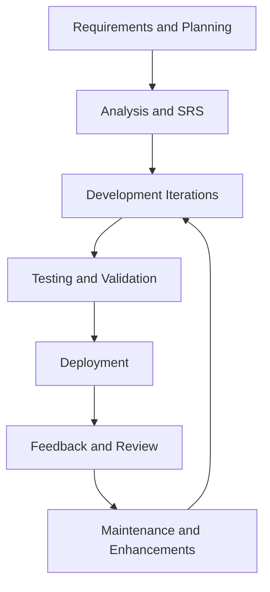

# Focus Hub Project Synopsis Report

## 1. Project Overview

Focus Hub is a full-stack social learning platform that combines authentication, social feed sharing, real-time chat, Q&A, resource sharing, user profiles, and admin moderation in a single responsive web application. The project is implemented with React, TypeScript, Vite, Tailwind CSS, Supabase, and related modern frontend and backend services.

## 2. Agile SDLC Summary

The project has been organized using Agile SDLC principles. Each stage is treated as a working phase with iterative refinement, review, and feedback-driven improvement rather than a one-time linear handoff.

## 3. 360 Hour Distribution

| Phase | Hours | Purpose |
| --- | ---: | --- |
| Analysis and SRS | 60 | Requirement gathering, scope definition, and specification |
| Development | 150 | Core implementation, integration, and UI build-out |
| Testing | 70 | Functional, regression, and end-to-end validation |
| Deployment | 25 | Release preparation, environment setup, and rollout |
| Feedback | 25 | User review, iteration, and backlog refinement |
| Maintenance | 30 | Monitoring, fixes, and post-release support |
| Total | 360 | Complete Agile SDLC effort |

## 4. Document Index

1. [01_Analysis_and_SRS.md](01_Analysis_and_SRS.md)
2. [02_Development.md](02_Development.md)
3. [03_Testing.md](03_Testing.md)
4. [04_Deployment.md](04_Deployment.md)
5. [05_Feedback.md](05_Feedback.md)
6. [06_Maintenance.md](06_Maintenance.md)

## 5. Report Convention

- File names use a two-digit numeric prefix followed by a clear phase name.
- Each phase file contains a short narrative, phase objectives, deliverables, and a Mermaid diagram.
- The overall report stays aligned with the current project implementation rather than unsupported future claims.
