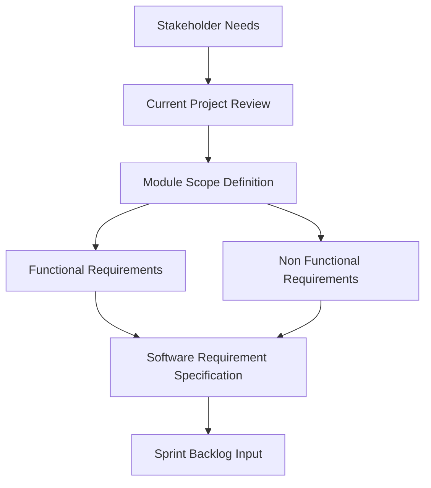

# 1. Analysis and SRS

## 1.1 Phase Objective

This phase defines the current project scope, identifies user needs, and translates the platform idea into a structured software requirements specification. It establishes the baseline for the remaining Agile SDLC phases.

## 1.2 Scope of Analysis

Focus Hub addresses collaborative learning and social interaction through:

- User registration, login, and protected access
- Social feed posting, commenting, liking, and moderation
- Real-time chat and presence features
- Q&A community interactions with AI-assisted support
- Resource sharing with upload, preview, and download capabilities
- User profile management and admin dashboard functions

## 1.3 Requirements Elicitation Summary

The current application requirements are derived from the implemented platform capabilities and project documentation. The specification focuses on users, modules, data handling, security, and usability.

### 1.3.1 Functional Requirements

- Secure user authentication and session handling
- Role-aware routing for users and administrators
- Feed creation and interaction capabilities
- Real-time messaging and group conversations
- Question and answer workflows with voting and AI support
- File upload, categorization, and resource management
- Administrative moderation and analytics controls

### 1.3.2 Non-Functional Requirements

- Responsive and accessible user interface
- Reliable real-time updates
- Safe handling of user data and permissions
- Maintainable modular architecture
- Fast page transitions and interactive behavior

## 1.4 Agile SRS Output

This phase produces the requirement baseline used by the development team for sprint planning and backlog prioritization. The requirements remain flexible so that refinements can be added after feedback from later phases.

## 1.5 Phase Effort

- Planned hours: 60
- Outcome: approved scope, module list, and requirement baseline
