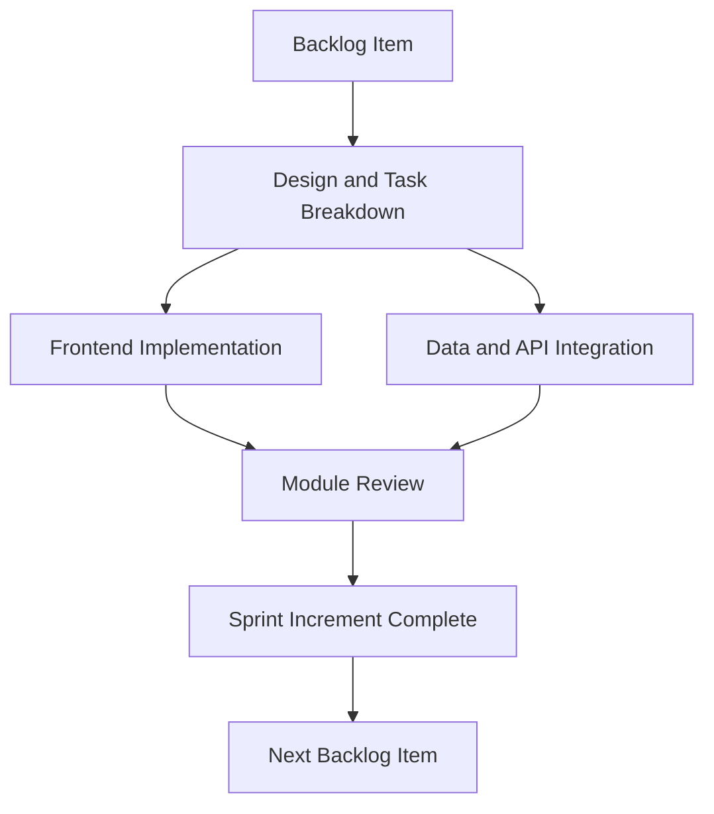

# 2. Development

## 2.1 Phase Objective

This phase covers the implementation of the Focus Hub platform across the major product modules, using iterative Agile delivery to build and integrate features in small, reviewable increments.

## 2.2 Implementation Summary

The current project is developed with a modern frontend stack and Supabase-backed services. Development work centers on modular pages, reusable UI components, application contexts, API integration, and data-driven features.

### 2.2.1 Core Build Areas

- Authentication and protected route handling
- Social feed and interaction components
- Q&A workflows and AI-assisted answer generation
- Real-time chat and messaging views
- Resource upload and management interfaces
- Profile, settings, and admin dashboard modules

### 2.2.2 Technical Foundation

- React and TypeScript for the user interface and state logic
- Vite for build tooling and local development
- Tailwind CSS and component primitives for responsive UI
- Supabase for authentication, database access, storage, and realtime features
- Modular source organization for maintainability

## 2.3 Agile Development Flow

Development is handled as a sequence of sprint-style increments. Each completed module is reviewed before the next feature set is expanded.

## 2.4 Development Deliverables

- Functional UI screens for all major modules
- Integrated Supabase-backed application flows
- Reusable components and shared layouts
- Role-aware navigation and protected access
- Documentation alignment with implemented features

## 2.5 Phase Effort

- Planned hours: 150
- Outcome: working application modules prepared for testing
