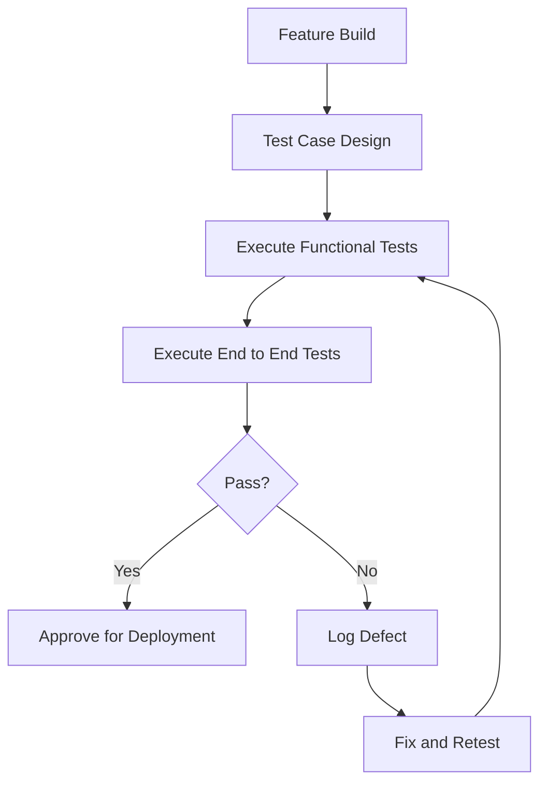

# 3. Testing

## 3.1 Phase Objective

This phase validates that the implemented Focus Hub features work as expected across the user interface, business flows, and system integrations.

## 3.2 Testing Scope

Testing focuses on the current application areas that are most important to user experience and platform reliability.

### 3.2.1 Test Coverage Areas

- Authentication and route protection
- Social feed posting and interaction flows
- Q&A creation, response, and voting flows
- Chat behavior and message delivery
- Resource upload, preview, and download flows
- Admin moderation and user management actions

### 3.2.2 Test Types

- Functional testing
- Regression testing
- Cross-browser and responsive testing
- End-to-end testing with Cypress
- User acceptance validation through feature review

## 3.3 Validation Flow

Testing is performed as a loop between implementation and defect correction so that issues are resolved quickly and rechecked before release.

## 3.4 Quality Outcome

Testing confirms that the platform is stable enough for release, with defects handled through an iterative fix-and-verify process that matches Agile practice.

## 3.5 Phase Effort

- Planned hours: 70
- Outcome: verified build with documented quality checks
