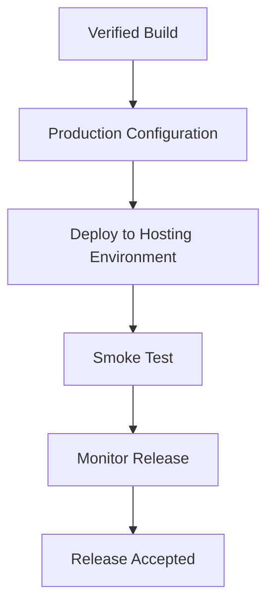

# 4. Deployment

## 4.1 Phase Objective

This phase prepares the application for production release by validating the build, aligning configuration, and completing deployment steps in a controlled order.

## 4.2 Deployment Scope

Deployment covers the release readiness activities needed to make the current application available in a live environment.

### 4.2.1 Release Activities

- Build verification and production readiness checks
- Environment configuration review
- Database and service alignment
- Hosting and runtime preparation
- Post-deployment smoke validation

## 4.3 Deployment Flow

The release process follows a short Agile delivery path that emphasizes verification before and after go-live.

## 4.4 Deployment Outcome

The deployment phase ensures that the application is delivered with minimal disruption and that immediate issues can be detected quickly through smoke testing and monitoring.

## 4.5 Phase Effort

- Planned hours: 25
- Outcome: release-ready application deployed and checked
