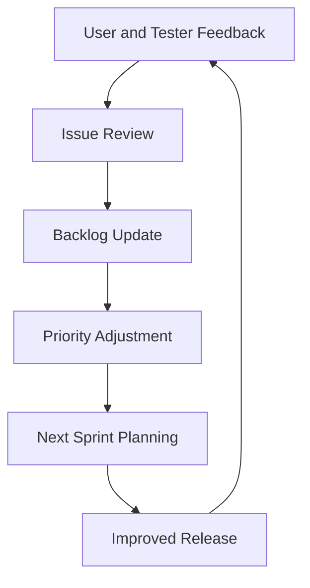

# 5. Feedback

## 5.1 Phase Objective

This phase captures user, tester, and stakeholder feedback after release so that the product backlog can be adjusted based on real usage and review findings.

## 5.2 Feedback Scope

Feedback is collected from the current product experience and used to identify refinements for the next Agile iteration.

### 5.2.1 Feedback Sources

- End user experience observations
- Admin review and moderation needs
- Test team defect reports
- Feature improvement requests
- UI and usability suggestions

## 5.3 Feedback Loop

The Agile framework uses feedback as a control point for prioritizing changes and shaping future sprints.

## 5.4 Feedback Outcome

This phase keeps the project responsive to real usage patterns and ensures that product changes are driven by evidence rather than assumptions.

## 5.5 Phase Effort

- Planned hours: 25
- Outcome: prioritized improvement list for future iterations
