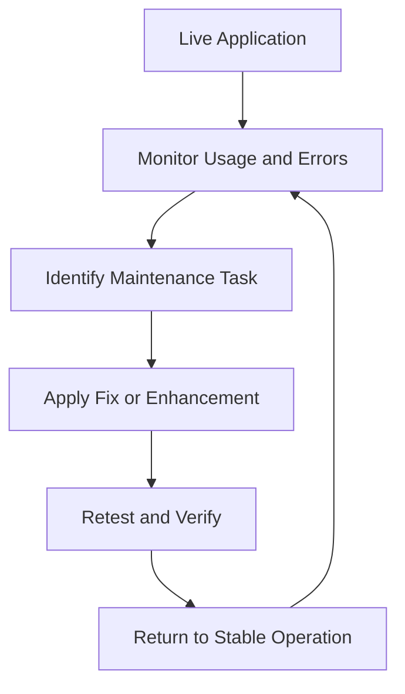

# 6. Maintenance

## 6.1 Phase Objective

This phase covers ongoing support after deployment, including fixes, monitoring, small enhancements, and documentation upkeep to keep the platform stable and usable.

## 6.2 Maintenance Scope

Maintenance is treated as a continuous Agile cycle rather than a final one-time task.

### 6.2.1 Maintenance Activities

- Bug fixing and regression correction
- Monitoring runtime behavior and user issues
- Minor feature refinements
- Documentation updates
- Security and usability improvements

## 6.3 Operational Cycle

## 6.4 Maintenance Outcome

The maintenance phase ensures that Focus Hub remains dependable, current, and ready for future Agile improvements after the initial release cycle.

## 6.5 Phase Effort

- Planned hours: 30
- Outcome: stable support cycle with iterative improvements
