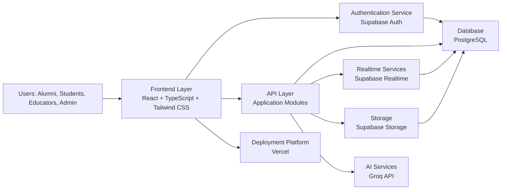
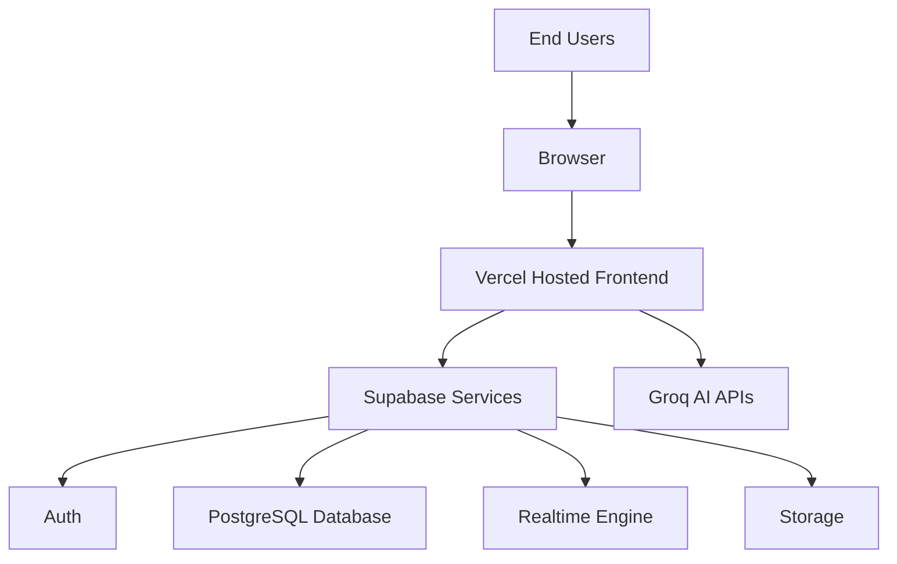
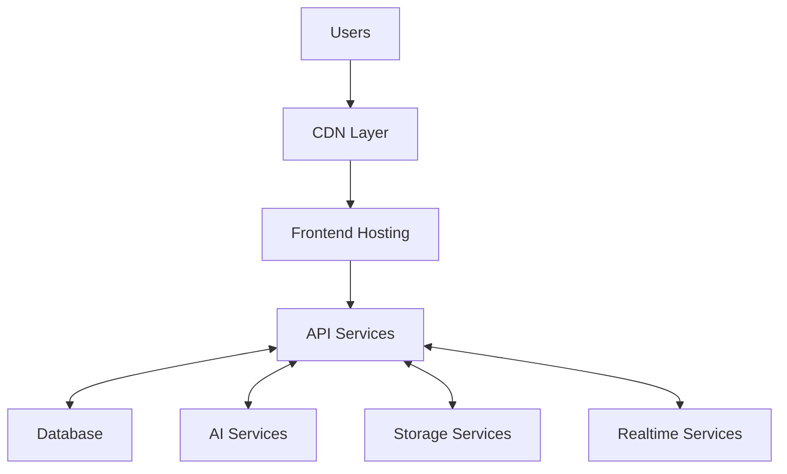
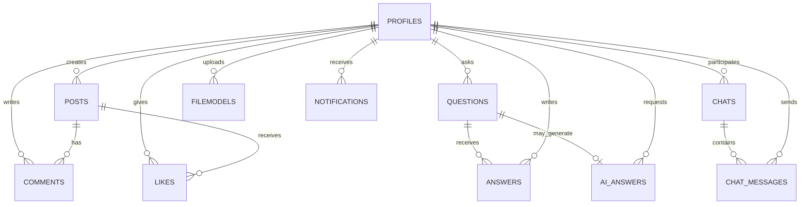

# Focus Hub - AI Powered Alumni Social Platform

## MCA Project Synopsis

**Project Type:** Proposed Web-Based Alumni Social and Learning Platform  
**Technology Stack:** React, TypeScript, Supabase, PostgreSQL, Groq AI, Tailwind CSS, Vercel  
**Document Purpose:** Academic synopsis submission for MCA final year project approval

---

## 1. Introduction

### 1.1 Background of Project
The proposed system, Focus Hub, will be a modern AI powered alumni social platform designed to strengthen communication and collaboration among alumni, students, and educators. The platform will combine social networking, knowledge sharing, real-time interaction, and AI-assisted question answering in one integrated web application. It will be aligned with contemporary academic and community engagement needs, where users will expect fast access to discussion, mentoring, and learning resources.

### 1.2 Need of System
In many educational institutions, alumni engagement will remain fragmented across informal messaging groups, email chains, and disconnected social channels. The proposed system will address this gap by providing a centralized digital space for academic interaction, professional networking, and resource exchange. It will also support community learning by enabling users to ask questions, share documents, and communicate in real time.

### 1.3 Problem Statement
The current methods of alumni communication will often suffer from scattered information, limited participation, weak knowledge retention, and the absence of intelligent support for learning queries. Students may find it difficult to reach experienced alumni, while educators may lack a structured space for extending academic interaction beyond the classroom. The proposed Focus Hub platform will solve these issues by offering a secure, centralized, and AI enabled environment for communication, collaboration, and engagement.

---

## 2. Objectives of the Project

- The proposed system will enable structured interaction between alumni, students, and educators.
- The application will support AI-powered learning assistance for academic and professional queries.
- The platform will provide a centralized communication space for posts, comments, chat, and notifications.
- The system will allow secure sharing of educational resources and documents.
- The platform will deliver real-time updates for feed activities and chat communication.
- The application will support user profiles, role-based access, and moderation features.
- The proposed system will improve alumni engagement and community participation.

---

## 3. Scope of the Project

The proposed platform will be intended for students, alumni, educators, and administrators within an academic community. It will support educational discussion, peer mentoring, event awareness, career guidance, and collaborative learning. The system will be scalable enough to support future growth in the number of users, posts, questions, and shared files. It will also remain accessible through modern browsers on desktop and mobile devices, making it suitable for long-term academic and institutional use.

---

## 4. Existing System Analysis

Traditional alumni communication systems will typically rely on email groups, messaging applications, isolated forums, or static websites. These approaches will not provide a unified environment for interaction, and they may lack moderation, structured knowledge sharing, and intelligent support. In many cases, users will need to switch between multiple tools to post updates, ask questions, exchange files, or participate in discussions.

### 4.1 Limitations of Existing System

- Communication will be fragmented across multiple channels.
- A centralized academic social platform will often be absent.
- Real-time interaction will usually be limited or unavailable.
- AI-powered assistance for questions and learning will not be present.
- Resource sharing will be poorly structured and difficult to manage.
- Moderation and role-based control will be weak or inconsistent.

---

## 5. Proposed System

The proposed Focus Hub system will be a full-stack alumni social platform that will integrate social networking, collaborative learning, file sharing, real-time chat, and AI-assisted Q&A. It will be developed as a modular web application so that each feature area will remain maintainable and expandable. The system will use Supabase services for backend operations, PostgreSQL for relational data storage, Groq APIs for AI answers, and React with TypeScript for a responsive frontend experience.

### 5.1 Features of Proposed System

| Feature | Description |
|---|---|
| User Authentication and Authorization | The system will provide secure sign-up, login, password recovery, and role-based access control for different categories of users. |
| Social Feed System | The platform will allow users to create posts, react to content, comment, and follow updates from the community. |
| AI-Powered Q&A Module | The application will generate AI-assisted answers to academic and professional questions using Groq APIs. |
| Real-Time Chat System | The platform will provide instant messaging and live conversation support for personal and group communication. |
| Resource Sharing Module | Users will be able to upload, download, preview, and organize educational files and documents. |
| User Profile Management | The system will allow users to maintain profile information, avatars, biography, and visibility preferences. |
| Admin Dashboard | The platform will provide moderation, user management, content review, and platform oversight tools. |
| Security and Data Protection | The application will enforce secure access, role checks, database policies, and protected communication. |
| Responsive User Interface | The frontend will adapt to desktop and mobile screens and will maintain a clean academic user experience. |

### 5.2 AI Powered Alumni Platform Overview

The AI integration will strengthen the proposed platform by providing faster, more contextual, and more useful academic assistance within the same collaborative environment. When a user posts a question, the system will generate an AI-assisted response that complements community answers, summarizes relevant knowledge, and improves discoverability of useful information. This will reduce response delays, support continuous learning, and make the platform more effective as an academic support space.

The conceptual architecture will place the AI capability as an intelligent service layer inside the broader platform rather than as a separate application. The user-facing interface will allow students, alumni, educators, and administrators to interact through posts, questions, chat, and resource sharing. Behind this interface, backend services will manage identity, permissions, and relational data, while the knowledge processing layer will prepare prompts, retrieve relevant context, and coordinate AI responses. Real-time communication services will ensure that updates, replies, and community interactions remain immediate and synchronized.

From a stakeholder perspective, the platform will support role-appropriate participation across the academic community. Students will use the system to seek guidance, clarify concepts, and access mentorship. Alumni will contribute experience, professional insight, and career support. Educators will participate in discussion, verification, and knowledge sharing. Administrators will oversee moderation, access control, and platform governance to ensure safe and structured usage.

The expected benefits will include improved access to institutional knowledge, stronger mentorship opportunities, and a unified environment for academic collaboration. AI support will help users receive timely guidance even when community responses are delayed, while the social and realtime features will preserve the human interaction that makes the platform valuable. As a result, the AI component will act as an enabling layer that enhances the overall platform experience and supports the long-term educational goals of the project.

---

## 6. Feasibility Study

### 6.1 Technical Feasibility

The proposed system will be technically feasible because the required technologies will already be available as mature, well-supported tools. React, TypeScript, Supabase, PostgreSQL, Groq APIs, Tailwind CSS, and Vercel will provide a practical stack for rapid development and deployment. The architecture will support modular development, cloud integration, and scalability without requiring highly specialized infrastructure.

### 6.2 Operational Feasibility

The platform will be operationally feasible because it will follow familiar user interaction patterns such as login, feed browsing, posting, chat, and file sharing. Alumni and students will be able to use the system with minimal training. Administrators will also be able to manage users and content through structured dashboard views, which will simplify day-to-day maintenance and moderation.

### 6.3 Economic Feasibility

The project will be economically feasible because it will rely on open-source frontend technologies and managed cloud services that will reduce infrastructure and maintenance cost. Supabase and Vercel will minimize the need for custom server management, while PostgreSQL will provide reliable relational storage without expensive enterprise licensing. This will make the system suitable for academic deployment and institutional adoption.

---

## 7. SDLC Methodology

### 7.1 Agile Development Model

The proposed system will follow the Agile development model because it will support iterative planning, incremental delivery, and continuous feedback. Requirements will be gathered in small groups, implemented module by module, tested frequently, and refined based on review. This approach will help the project remain flexible and aligned with academic expectations and future enhancements.

### Agile Workflow Used in the Project

| Stage | Activities |
|---|---|
| Requirement Gathering | The project team will identify academic, social, and technical needs. |
| Iterative Design | User interface, data flow, and architecture will be refined in small cycles. |
| Development Sprint | Core modules will be implemented incrementally. |
| Testing and Review | Each feature set will be validated and adjusted based on feedback. |
| Deployment Planning | The application will be prepared for cloud hosting and release. |
| Maintenance | Future fixes and improvements will be incorporated after review. |

### Advantages of Using Agile Model

- The project will support continuous refinement of requirements.
- Changes will be easier to manage during development.
- The team will be able to validate modules early and reduce risk.
- Feedback will be incorporated in shorter development cycles.
- The approach will suit a modular web application with multiple features.

---

## 8. System Architecture

### 8.1 High Level Architecture

The proposed architecture will follow a layered web application model. Users will interact with a React and TypeScript frontend, which will communicate with Supabase-backed services for authentication, database access, realtime messaging, and storage. Groq AI services will provide answer generation for the Q&A module. PostgreSQL will manage relational data, and Vercel will host the frontend application in the cloud.

### 8.2 Deployment Architecture

The deployment structure will place the frontend on Vercel, while backend services will be managed through Supabase. The frontend will consume authentication, database, storage, and realtime capabilities through hosted APIs. This separation will simplify deployment, improve scalability, and reduce operational overhead.

### 8.3 Scalability and Performance Considerations

The proposed system will be designed to support public deployment with attention to scalability, responsiveness, and sustained performance. The cloud-based deployment architecture will allow the frontend and backend services to scale independently as usage grows. CDN-backed static asset delivery will reduce page load time by serving images, scripts, and styles from geographically distributed edge locations.

Database indexing and query optimization will improve retrieval efficiency for posts, questions, chat records, and resource metadata. Realtime communication will scale through managed subscription services that will distribute live updates without requiring heavy custom server maintenance. Lazy loading and frontend optimization will reduce initial rendering cost by loading only the required components and content.

API response optimization will improve user experience by limiting unnecessary payloads, structuring requests efficiently, and reducing repeated data access. A modular architecture will support maintainability by separating authentication, feed, chat, AI, and resource modules into distinct functional units. Caching strategies will further reduce repeated computation and improve response speed for frequently accessed data.

The system will also be capable of handling increasing user traffic through layered cloud services and optimized data flow. Its structure will remain adaptable to future microservices adoption if the platform later requires stronger separation of concern. In addition, the proposed system will support SEO and web optimization for public-facing pages through semantic HTML structure, metadata management, mobile responsiveness, optimized routing, performance tuning, accessibility considerations, and improved search engine visibility.

---

## 9. Module Overview

| Module | Main Functionalities | Features | Technologies Used |
|---|---|---|---|
| Authentication Module | The system will manage sign-up, login, password recovery, and session handling. | Role-based access, protected routes, secure authentication. | React, TypeScript, Supabase Auth, PostgreSQL. |
| Social Feed Module | The platform will support posts, likes, comments, and feed updates. | Community engagement, content interaction, moderation support. | React, Supabase Realtime, PostgreSQL. |
| AI Powered Q&A Module | The application will allow users to post questions and receive AI-generated answers. | Answer generation, voting, feedback, copy/regenerate options. | Groq API, React, Supabase, PostgreSQL. |
| Real Time Chat Module | The system will provide private and group messaging. | Live chat, file sharing, online presence, message history. | Supabase Realtime, React, PostgreSQL, Storage. |
| Resource Sharing Module | Users will upload and manage academic documents and files. | Preview, download, visibility control, filtering. | Supabase Storage, React, PostgreSQL. |
| Admin Module | Administrators will supervise users, content, and platform activity. | Dashboard, moderation, system monitoring, role control. | React, Supabase, PostgreSQL. |

---

## 10. Database Overview

The proposed system will use PostgreSQL as a relational database to store structured academic and social interaction data. Relational modeling will support normalized storage, referential integrity, and efficient querying across users, posts, questions, chat messages, and resources. Supabase will manage the database layer and will add security through row level policies and authentication integration.

### Main Database Entities

- **profiles**: The table will store user identity, bio, avatar, and account metadata.
- **posts**: The table will store social feed content and published updates.
- **comments**: The table will store comments and threaded responses on posts.
- **likes**: The table will track post or content reactions.
- **questions**: The table will store questions posted in the Q&A module.
- **answers**: The table will store community answers to questions.
- **ai_answers**: The table will store AI-generated responses and metadata.
- **chats**: The table will store conversation threads and chat metadata.
- **chat_messages**: The table will store individual chat messages.
- **filemodels**: The table will store resource metadata and file visibility details.
- **notifications**: The table will store platform alerts and user notifications.

### 10.1 ER Diagram

---

## 11. Technology Stack

### Frontend Technologies

| Technology | Purpose |
|---|---|
| React | The UI layer will provide component-based rendering and interactive views. |
| TypeScript | The codebase will use static typing for maintainability and reliability. |
| Tailwind CSS | The interface will use utility-based styling for responsive design. |
| Vite | The project will use fast development builds and local serving. |
| React Router DOM | The application will handle client-side navigation. |
| Lucide React | The UI will use icons for clarity and usability. |

### Backend & Services

| Technology | Purpose |
|---|---|
| Supabase Auth | The system will manage authentication and session control. |
| Supabase PostgreSQL | The platform will store relational application data. |
| Supabase Realtime | The application will deliver live updates and chat messaging. |
| Supabase Storage | The system will manage file uploads and document access. |
| Row Level Security | The database will enforce access restrictions at the data layer. |

### AI Integration

| Technology | Purpose |
|---|---|
| Groq API | The platform will generate AI-assisted answers and learning support. |
| LLM Models via Groq | The Q&A module will use language models for contextual responses. |

### Testing & Development Tools

| Technology | Purpose |
|---|---|
| Cypress | The system will support end-to-end browser testing. |
| ESLint | The code will be checked for consistency and quality. |
| Git | The project will use version control for collaboration. |
| VS Code | The development environment will support coding and debugging. |

### Deployment & Cloud Services

| Technology | Purpose |
|---|---|
| Vercel | The frontend will be deployed to a cloud hosting platform. |
| Supabase Cloud | The backend services will be hosted and managed in the cloud. |
| PostgreSQL | The relational data layer will support scalable persistence. |

---

## 12. Security and Testing Overview

### 12.1 Security Overview

The proposed system will use security controls that are suitable for an academic social platform. Authentication will protect user accounts, role-based access will limit sensitive actions, and database policies will prevent unauthorized data access. Secure APIs and validated inputs will reduce exposure to common application threats. Cloud services will also help with controlled deployment and operational security.

#### Security Features

- The system will provide secure authentication and session management.
- The platform will enforce role-based access for users and administrators.
- The database will use row level security policies.
- Input validation will reduce invalid or malicious submissions.
- File access will be controlled through visibility and authorization rules.
- Administrative activities will be restricted and monitored.

#### Security Technologies Used

| Technology | Purpose |
|---|---|
| Supabase Auth | The system will secure sign-in and identity verification. |
| Row Level Security | The database will enforce per-user access policies. |
| TypeScript Validation | The frontend will reduce type-related runtime issues. |
| Protected Routes | The application will limit unauthorized navigation. |
| HTTPS via Hosting | The deployed platform will support secure communication. |

### 12.2 Testing Overview

The proposed testing strategy will verify individual functions, module interactions, UI behavior, and overall system reliability. The project will use a combination of automated and manual testing approaches so that functional correctness, user experience, and integration behavior will be validated before deployment.

#### Testing Types Implemented

- Unit testing will verify individual utility and component behaviors.
- Integration testing will verify module communication and backend interaction.
- UI testing will verify layout, responsiveness, and interaction flow.
- API testing will verify request and response behavior.
- System testing will verify end-to-end user journeys.
- Performance testing will evaluate how the application responds under sustained usage.
- Scalability testing will assess how the system will behave as user and data volumes grow.
- Load testing will examine behavior under concurrent requests and peak traffic conditions.
- Responsiveness testing will confirm usability across desktop and mobile viewports.

#### Testing Tools Used

| Tool | Purpose |
|---|---|
| Cypress | The platform will use browser automation for end-to-end testing. |
| Browser Testing | The interface will be validated across supported environments. |
| Manual Review | The project will be checked for usability and workflow consistency. |

#### Major Tested Modules

- Authentication module
- Social feed module
- AI powered Q&A module
- Real time chat module
- Resource sharing module
- Admin dashboard module

---

## 13. Hardware and Software Requirements

### Hardware Requirements

| Component | Minimum Requirement | Recommended Requirement |
|---|---|---|
| Processor | Dual-core processor | Quad-core processor or better |
| RAM | 4 GB | 8 GB or more |
| Storage | 2 GB free space | 10 GB or more |
| Internet Connectivity | Stable broadband connection | High-speed broadband connection |

### Software Requirements

| Software | Requirement / Purpose |
|---|---|
| Operating System | Windows, Linux, or macOS |
| Node.js | Runtime for frontend development and tooling |
| Browser | Modern browser such as Chrome, Firefox, or Edge |
| VS Code | Source code editing and project development |
| Supabase | Backend, auth, realtime, and storage services |
| Git | Version control and collaboration |
| Vercel | Deployment platform for the frontend |

---

## 14. Expected Outcomes and Future Enhancements

The proposed system will improve alumni interaction by creating a single digital space for learning, discussion, and collaboration. It will strengthen academic networking, support real-time communication, and make educational resources easier to access and share. AI assistance will improve the speed and usefulness of answers to user questions, while the modular architecture will support future expansion.

### Future Enhancement Possibilities

- The platform will support a dedicated mobile application in the future.
- The system will introduce AI recommendation features for posts and resources.
- Video conferencing and event streaming may be added later.
- An analytics dashboard will provide deeper community insights.
- Machine learning-based personalization may improve content discovery.
- Additional notification and automation features may be integrated.
- The platform will support distributed deployment for higher availability and reach.
- AI scalability improvements will allow smarter answer generation under larger workloads.
- Advanced analytics will help institutions understand engagement and content trends.
- The architecture will remain suitable for migration toward scalable microservices.
- Mobile application scalability will support broader adoption across handheld devices.

---

## 15. Conclusion

The proposed Focus Hub - AI Powered Alumni Social Platform will provide a structured, secure, and scalable solution for academic and alumni collaboration. It will combine social networking, real-time communication, resource sharing, and AI-powered assistance in a single environment. The system will follow a modular architecture and Agile development methodology, which will support maintainability, responsiveness, and future growth. As a result, the proposed platform will offer meaningful educational value and will serve as a practical MCA project aligned with modern web and AI technologies.

---

## 16. References / Bibliography

1. React Documentation. Available at: https://react.dev/
2. TypeScript Documentation. Available at: https://www.typescriptlang.org/docs/
3. Supabase Documentation. Available at: https://supabase.com/docs
4. PostgreSQL Documentation. Available at: https://www.postgresql.org/docs/
5. Groq Documentation. Available at: https://console.groq.com/docs
6. Tailwind CSS Documentation. Available at: https://tailwindcss.com/docs
7. Cypress Documentation. Available at: https://docs.cypress.io/
8. Pressman, R. S. Software Engineering: A Practitioner's Approach. McGraw-Hill.
9. Sommerville, I. Software Engineering. Pearson.
10. Beck, K. Manifesto for Agile Software Development. https://agilemanifesto.org/

---

## Synopsis Context Note

This synopsis will be aligned with the existing Focus Hub documentation set, including the system design notes, implementation overview, module documentation, and technical reports. The next project phases will be based on this proposed structure so that the detailed development, testing, and deployment documents will remain consistent with the approved synopsis.