# Kulkarni's Focus Hub — Final Viva Presentation (v2)

**Tagline:** AI-Powered Student–Alumni Career & Mentorship Platform
**Format:** 16:9, Dark Theme, Glassmorphism, Minimal
**Design language:** Deep charcoal/navy background (#0B0F1A–#111827), frosted-glass cards (`backdrop-filter: blur`), single accent gradient (electric indigo → teal, e.g. #6366F1 → #14B8A6), one accent color for "Implemented," a distinct muted/outline style for "Designed / Phase 2," large sans-serif type (Inter/Poppins), generous whitespace, max ~25 words of on-slide text per slide (detail lives in speaker notes).

**Legend used throughout:**
🟢 Implemented (Phase 1, live in repo) — 🔵 Designed (Phase 2, specified but not built) — 🟣 Future (Phase 3, roadmap)

---

## Slide 1: Title

**Objective:** Establish institutional credibility and introduce the project identity before pivoting to startup framing.

**On-slide text:**
- Mohanlal Sukhadiya University, Udaipur — Department of Computer Science
- **Kulkarni's Focus Hub**
- *Alumni Student Connect Platform Using Generative AI*
- Project Presentation — MCA (4th Semester), Session 2025–26
- Submitted To: Dr. Avinash Panwar, Professor & Head, Dept. of Computer Science, MLSU
- Submitted By: Jingesh Ameta, Roll No. 13, Reg No. 1796267

**Speaker Notes:** "Good [morning/afternoon], panel. I'm Jingesh Ameta, presenting my final MCA project — Focus Hub — an AI-powered platform connecting students and alumni for mentorship and career growth. Over the next few minutes I'll walk through the problem, what's built, how it's built, and what's next."

**Suggested Icons:** University crest / graduation cap, small AI spark icon beside the project name.

**Suggested Animations:** Fade-in of university name → project name scales up with a subtle glow pulse on "Focus Hub" → submission details slide in from bottom, staggered.

**Diagram:** None — clean title card.

**Mermaid Diagram:** N/A

**Key Talking Points:**
- State your name, roll number, and guide clearly and slowly — first impression.
- Bridge immediately into the problem on the next slide; don't linger.

---

## Slide 2: The Problem

**Objective:** Establish the pain point in human terms before showing any technology, so the solution feels motivated.

**On-slide text:**
- Students need mentorship. Alumni want to give back.
- Today: scattered WhatsApp groups, cold LinkedIn DMs, no structure.
- Result: guidance is random, not reliable.

**Speaker Notes:** "Most colleges 'connect' students and alumni through ad-hoc WhatsApp groups or LinkedIn messages. There's no structured way for a student to find the right alumnus, ask a focused question, or get consistent career guidance. Focus Hub exists to fix exactly this gap."

**Suggested Icons:** Broken chain-link icon, scattered chat-bubble cluster, question-mark icon.

**Suggested Animations:** Three pain-point cards fade in one at a time with a slight shake/jitter to visually suggest "chaos," then settle.

**Diagram:** Simple before/after split — left side shows scattered icons (WhatsApp, LinkedIn, email) with dotted disconnected lines; right side (teaser, greyed out) hints at a single organized hub.

**Mermaid Diagram:**
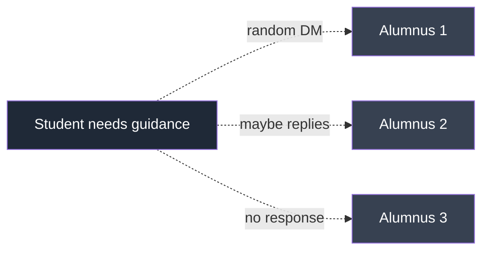

**Key Talking Points:**
- Keep this relatable — every panel member has seen this exact chaos.
- Don't mention Focus Hub by name yet; let the problem breathe for a moment.

---

## Slide 3: The Solution — Product Vision

**Objective:** Introduce Focus Hub as the structured answer to the previous slide's chaos, in one clear sentence.

**On-slide text:**
- **Focus Hub**: one platform for AI-guided mentorship, career support, and alumni connection.
- Three pillars: **Guide** (AI) · **Connect** (Mentors) · **Grow** (Career tools).

**Speaker Notes:** "Focus Hub replaces that chaos with one platform built around three pillars: AI-powered guidance available any time, structured mentor discovery instead of cold messaging, and career tools like resume review baked directly into the student's workflow."

**Suggested Icons:** Compass (Guide), handshake (Connect), upward trend arrow (Grow).

**Suggested Animations:** Three pillar cards rise from bottom in sequence with a soft glass-shine sweep across each on entry.

**Diagram:** Three-pillar hero layout — Guide / Connect / Grow as glass cards under the Focus Hub logo/wordmark.

**Mermaid Diagram:**
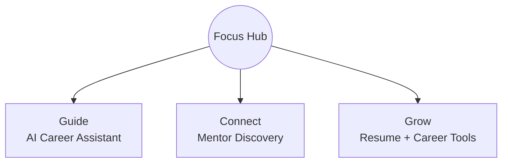

**Key Talking Points:**
- This is your elevator pitch slide — say it like a founder, not a student reading a report.
- Keep to one breath per pillar; detail comes later.

---

## Slide 4: Product Snapshot — Key Features

**Objective:** Give the panel a concrete, scannable list of what the product actually does today, before diving into the roadmap framing.

**On-slide text:**
- 🟢 AI Chat Support — 24/7 career-question assistant
- 🟢 Smart Mentor Matching — find the right alumnus by field
- 🟢 AI Resume Review — instant, structured feedback
- 🟢 Social Feed, Q&A, Real-time Chat, Resource Sharing

**Speaker Notes:** "Concretely, here's what a student can do today: chat with an AI assistant for career questions, get matched to mentors by field, get their resume reviewed by AI, post to a feed, ask questions with AI-assisted answers, chat in real time, and share resources — all live, all working."

**Suggested Icons:** Chat bubble with spark, magnifying-glass-on-profile, document-with-checkmark, feed/grid icon.

**Suggested Animations:** 2x3 feature grid with a staggered fade+rise; each 🟢 badge pulses once on entry to draw the eye to "live today."

**Diagram:** Feature grid (6 glass tiles, icon + one-line label each).

**Mermaid Diagram:** N/A (grid slide, no flow needed)

**Key Talking Points:**
- Every item here is real and demoable — if asked, be ready to show it live.
- This slide is entirely 🟢 Phase 1 — do not let anything alumni-specific slip in here.

---

## Slide 5: MVP Scope & Product Roadmap — Overview

**Objective:** Introduce the three-phase roadmap framing that will structure the rest of the technical narrative and pre-empt the "where's the alumni feature?" question.

**On-slide text:**
- **Phase 1 — Implemented:** Student-facing core, live today.
- **Phase 2 — Designed:** Alumni experience, fully specified.
- **Phase 3 — Future:** AI intelligence & analytics layer.
- Built the Agile way: ship the core, design the next, plan what's beyond.

**Speaker Notes:** "Focus Hub was built using Agile MVP methodology. Rather than trying to build everything at once, we prioritized the student-facing core first — that's Phase 1, and it's fully live. Alumni-side workflows are Phase 2: completely designed, database and UX planned, but intentionally sequenced after the student core so we could validate the foundation first. Phase 3 is the intelligence layer — AI matching and analytics — built on top of real usage data once Phase 1 and 2 are live."

**Suggested Icons:** Three-step staircase icon, roadmap/milestone flag icons per phase.

**Suggested Animations:** Horizontal timeline draws left-to-right; Phase 1 node lights up solid green, Phase 2 outlines in blue (dashed border, "designed" texture), Phase 3 fades in muted purple.

**Diagram:** Horizontal 3-stage roadmap bar (Phase 1 → Phase 2 → Phase 3) with distinct visual treatment per phase (solid/filled vs outline vs dotted).

**Mermaid Diagram:**
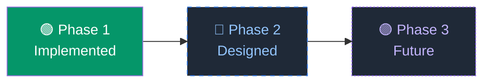

**Key Talking Points:**
- This slide is the single most important framing device in the whole deck — everything after it hangs off this roadmap.
- Say clearly: "designed" means specified end-to-end (schema, flows, UX) but not yet coded — be honest and confident, not apologetic.
- This pre-answers the panel's likely question about alumni before they have to ask it.

---

## Slide 6: Phase 1 — Implemented (Student Core)

**Objective:** Detail exactly what is live and working, mapped one-to-one to the roadmap slide's Phase 1 node.

**On-slide text:**
- 🟢 Student Authentication (Supabase Auth, RLS-secured)
- 🟢 Student Dashboard
- 🟢 AI Resume Review
- 🟢 AI Career Assistant
- 🟢 Mentor Discovery

**Speaker Notes:** "Phase 1 is everything a student needs to get value from day one: secure login, a personalized dashboard, AI resume review, an AI career assistant for on-demand questions, and mentor discovery to find alumni by field. All five of these are implemented, tested, and running in the current build."

**Suggested Icons:** Lock/shield (auth), dashboard-grid, document-scan (resume), chat-spark (AI assistant), people-search (mentor discovery).

**Suggested Animations:** Five feature chips fill in left-to-right, each with a green checkmark "stamp" animation on entry.

**Diagram:** Checklist-style card grid, all items in solid green/filled style to visually contrast with the outlined Phase 2 slide that follows.

**Mermaid Diagram:**
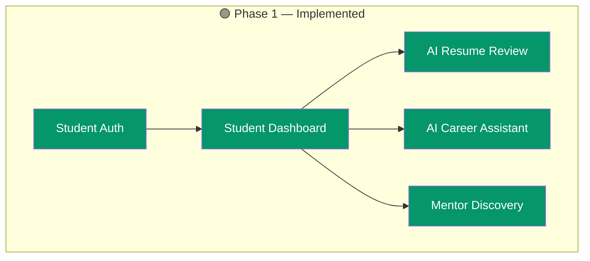

**Key Talking Points:**
- Be ready to demo any one of these live if asked — this is the credibility slide.
- Emphasize RLS (row-level security) briefly — shows engineering maturity, not just UI.

---

## Slide 7: Phase 2 — Designed (Alumni Experience)

**Objective:** Present the alumni module honestly as fully designed but not yet built — the most sensitive slide in the deck, must be unambiguous.

**On-slide text:**
- 🔵 Alumni Dashboard — *designed*
- 🔵 Mentorship Requests — *designed*
- 🔵 Opportunity Posting — *designed*
- 🔵 Session Scheduling — *designed*
- 🔵 Community Analytics — *designed*
- *Scoped for Phase 2 — schema, flows & UX specified; not yet in production.*

**Speaker Notes:** "Alumni-facing features were deliberately scoped as Phase 2. We made a conscious Agile call: validate the student core first, then build the alumni side on a proven foundation rather than splitting effort across both simultaneously. Every item here — the alumni dashboard, mentorship request handling, opportunity posting, session scheduling, and community analytics — has a complete design: data model, user flows, and UI specification. None of it is implemented in the current codebase yet, and I want to be upfront about that distinction."

**Suggested Icons:** Blueprint/drafting-compass icon, dashed-outline versions of the Phase 1 icons to visually signal "planned, not built."

**Suggested Animations:** Cards enter with a dashed-border draw-on effect (like a blueprint being sketched), no "checkmark stamp" — deliberately different motion language from Slide 6.

**Diagram:** Same checklist-grid layout as Slide 6 but rendered in outline/dashed style only, explicitly labeled "Designed — Phase 2" as a banner across the top.

**Mermaid Diagram:**
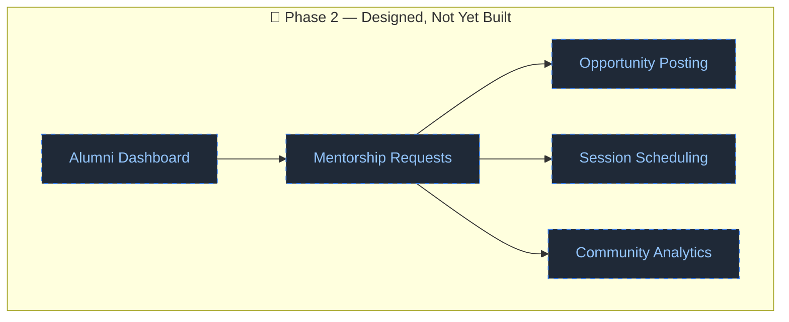

**Key Talking Points:**
- State plainly: "This is designed, not implemented" — do not soften this into ambiguous language.
- If asked "why isn't it done," answer with the Agile sequencing rationale from Slide 9, not excuses.
- This slide should feel like a confident product roadmap disclosure, not a confession.

---

## Slide 8: Phase 3 — Future Intelligence Layer

**Objective:** Show long-term product ambition beyond the current scope, demonstrating vision without overpromising near-term delivery.

**On-slide text:**
- 🟣 AI Matching Engine
- 🟣 AI Recommendation Engine
- 🟣 Community Intelligence
- 🟣 Placement Analytics
- 🟣 Knowledge Hub

**Speaker Notes:** "Looking beyond Phase 2, once both student and alumni sides are live, we get real usage data — that unlocks Phase 3: AI-driven matching between students and alumni, personalized recommendations, community-wide intelligence dashboards, placement analytics for the department, and a curated knowledge hub built from accumulated Q&A. This is the long-term vision, not a near-term commitment."

**Suggested Icons:** Neural-network/node icon, radar/target icon, bar-chart icon, open-book icon.

**Suggested Animations:** Five items appear as floating particles that converge into a loose network graph — conveys "future/emerging" visually distinct from the structured grids of Slides 6-7.

**Diagram:** Loose node-graph / constellation layout rather than a grid — visually signals "conceptual, exploratory."

**Mermaid Diagram:**
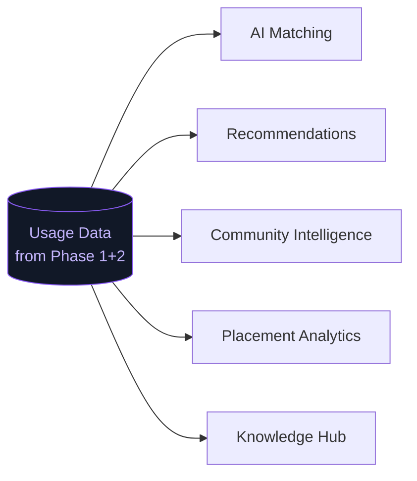

**Key Talking Points:**
- Keep this brief — it's a vision slide, not a deliverable slide.
- Tie it back explicitly to data generated by Phase 1/2, showing the roadmap is causally connected, not a wishlist.

---

## Slide 9: Agile Delivery Approach

**Objective:** Justify the phased sequencing methodologically — this is the academic "SDLC/methodology" requirement, reframed to support the roadmap narrative.

**On-slide text:**
- Built in short, testable cycles — not one big release.
- Plan → Design → Build → Test → Launch → Maintain, repeated per feature.
- Student core prioritized first; alumni & AI intelligence sequenced deliberately.

**Speaker Notes:** "We used Agile: small, testable increments instead of a single monolithic release — like building a house room by room, testing each room before moving to the next. This is exactly why the roadmap has three phases — it's not a gap, it's the methodology working as intended. Each cycle went through planning, design, build, test, and launch, with maintenance ongoing."

**Suggested Icons:** Circular/refresh arrows (sprint cycle), checklist-with-clock.

**Suggested Animations:** Circular Agile-loop diagram rotates into place; each stage highlights in sequence as the speaker narrates it.

**Diagram:** Circular SDLC loop (Plan → Design → Build → Test → Launch → Maintain → back to Plan).

**Mermaid Diagram:**
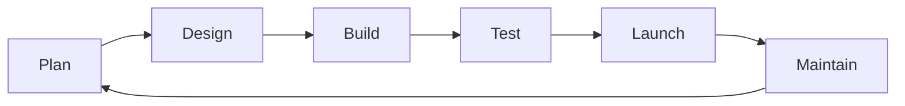

**Key Talking Points:**
- This slide is the methodological justification for the Phase 1/2/3 split — connect it explicitly back to Slide 5.
- Mention it was applied per-feature, not just once for the whole project.

---

## Slide 10: System Architecture

**Objective:** Demonstrate technical depth — show the real stack and how the pieces fit together.

**On-slide text:**
- Frontend: React + TypeScript + Tailwind (Vite)
- Backend: Supabase (Postgres, Auth, Realtime, Storage) + Express (Groq AI service)
- Deployment: Vercel + Docker/Nginx

**Speaker Notes:** "The frontend is React with TypeScript and Tailwind, built on Vite. Supabase handles our database, authentication, real-time subscriptions, and file storage. A small Express service integrates Groq for AI-powered answers and resume review. Everything is secured with row-level security so a student can never read another user's private data. It's deployed on Vercel with a Docker/Nginx setup for containerized environments."

**Suggested Icons:** React logo, TypeScript logo, Supabase logo, small AI-chip icon, Docker whale icon.

**Suggested Animations:** Layered architecture diagram builds bottom-up: database layer fades in first, then backend services, then frontend, then deployment layer on top — visually reinforcing "stack."

**Diagram:** Layered architecture diagram (Client → API/Backend → AI Service → Database → Deployment).

**Mermaid Diagram:**
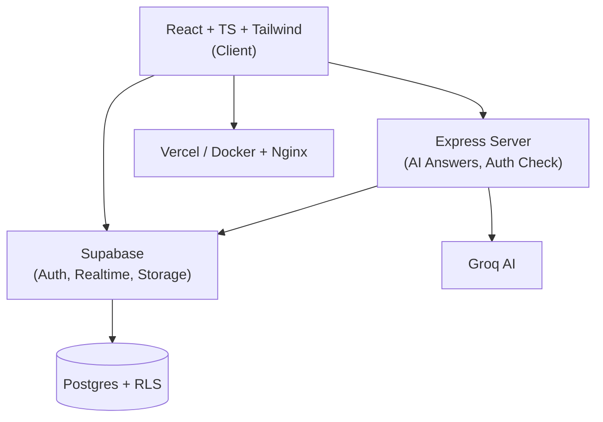

**Key Talking Points:**
- Mention row-level security explicitly — it's a strong technical detail examiners appreciate.
- Keep the explanation under a minute; the diagram should carry most of the weight.

---

## Slide 11: Data Model

**Objective:** Show database design maturity without drowning in ER-diagram detail.

**On-slide text:**
- Core entities: Users, Posts, Chats, Q&A, Resources — all connected.
- Example: one student follows many alumni; posts many questions.

**Speaker Notes:** "The database centers on Users, with Posts, Chats, Q&A, and Resources all linked back to a profile. Relationships are mostly one-to-many — for example, one student can follow many alumni and ask many questions — kept consistent and enforced through foreign keys and RLS policies."

**Suggested Icons:** Database-cylinder icon, connected-nodes icon.

**Suggested Animations:** Entity boxes fade in with connecting lines drawing between them in sequence, like a live ER diagram being sketched.

**Diagram:** Simplified ER diagram — Users at center, Posts/Chats/Q&A/Resources radiating outward.

**Mermaid Diagram:**
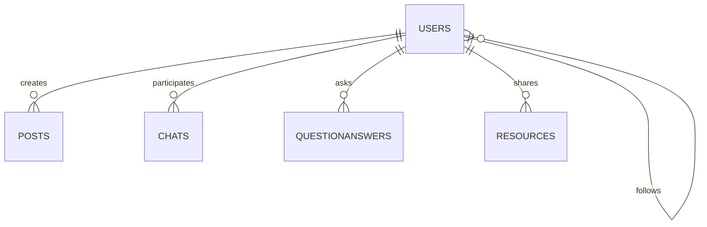

**Key Talking Points:**
- Don't read every field — this is about showing relational thinking, not a schema dump.
- If pressed on alumni-specific fields, be ready to acknowledge (per Slide 7) that `member_type` exists today only as a label, with richer alumni fields planned for Phase 2.

---

## Slide 12: Student User Journey

**Objective:** Walk the panel through the live, working student flow end-to-end.

**On-slide text:**
- Sign Up → Find an Alumnus → Ask a Question → Chat
- Admins manage content & resources behind the scenes.

**Speaker Notes:** "Here's a typical student journey: they sign up, search for an alumnus in their field using mentor discovery, ask a question — either directly or via AI-assisted Q&A — and start chatting in real time. Behind the scenes, admins moderate content and manage shared resources."

**Suggested Icons:** User-plus, search, question-mark-bubble, chat-bubbles.

**Suggested Animations:** Horizontal journey stepper animates left-to-right, each step's icon "lighting up" as a progress dot moves along the path.

**Diagram:** Horizontal journey/stepper diagram, 4 steps.

**Mermaid Diagram:**
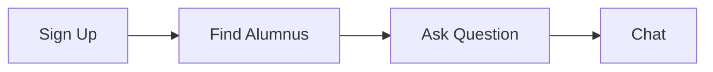

**Key Talking Points:**
- This is the flow to demo live if the panel wants to see the product in action.
- Keep pace brisk — this is familiar territory after Slide 4/6.

---

## Slide 13: Alumni User Journey (Designed — Phase 2)

**Objective:** Present the complete, thought-through alumni experience design — proving the module was fully planned, not skipped.

**On-slide text:**
- 🔵 Login → Complete Profile → Receive Mentorship Requests → Accept/Reject → Schedule Session → Conduct Mentorship → Share Opportunities → Community Recognition
- *Fully designed end-to-end flow — implementation scoped for Phase 2.*

**Speaker Notes:** "This is the alumni journey as designed. An alumnus logs in, completes a richer profile — company, role, graduation year — and starts receiving mentorship requests from students. They can accept or decline each one, schedule a session, conduct the mentorship, optionally share job or internship opportunities with the community, and earn recognition for their contributions. Every step of this flow has been specified — data model, screens, and interactions — as part of Phase 2. It is not live in the current build, and I want that to be completely clear to the panel."

**Suggested Icons:** Login-key, profile-edit, inbox/bell (requests), checkmark/cross (accept-reject), calendar (schedule), mentorship/people icon, briefcase (opportunities), star/badge (recognition).

**Suggested Animations:** Vertical journey timeline draws downward step-by-step, each node appearing in the same dashed/blueprint style used in Slide 7, reinforcing "designed not built."

**Diagram:** Vertical 8-step journey map, dashed-outline styling throughout, banner label "Designed — Phase 2" at top matching Slide 7's treatment.

**Mermaid Diagram:**
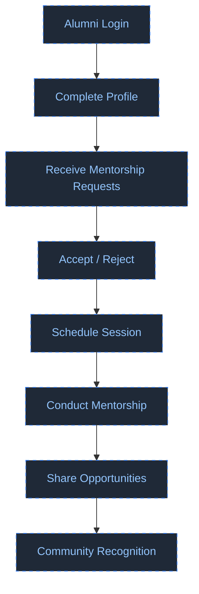

**Key Talking Points:**
- Repeat the "designed, not implemented" framing once more here — consistency across Slides 5, 7, and 13 is what makes this credible rather than evasive.
- If asked about current `member_type` field, explain it exists today only as a profile label with no distinct permissions — the real alumni experience is this Phase 2 design.

---

## Slide 14: Product Walkthrough (Screenshots)

**Objective:** Ground all the previous claims in visual proof of the live application.

**On-slide text:**
- Main Dashboard · Profile Page · Chat Interface · Admin Dashboard

**Speaker Notes:** "Here's what it actually looks like today — the main dashboard, a profile page, the real-time chat interface, and the admin panel, all in a clean, dark-themed UI consistent with what you're seeing in this presentation."

**Suggested Icons:** None needed — screenshots are the visual content.

**Suggested Animations:** Four screenshots in a 2x2 glass-framed grid, each with a subtle zoom-in-on-hover/reveal as it's discussed; browser-chrome mockup frame around each for polish.

**Diagram:** 2x2 screenshot grid with device/browser frame styling.

**Mermaid Diagram:** N/A

**Key Talking Points:**
- Have the actual app open in a browser tab as backup in case screenshots don't fully convince — offer a live demo if time allows.
- Note the visual consistency between the deck's dark/glass theme and the actual product UI, reinforcing design maturity.

---

## Slide 15: Engineering Practices

**Objective:** Show software engineering maturity — organization, typing discipline, version control — for the technical evaluators on the panel.

**On-slide text:**
- Feature-sliced architecture — Chat, Feed, Q&A each self-contained.
- Fully typed with TypeScript across frontend and shared types.
- Every change tracked in Git — full history, no black boxes.

**Speaker Notes:** "Code is organized by feature — a folder for chat, one for feed, one for Q&A — so it's easy to locate and modify any part of the system. It's built with React, TypeScript, Supabase, and Node.js. TypeScript gives us compile-time safety across the app. And every change is tracked in Git, giving us a complete history of the project's evolution."

**Suggested Icons:** Folder-tree icon, TypeScript logo, Git-branch icon.

**Suggested Animations:** Folder-tree icon expands outward to reveal feature sub-folders (Chat/Feed/Q&A) in a quick unfold animation.

**Diagram:** Simple folder-tree visual: `src/features/{chat, feed, qa, admin, profile}`.

**Mermaid Diagram:**
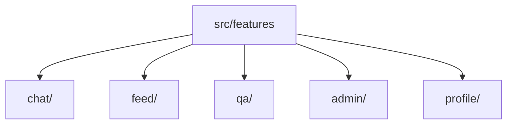

**Key Talking Points:**
- Mention feature-slicing was a deliberate refactor decision, not the original structure — shows iterative improvement.
- Good moment to mention ongoing hardening work (typecheck/lint/test scripts) if asked about code quality practices.

---

## Slide 16: Quality & Testing

**Objective:** Demonstrate that correctness is verified, not assumed — key for academic rigor.

**On-slide text:**
- Two testing layers: manual + automated (Cypress E2E).
- Example checks: Login flow, Feed post creation, Q&A submission.

**Speaker Notes:** "We test two ways: manually during development, and automatically with Cypress end-to-end tests. For example, an automated test logs in and verifies it lands on the right page, or creates a post and confirms it shows up in the feed — every time a change is made, these run to catch regressions."

**Suggested Icons:** Checkmark-shield, test-tube/flask icon, Cypress logo.

**Suggested Animations:** Three test-case cards flip in sequence from "pending" (grey) to "passed" (green checkmark), simulating a test run.

**Diagram:** Three test-case cards: Login Test / Feed Test / Create Post Test, each showing a pass indicator.

**Mermaid Diagram:**
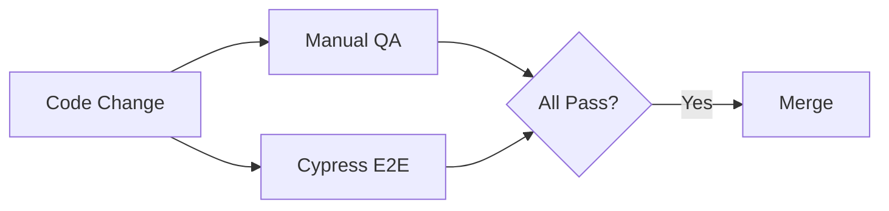

**Key Talking Points:**
- Be honest if asked about unit test coverage — mention it's an area of active investment (ties to ongoing gap-analysis-driven hardening).
- Keep this slide fast-paced; testing slides can drag if over-explained.

---

## Slide 17: CI/CD & Deployment

**Objective:** Show that the project follows real-world DevOps practice, not just "it runs on my machine."

**On-slide text:**
- Hosted on Vercel (frontend) + Supabase (data) — always live.
- Release flow: Push → Migrate DB → Test on Staging → Go Live.
- Docker/Nginx containerization for portable deployment.

**Speaker Notes:** "The app is hosted on Vercel for the frontend and Supabase for data, so it's always live. Our release flow pushes code, updates the database, tests on staging, then deploys — with the pipeline automated end-to-end. We've also added Docker and Nginx configuration so the app can be containerized and deployed consistently across environments."

**Suggested Icons:** Vercel triangle logo, Supabase logo, Docker whale, pipeline/conveyor-belt icon.

**Suggested Animations:** Pipeline diagram animates left-to-right as a small "package" icon travels through each stage (Push → Migrate → Test → Deploy).

**Diagram:** Horizontal CI/CD pipeline diagram, 4 stages.

**Mermaid Diagram:**
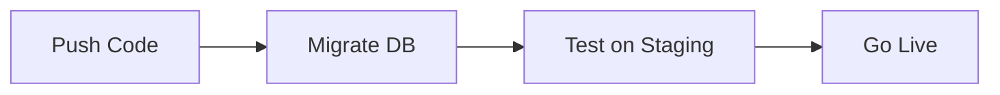

**Key Talking Points:**
- Mention this pipeline work is actively being hardened (CI running lint/typecheck/tests/build, not just E2E) — shows continuous improvement mindset.
- Keep claims scoped to what's actually configured; don't overstate pipeline maturity beyond what's in the repo.

---

## Slide 18: Roadmap & What's Next

**Objective:** Close the technical narrative by tying back to the Phase 2/3 roadmap with concrete near-term priorities.

**On-slide text:**
- Next up: build out Phase 2 (Alumni experience).
- Then: Phase 3 intelligence layer — AI matching, analytics.
- Ongoing: monitoring, logging, backups, error alerts.

**Speaker Notes:** "Looking ahead, the immediate next step is implementing Phase 2 — the alumni experience we walked through earlier — followed by Phase 3's intelligence features once we have real usage data. In parallel, we're continuing to invest in monitoring: logs, backups, and error alerts, so the platform stays reliable as it grows."

**Suggested Icons:** Roadmap/flag icon, bell/alert icon, upward-graph icon.

**Suggested Animations:** Same roadmap bar style as Slide 5 reappears, now with a "you are here" marker sitting just past Phase 1, reinforcing narrative closure.

**Diagram:** Recap of the Slide 5 roadmap bar with a progress marker.

**Mermaid Diagram:**
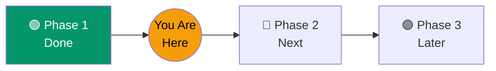

**Key Talking Points:**
- Bring the roadmap full-circle — panel should leave with the Phase 1/2/3 structure clearly remembered.
- End on momentum, not apology — "next up" framing, not "still missing."

---

## Slide 19: Thank You / Q&A

**Objective:** Close confidently and open the floor for questions.

**On-slide text:**
- Thank you.
- Kulkarni's Focus Hub — AI-Powered Student–Alumni Career & Mentorship Platform.
- Questions welcome.

**Speaker Notes:** "Thank you for your time. To summarize: Focus Hub delivers a fully working AI-powered student experience today, with the alumni experience completely designed and ready for its next build phase. I'm happy to take any questions."

**Suggested Icons:** Simple checkmark or wave/hand icon, subtle Focus Hub wordmark.

**Suggested Animations:** Gentle fade-in of "Thank You" with the accent gradient sweeping once across the wordmark; no further motion — let it sit calmly for Q&A.

**Diagram:** None — clean closing card, mirrors Slide 1's minimalism.

**Mermaid Diagram:** N/A

**Key Talking Points:**
- Restate the Phase 1 (done) / Phase 2 (designed) distinction one final time in your closing line — repetition builds credibility.
- Pause fully before taking questions; don't rush off this slide.

