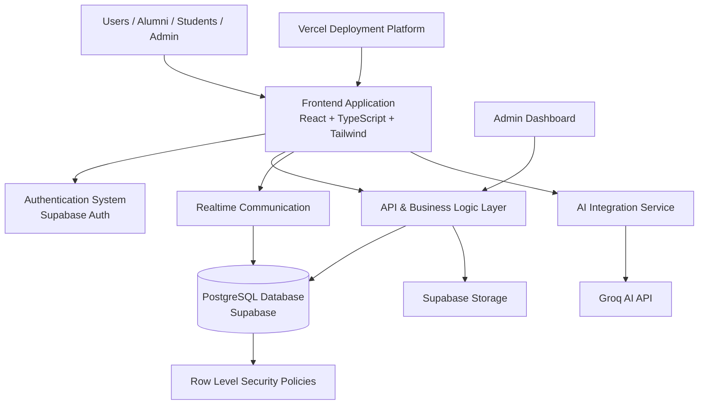

# 7. System Overview Architecture

This section presents a high-level, conceptual architecture for the proposed Focus Hub platform. The description emphasizes intended capabilities and design intent; specific technology selections are deferred to the technical design phase.

Architectural Layers (conceptual)
- Presentation Layer: user-facing interfaces and accessibility considerations.
- Application Layer: business logic, APIs, and orchestration services.
- Service Layer: identity, knowledge services (AI), and real-time communication.
- Data Layer: persistent storage and query/indexing services with governance controls.
- Infrastructure Layer: managed cloud hosting, content delivery, and operational services.

Design Principles
- Modularity to enable iterative development and component validation.
- Separation of concerns between user interface, business logic, and knowledge services.
- Policy-aligned data governance and access controls.

---

# 7.1 High-Level Conceptual Diagram



### Architecture Explanation (concise)
- Presentation: supports responsive and accessible client experiences.
- Identity: provides authentication, authorization, and session governance.
- API: coordinates requests, enforces policies, and mediates data access.
- Knowledge/AI: provides query understanding, retrieval augmentation, and response synthesis.
- Realtime: supports synchronous messaging and live update propagation.
- Data: maintains canonical records, indices, and governance artifacts.
- Infrastructure: managed hosting and delivery services for scalability and resilience.

---

# 7.2 Deployment Overview (conceptual)

Deployment Approach
The platform is proposed to deploy on managed cloud infrastructure offering CDN-enabled frontend delivery, managed database services, and scalable backend hosting. Integration with third-party AI providers is anticipated for knowledge processing.

```mermaid
flowchart LR

    U[Client Browser / Device]

    U --> CDN[Edge / CDN Delivery]

    CDN --> APP[Client Application]

    APP --> BACKEND[Managed Backend Services]

    BACKEND --> DB[(Managed Relational Store)]

    BACKEND --> AUTH[Identity Service]

    BACKEND --> STORAGE[Object Storage]

    APP --> AI[External AI Provider(s)]

```

Deployment Considerations
- Use managed services to reduce operational overhead and improve reliability.
- Apply encryption, access controls, and governance policies across layers.
- Stage deployments to validate scalability and security hypotheses progressively.

---

# 8. Module Overview (conceptual)

The platform is organized into modular capabilities; each module is described at a conceptual level with planned responsibilities.

Major Modules (planned)
- Authentication and Authorization
- Social Feed and Community Interaction
- AI-Enabled Q&A and Knowledge Services
- Real-Time Communication
- Resource Management and Sharing
- Administration and Governance

For each module, implementation choices and integration patterns will be defined during the technical design phase.

---

# 8.1 Authentication and Authorization (planned)

Planned Responsibilities
- Identity lifecycle: registration, recovery, and deprovisioning.
- Role and policy enforcement for user interactions.
- Session management and token governance.

Security Objectives
- Protect user credentials and session tokens.
- Support policy-driven access controls and audit logging.

---

# 8.2 Social Feed and Community Interaction (planned)

Planned Responsibilities
- Structured posting, threaded discussions, and content interaction.
- Moderation workflows and content policy enforcement.
- Mechanisms for surfacing relevant discussions and announcements.

---

# 8.3 AI-Enabled Q&A and Knowledge Services (planned)

Planned Responsibilities
- Facilitate user queries, retrieval of institutional artifacts, and AI-assisted response generation.
- Support feedback loops for answer curation and community validation.

Research Considerations
- Evaluate provider models for domain adaptation, latency, and cost-effectiveness.

---

# 8.4 Real-Time Communication (planned)

Planned Responsibilities
- Support low-latency messaging, group coordination, and presence indicators.
- Provide mechanisms for reliable delivery and persistence where appropriate.

---

# 8.5 Resource Management and Sharing (planned)

Planned Responsibilities
- Upload, index, and provide controlled access to educational artifacts.
- Support metadata, categorization, and searchability for shared resources.

---

# 8.6 Administration and Governance (planned)

Planned Responsibilities
- User and content moderation, reporting workflows, and analytics for governance.
- Operational monitoring and compliance reporting.

Implementation Note
Specific technology selections and integration patterns will be articulated in the subsequent technical design and deployment chapters.
