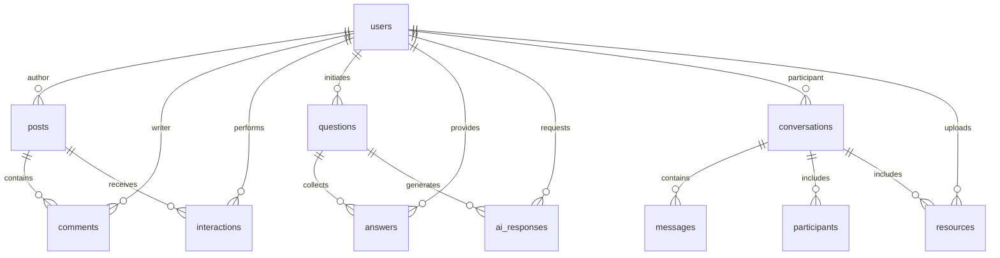

# 9. Data Architecture (proposed)

Overview
A relational data model is proposed to support persistent storage of user identity, community interactions, knowledge artifacts, and operational records. The model emphasizes referential integrity, policy-aligned access controls, and query optimization.

Principal Entity Categories (conceptual)
- User profiles and identity records
- Community artifacts: posts, discussions, and interactions
- Knowledge resources: questions, answers, and AI-generated content
- Communication records: messages, presence, and notification logs
- Administrative records: moderation actions and audit logs

Design Principles
- Normalized relational structure to reduce redundancy and enforce consistency.
- Role and attribute-based access policies at the data layer.
- Indexed query paths to support interactive latency requirements.

*Database schema diagram showing entity relationships and data model structure.*

---

# 9.1 Conceptual Entity Relationships

Relationships (high-level)
- Users generate posts, questions, and community artifacts.
- Posts and questions aggregate community responses and AI-assisted answers.
- Conversations maintain message history and participant membership.
- Users contribute resources indexed for discovery and access.

---

# 10. Architecture and Technology Considerations (proposed)

This section outlines proposed architectural layers and technology considerations; specific vendor selection and implementation choices will be detailed in the technical design phase.

Architectural Considerations (high-level)

## Presentation Layer
- Responsive user interface for desktop and mobile contexts.
- Progressive enhancement and accessibility support.
- Client-side state management and caching for offline resilience.

## Backend Services Layer
- RESTful or GraphQL API interface for client communication.
- Role and policy enforcement middleware.
- Session and token management services.

## Data Persistence Layer
- Relational data model with strong consistency guarantees.
- Access policy enforcement at the data layer.
- Query optimization for interactive response times.

## External Integrations
- Third-party AI providers for knowledge services.
- Cloud storage for resource persistence.
- Managed authentication providers (optional).

## Deployment Infrastructure
- Managed cloud hosting for operational simplicity.
- Content delivery networks for global access.
- Monitoring and logging services for operational visibility.

Technology Selection Rationale
Technologies will be selected based on criteria including: operational maturity, security posture, support for the proposed modular architecture, vendor SLA and scalability characteristics, and total cost of ownership. Specific selections and trade-offs will be documented in the technical design phase.

---

# 11. Security and Quality Assurance (proposed)

This section outlines proposed security and quality assurance principles; detailed threat models, security testing plans, and SLAs will be developed during technical design.

## 11.1 Security Approach (proposed)

Principles
- Defense in depth: multiple security layers (identity, API, database, transport).
- Least privilege: users and services are granted minimal necessary permissions.
- Audit and accountability: security-relevant events are logged and reviewable.
- Data protection: encryption in transit and at rest for sensitive information.

Proposed Mechanisms
- Multi-factor authentication for privileged accounts.
- Role-based and attribute-based access control.
- Data-layer policy enforcement for fine-grained access control.
- Input validation and output encoding to prevent injection attacks.
- Secure credential management and key rotation protocols.
- Regular security assessments and vulnerability scanning.

---

## 11.2 Quality Assurance Approach (proposed)

Testing Strategy
A multi-layer testing approach is proposed:
- Unit testing for individual components and modules.
- Integration testing for cross-module interactions and API contracts.
- End-to-end testing for complete user workflows.
- Security testing including penetration testing and threat modeling validation.
- Performance and scalability testing under projected load.

Test Automation
Automated test suites are proposed for regression prevention and continuous validation. Test coverage targets and specific test frameworks will be defined during technical design.

Continuous Integration and Deployment
A CI/CD pipeline is proposed to automate build, test, and deployment workflows. This will support rapid validation and reduce human error in deployment processes.

---

# 12. Conclusion and Future Work

Summary
This document has presented the conceptual design and anticipated benefits of Focus Hub, an AI-enabled alumni collaboration platform. The proposal emphasizes:
- centralized, purpose-built infrastructure for academic networking and collaboration,
- integration of AI services to enhance knowledge discovery and access,
- modular, cloud-oriented architecture for scalability and operational resilience,
- security and governance as foundational concerns,
- systematic design and validation practices.

Platform Value Proposition
Focus Hub is positioned to address institutional needs for alumni engagement, mentorship, and collaborative learning by providing a unified, intelligent environment that bridges communication gaps and promotes knowledge reuse.

Next Steps
Subsequent project phases will include:
- Detailed technical architecture and design specifications.
- Security threat modeling and compliance alignment.
- Prototype development and user validation.
- Scalability and performance testing.
- Operational readiness planning and deployment strategy.

Future Enhancement Opportunities
Upon successful initial deployment, the platform may be extended with:
- advanced analytics and learning analytics integration,
- recommendation systems for content and mentorship matching,
- multimedia conferencing and collaborative tools,
- career services and opportunity marketplace integration,
- mobile-native applications,
- APIs and integrations with institutional information systems.

Closing Statement
The Focus Hub initiative represents a comprehensive response to institutional needs for intelligent, scalable alumni engagement. The proposed architecture and methodology balance rigorous design principles with practical implementation considerations, providing a strong foundation for systematic development and validation.
