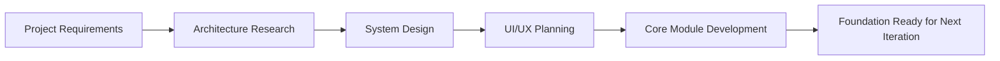
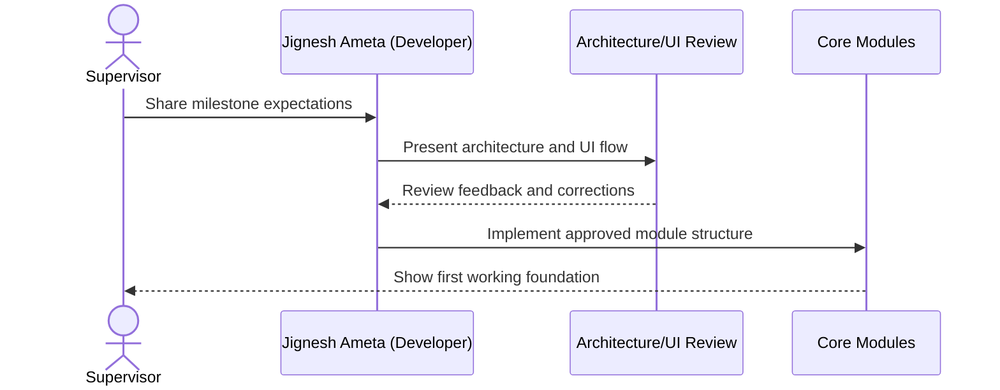
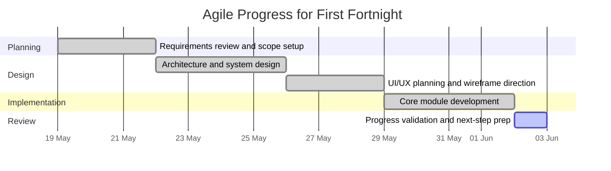

# Fortnightly Project Progress Report

**Project Title:** Focus Hub  
**Reporting Period:** 19 May 2026 to 2 June 2026  
**Prepared By:** Jignesh Ameta (Junior Software Engineer)

## Overview

During this fortnight, substantial progress was made on the project in both planning and implementation. The main focus areas were researching and developing the project architecture, defining the system design, preparing the UI/UX direction, and implementing the core modules of the application.

This phase helped establish a clear technical foundation for the project and improved the overall structure of the development process. The work completed during this period has made the project more organized, scalable, and ready for further feature development.

## Work Completed

### 1. Project Architecture Research and Development
A detailed study of the project requirements was conducted to determine the most suitable architecture for the application. This included identifying the main functional areas of the system, how the modules should interact, and how the application should be structured for maintainability and future expansion.

Based on this research, the project architecture was developed to support the core features of the application in a clean and organized manner. The architecture was designed to ensure that the system remains flexible enough to accommodate future enhancements and additional modules.

### 2. System Design
The system design phase focused on translating the project requirements into a practical technical structure. The application layers, data flow, and module relationships were planned to ensure smooth communication between different parts of the system.

This work provided a clearer understanding of how the application will operate as a whole. It also helped define a more stable development path by establishing the technical foundation needed for implementation and integration.

### 3. UI/UX Design
The user interface and user experience design were developed with the goal of making the application simple, intuitive, and visually clear. Design decisions were made to ensure that users can navigate the system easily and interact with its features without confusion.

Attention was given to layout, visual hierarchy, consistency, and usability. The UI/UX work supports a more polished and user-friendly application experience, which will be important as more features are added in later stages.

### 4. Core Module Development
The core modules of the project were developed during this period. These modules form the basis of the application and are essential for the main workflow of the system.

This development work has helped establish the initial working version of the project and created a stronger base for upcoming features. The completed modules are expected to support further integration and testing in the next phase of development.

## Module List and Technical Details

The following core modules were defined and advanced during this fortnight:

| Module | Main Features | Technical Details |
| --- | --- | --- |
| Project Architecture Module | Layered structure, feature boundaries, scalability planning | Defines how front-end, data, and business logic are separated for maintainability. |
| System Design Module | Data flow, module interactions, application structure | Establishes the technical blueprint for integrating all major application parts. |
| UI/UX Design Module | Layout planning, user flow, interface consistency | Guides the component structure and visual hierarchy for a user-friendly interface. |
| Core Application Module | Base application workflow, initial functionality, shared logic | Provides the foundation for the main screens, routes, and reusable application behavior. |
| Shared Component Setup | Buttons, forms, containers, reusable layout blocks | Supports clean implementation and reduces duplication in the front-end layer. |

## Agile Workflow Visuals

### Architecture-to-Implementation Flow

### Example Design Review Flow

### Agile Progress Gantt Chart

## Progress Summary

Overall, this fortnight was productive and well-focused. The project now has:
- a well-researched and structured architecture,
- a defined system design,
- a clearer UI/UX direction, and
- developed core modules that support the application foundation.

These achievements have significantly advanced the project and reduced uncertainty for the remaining development stages.

## Challenges and Observations

While the work progressed smoothly, careful planning was required to ensure that the architecture and module structure aligned with the project goals. The design decisions taken during this period were important in keeping the system scalable and maintainable.

The UI/UX work also required balancing usability with the technical capabilities of the system. This helped ensure that the application remains practical for users while still being feasible to implement efficiently.

## Next Steps

The next phase of the project will focus on:
- completing the remaining modules,
- integrating all developed components into the main application,
- testing and refining system behavior,
- improving UI/UX details based on implementation feedback, and
- preparing the project for the next milestone.

## Supervisor Comments

Supervisor: Senior Software Engineer & CEO / Founder

Observations and technical guidance:

- Architecture: The initial architecture demonstrates sound separation of concerns and a sensible modular breakdown. Continue enforcing strict module boundaries (feature ⟂ data ⟂ UI) and document API contracts (request/response shapes) for every backend endpoint and frontend consumer. Consider a small OpenAPI spec or typed request/response interfaces to reduce integration friction.

- Code Quality & Tooling: Adopt continuous linting and TypeScript strictness (if not already enabled) and add pre-commit checks (lint, typecheck, test smoke). This early discipline will pay large dividends during integration.

- Testing: Prioritize unit tests for core logic and add lightweight integration tests for critical flows (auth, create/read posts, realtime events). Create small fixtures for reproducible test data and isolate DB-dependent tests with a test schema or ephemeral Supabase project.

- Documentation: Keep `docs/implementation` and the module README files up to date. Add a short "API contract" section to each module doc so future integration or contributor work can pick up without deep onboarding.

- Security & Data: Begin listing data classification for user data and ensure auth flows, password handling, and token expiry policies follow current best practices. Plan minimal data retention and backups strategy now — migrations change data shape and you must be able to rollback safely.

- Next immediate steps: create a short checklist for integration day (migrations applied to test DB, run integration suite, smoke E2E, spot check realtime events). Reserve a 1–2 hour design review once component contracts are frozen.

Closing: Good progress — the foundation looks solid. Keep moving with the same discipline, and treat integration as the first high-risk milestone (not merely a checkbox). I am available for a quick architecture review when you freeze the first set of cross-module API contracts.

## Conclusion

This fortnight marked an important stage in the development of the project. The research and development of the architecture, system design, and UI/UX direction, along with the implementation of the core modules, have created a solid foundation for the project.

The project is now in a stronger position for continued development, integration, and testing in the upcoming fortnight.