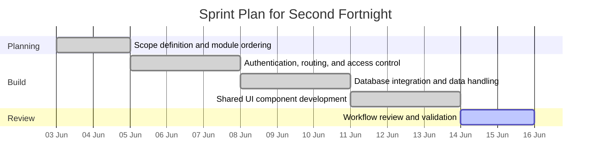
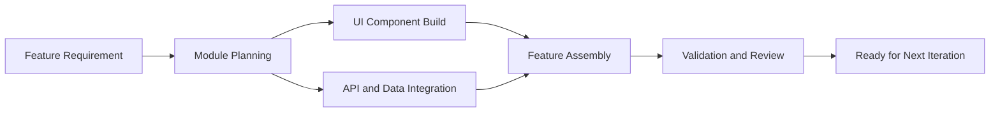
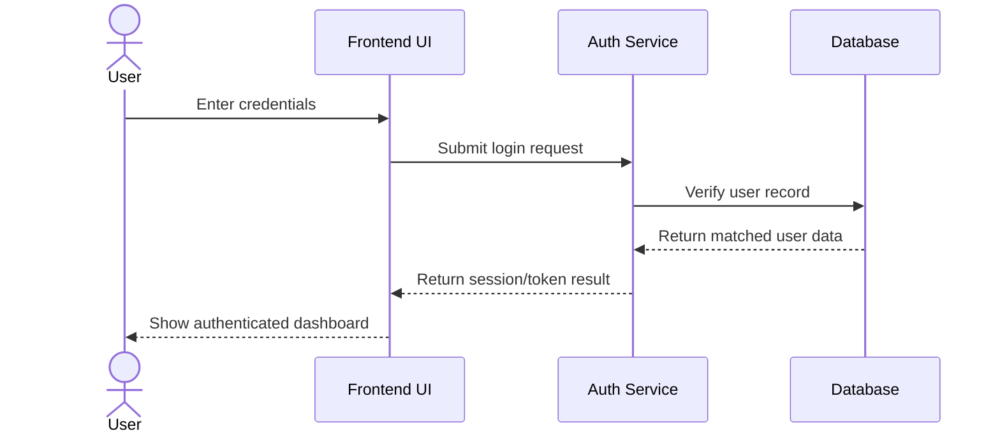
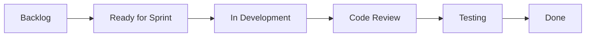
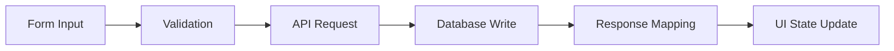
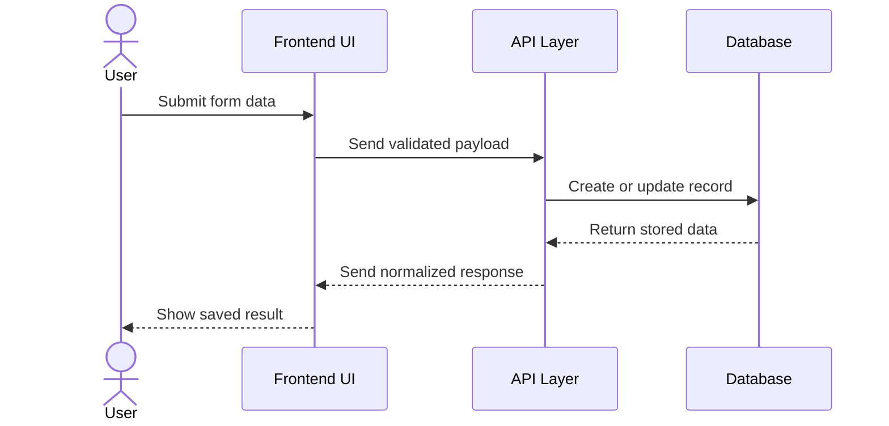
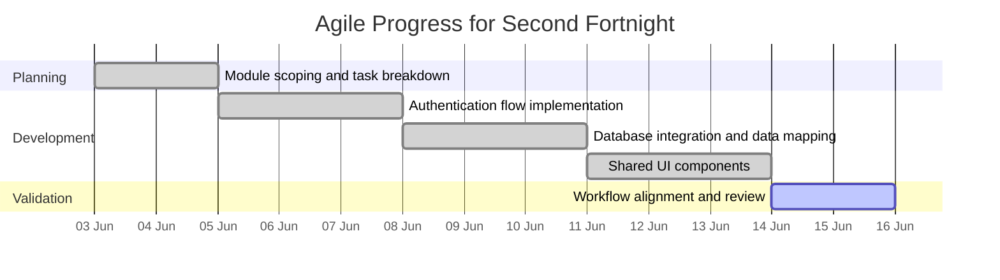
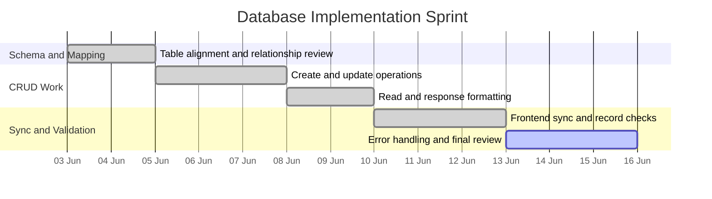

# Fortnightly Project Progress Report

**Project Title:** Focus Hub  
**Reporting Period:** 3 June 2026 to 16 June 2026  
**Prepared By:** Jignesh Ameta (Junior Software Engineer)

## Overview

During this fortnight, the project moved from foundation work into active feature development. The main focus was on building the platform foundation, strengthening the authentication and routing structure, and preparing the shared database and UI layers that other modules depend on. Considerable progress was made in implementing user-facing and backend-facing components that support the core platform shell, including state handling, API/data interaction, and reusable UI foundations.

This phase was important because it expanded the project beyond the initial architecture and core setup. The work completed during this period improved the practicality of the system and created a stronger base for the functional modules that follow. The application was also structured in a way that makes later sprint tasks easier to track and validate.

## Sprint Plan

| Sprint Focus | Target Work Items | Delivery Outcome |
| --- | --- | --- |
| Sprint Planning | Module scoping, dependency ordering, task breakdown | Clear execution path for the second development cycle. |
| Feature Build | Authentication, routing, database integration, shared UI components | Stable platform foundation for downstream modules. |
| Review and Validation | Workflow checks, state sync, interface consistency | Verified foundation ready for the next sprint stage. |

## Work Completed

### 1. Module Expansion and Feature Planning
A detailed review of the remaining feature requirements was carried out to identify the next set of modules to be developed. The focus was placed on arranging the work in a logical sequence so that dependent features could be implemented without disrupting the existing structure.

Based on this planning, the next development tasks were organized around the major application areas, including user management, content interaction, and communication-driven features. This helped ensure that implementation would remain structured and aligned with the project objectives.

The work breakdown also defined what could be completed in parallel and what needed to be sequenced after data and authentication dependencies were in place.

### 2. Authentication and User Flow Development
Work was carried out on the user authentication flow to support secure access to the platform. The login, registration, and session-based interaction paths were refined so that users can move through the application in a controlled and predictable way.

This work helped establish a more complete user journey and prepared the project for feature-level integration. The authentication flow also provided a foundation for role-based functionality and future access control enhancements.

The routing layer was aligned with protected and public paths so authenticated users, guests, and admin users can be directed to the correct pages without breaking the app flow.

### 3. Database Integration and Data Handling
The database layer was further aligned with the application requirements so that the system could store and retrieve data more effectively. Data relationships, table usage, and structured handling of records were reviewed to support the growing set of modules.

This stage improved the consistency between the front-end and the data layer. It also reduced the risk of implementation issues later in the project by ensuring that the application logic and stored data remain properly connected.

The data flow was reviewed with the module owners in mind, so each functional area could use a predictable contract for reads, writes, and record updates.

### 4. Shared UI and Layout Component Development
Reusable interface components were developed and refined to support a more consistent user experience across the application. These components help reduce duplication and ensure that the UI remains uniform as more pages and features are introduced.

The component work also improved development efficiency by making it easier to build new sections of the application using established patterns. This is especially important for maintaining a clean and scalable front-end structure.

This module also supported faster iteration, because new screens could reuse the same layout primitives, spacing rules, and form behaviors.

## Module List and Technical Details

The following foundation modules were identified and advanced during this fortnight:

| Module | Main Features | Technical Details |
| --- | --- | --- |
| Authentication Module | Login, registration, session handling, access control | Handles secure route access, form validation, and persistent user state for authenticated sessions. |
| User Profile Module | Profile view, profile update, avatar and account settings | Uses structured data binding and reusable UI components for profile editing and display. |
| Database Integration Layer | CRUD operations, relational data mapping, record synchronization | Connects application actions to persisted records and keeps the front-end aligned with backend data structures. |
| Routing and Navigation Module | Protected routes, page transitions, view switching | Controls how users move through authenticated and public areas of the application. |
| State Management Module | Shared state, session awareness, interaction updates | Keeps UI state synchronized across pages and feature modules. |
| Shared UI Component Library | Buttons, cards, modals, form fields, layout containers | Promotes consistency, reduces duplication, and supports scalable front-end development. |

## Agile Workflow Visuals

### Example Module Flow

### Authentication Flow Example

### Agile Task Board Flow

### Database Implementation Flow

### Data Synchronization Sequence

### Agile Progress Gantt Chart

### Database Work Sprint View

## Progress Summary

Overall, this fortnight was productive and marked a meaningful shift into feature development. The project now has:
- expanded module planning,
- a more complete authentication flow,
- improved alignment with the database layer, and
- a clearer route and state structure for page interactions,
- reusable interface components for continued development.

These achievements moved the project closer to a functional platform foundation and reduced the remaining uncertainty around module implementation.

## Challenges and Observations

As the feature set expanded, it became increasingly important to maintain consistency between modules and avoid overlapping responsibilities. Careful attention was required to ensure that data handling, UI structure, and user flow remained aligned.

The work also highlighted the need to keep the application modular and maintainable. This approach will make it easier to test, update, and extend the project in later phases.

## Next Steps

The next phase of the project will focus on:
- completing the feature modules that sit on top of the foundation,
- integrating the developed components into the application flow,
- improving feature consistency across the user interface,
- performing initial testing of the implemented workflows, and
- preparing the project for broader feature integration.

## Supervisor Comments

Supervisor: Senior Software Engineer & CEO / Founder

Observations and advisory (technical + operational):

- Foundation robustness: The authentication, routing, and database alignment work is well-executed. Before expanding feature scope, finalize the DB migration plan, enumerate idempotent migration steps, and validate them against an isolated staging Supabase project.

- Access control & storage: Ensure row-level security (RLS) policies and storage rules are specified and tested in staging. Review file upload size limits, storage lifecycle rules, and content-type enforcement to avoid accidental exposures.

- Observability: Add light-weight observability: error reporting (Sentry), request tracing for slow API calls, and basic metrics (response times, error rates) for the feed, chat, and Q&A endpoints.

- CI/CD: Make CI gates stricter for merges (lint + typecheck + unit tests). Add an integration stage that runs a small subset of E2E smoke tests against a staging environment before merging release branches.

- Backups & rollback: Create a quick documented backup-and-restore runbook for the database and storage assets. Test a full restore to an ephemeral instance to validate your rollback strategy — do this before any production migration.

- Prioritized next actions: 1) finalize migration ordering and test on staging, 2) enable RLS and test authorization flows, 3) add basic monitoring and alerting for production-level readiness.

Closing: Strong foundational work. The priority now is operational readiness (migrations, backups, RLS, monitoring) alongside the continued development of application features.

## Conclusion

This fortnight marked an important transition into active feature development. The work completed on authentication, database integration, interface components, and module planning has advanced the project significantly.

The project is now in a stronger position to continue with full feature implementation, testing, and refinement in the next stage.