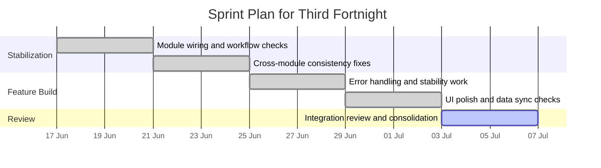
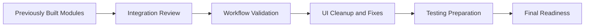
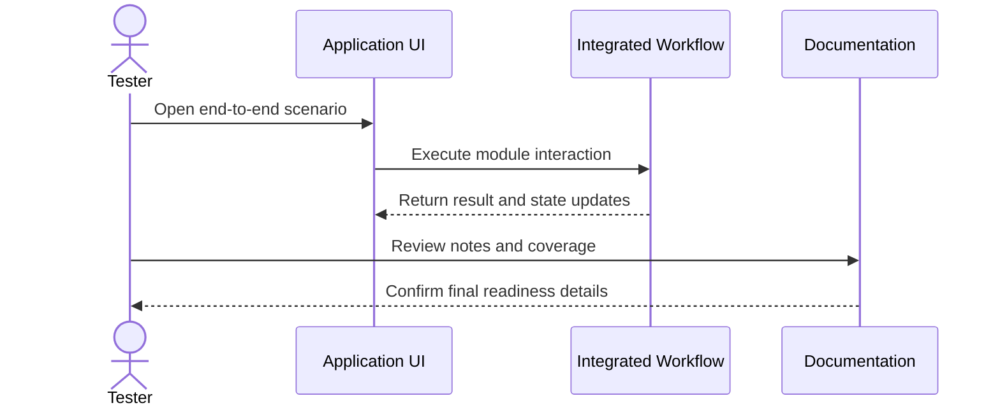
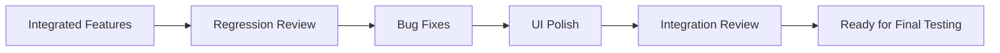
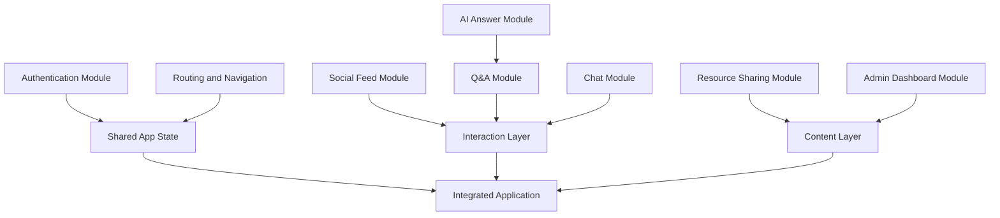
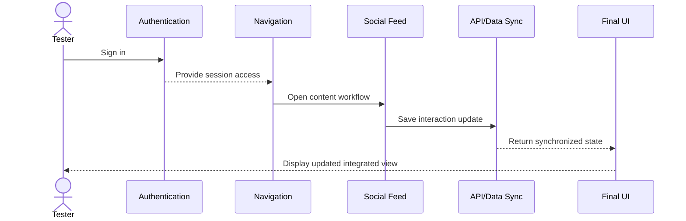
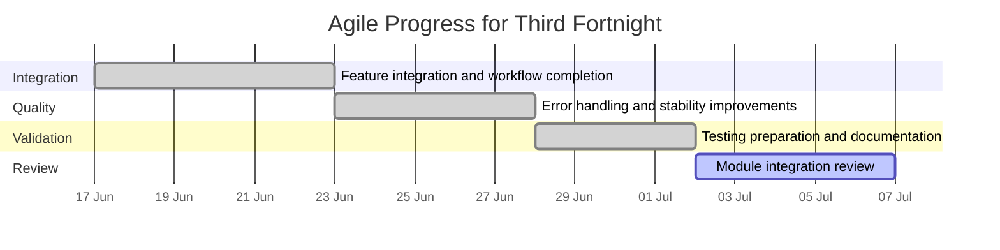
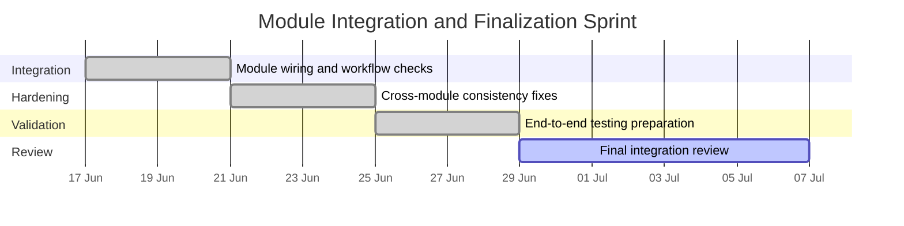

# Fortnightly Project Progress Report

**Project Title:** Focus Hub  
**Reporting Period:** 17 June 2026 to 6 July 2026  
**Prepared By:** Jignesh Ameta (Junior Software Engineer)

## Overview

During this period, the project entered a more mature development stage with emphasis on module integration, completion of feature-level components, and quality improvement. The work focused on bringing together the previously developed application modules into a more cohesive system while also strengthening usability, stability, and maintainability. Additional effort was placed on verifying cross-module behavior and confirming that the feature set worked as a connected platform.

This phase was essential for moving the project closer to a near-complete state. By this point, the application had a defined architecture and functional core, and the work completed during this period helped transform those foundations into a more connected and feature-rich system.

The period also served as an Agile-style consolidation stage, where completed stories were reviewed, unfinished items were narrowed down, and the project was prepared for the next implementation cycle.

## Sprint Plan

| Sprint Focus | Target Work Items | Delivery Outcome |
| --- | --- | --- |
| Sprint Stabilization | Integration review, dependency checks, workflow alignment | A consistent application structure ready for expansion. |
| Feature Build Phase | Social feed, Q&A, chat, resources, admin, AI modules | Integrated feature set with module-level interactions. |
| Review and Consolidation | UI consistency, workflow checks, documentation | Clear handover from feature build to final testing phase. |

## Work Completed

### 1. Feature Integration and Workflow Completion
The previously developed components were integrated into the main application flow to create a more complete user experience. This involved ensuring that individual pages and modules work together smoothly and support the intended end-to-end workflows.

Attention was given to how users transition between key sections of the system. The integration work helped reduce fragmentation in the application and made the overall product feel more unified and practical.

### 2. Social and Interaction Modules Refinement
The modules related to user interaction and content sharing were refined to improve usability and consistency. This included reviewing the behavior of the core communication and content-driven areas of the application so they better match the intended system behavior.

These refinements helped improve the overall engagement flow of the platform. They also ensured that the project continues to reflect the collaborative and interactive purpose of the application.

### 3. Error Handling and Stability Improvements
Work was completed on improving the reliability of the system by addressing implementation inconsistencies and adding better handling for edge cases. The goal of this work was to make the application more stable and reduce the likelihood of user-facing issues.

This stage was important because it strengthened the quality of the application before final testing. A more stable system provides a better basis for future deployment and makes later maintenance easier.

### 4. Testing Preparation and Documentation Updates
The project documentation was reviewed and updated to match the progress of the implementation. Relevant notes were prepared to support testing, validation, and future maintenance work.

In addition, the application structure was reviewed from a testing perspective so that upcoming validation can focus on the most important user flows and system behaviors. This prepares the project for a more disciplined final testing stage.

### 5. Module Handover and Final Polish
The final stretch of this period focused on preparing the application for the next phase by reviewing remaining UI inconsistencies, checking the readiness of critical flows, and validating that the project structure remained organized for continued work.

This work also helped confirm that the implemented modules were aligned with the original project objectives and could support a complete demonstration of the system.

The handover review further confirmed that the project structure remained maintainable and that the most important workflows were ready for the final testing phase.

## Module List and Technical Details

The following feature modules were refined and validated during this period:

| Module | Main Features | Technical Details |
| --- | --- | --- |
| Social Feed Module | Posts, comments, likes, content interaction | Connects post cards, comment flows, and realtime engagement behavior. |
| Q&A Module | Question posting, AI answer support, community replies | Uses the Q&A UI, API endpoints, and AI answer handling. |
| Chat Module | Real-time messaging, chat creation, notifications | Uses realtime hooks and chat-related UI components. |
| Resource Sharing Module | File handling, resource display, community sharing | Supports resource listing, upload/download, and file cards. |
| Admin Dashboard Module | Admin access, moderation views, flagged content | Uses protected routes and admin-only screens for oversight. |
| AI Answer Module | AI-generated responses, answer metadata, feedback flow | Integrates AI output with Q&A workflows and answer display. |
| Integration Orchestration Module | Connects existing pages, routes, and workflows | Ensures that module boundaries remain intact while the application behaves as a single system. |

## Agile Workflow Visuals

### Example Final Integration Flow

### Example Final Validation Flow

### Release Hardening Flow

### Module Integration Map

### End-to-End Module Sequence

### Agile Progress Gantt Chart

### Integration Sprint View

## Progress Summary

Overall, this period was focused on consolidation, quality improvement, and feature integration. The project now includes:
- more complete integration of developed modules,
- refined interaction and content-related features,
- improved stability and error handling,
- better API and data synchronization,
- updated documentation for ongoing development and testing, and
- a clearer separation between integrated modules and the upcoming final testing phase.

These results brought the project significantly closer to a functional and test-ready state.

## Challenges and Observations

As integration progressed, the main challenge was ensuring that the different parts of the system remained consistent in behavior and design. When multiple modules are connected, even small mismatches can affect the overall user experience, so careful validation was necessary.

This fortnight also reinforced the importance of testing and documentation. As the system becomes more complete, both become critical for keeping the project manageable and ensuring that future work can be carried out efficiently.

## Next Steps

The next phase of the project will focus on:
- final end-to-end testing of the integrated workflows,
- UI and usability refinements based on implementation feedback,
- verification of data consistency and module interactions,
- performance and stability checks,
- and final preparation for the dedicated testing and deployment sprint.

## Supervisor Comments

Supervisor: Senior Software Engineer & CEO / Founder

In-depth feedback and recommendations:

- Integration validation: Focus your testing on cross-cutting consistency (data shapes, event propagation, and idempotent operations). Add contract tests between frontend consumers and API responses (snapshot key fields) so regressions are caught early.

- Realtime and concurrency: The chat and realtime feed paths need specific concurrency tests (simulated concurrent commenters, rapid react/unreact operations). Measure end-to-end latency and watch for out-of-order events — add sequence ids where needed to ensure idempotency.

- Performance: Before production, run targeted load tests on feed and chat endpoints (k6 or Artillery) to expose hotspots. Use profiling on the server/API layer and consider caching hot-read paths (feed summaries) to reduce DB load.

- Data integrity & migrations: Validate migration scripts in a staging clone with production-like data (scrubbed). Ensure forward and backward migration paths where possible, or at minimum maintain comprehensive backups and a tested rollback plan.

- Release safeguards: Implement feature flags for risky changes and a staged rollout plan (canary or percentage rollout) if you expect user load spikes. Prepare a short incident response checklist with clear rollback steps and monitoring thresholds.

- Documentation & handover: Produce a two-page operational runbook that covers: deploy steps, migration commands, backup restore, and immediate smoke tests to run post-deploy. That will make the production window less risky.

Closing: Excellent progress on integration. The remaining work is primarily operational hardening and measurable performance validation. Complete those items and you will be in a strong position for a safe, repeatable production release.

## Conclusion

This period represented a meaningful step toward completion of the project. The work completed on integration, module refinement, stability, documentation, and final polish has significantly strengthened the application.

The project now stands in a much better position for final testing, polish, and submission.