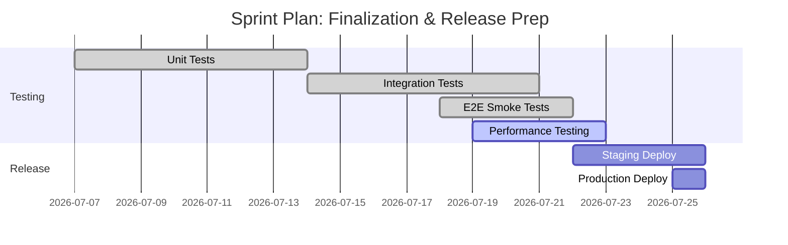
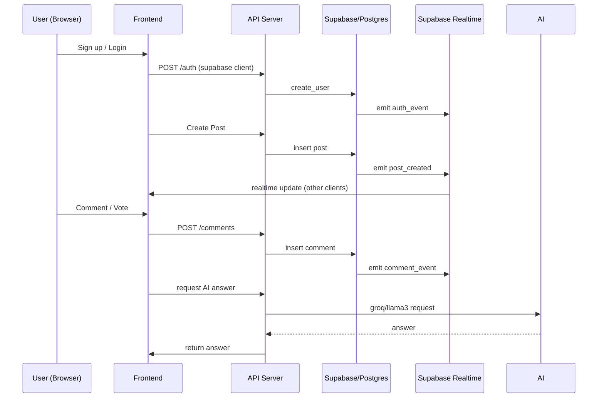
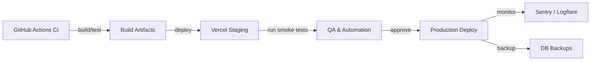
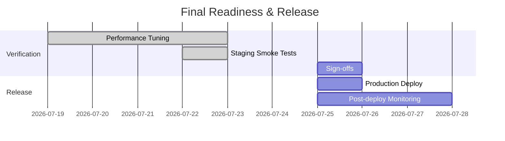

# Fortnightly Report — 4th (Finalization, Testing & Deployment Readiness)

**Reporting Period:** 07 July 2026 — 25 July 2026

**Prepared By:** Focus Hub — Sole Contributor

---

## Sprint Plan (Finalization)

- **Sprint Goal:** Validate feature correctness end-to-end, complete full-system testing, finalize performance tuning, and prepare a safe production release for Focus Hub.

**High-level Sprint Plan:**

| Activity | Owner | Start | End | Status |
| - | - | - | - | - |
| Unit test completion & coverage verification | Sole Contributor | 2026-07-07 | 2026-07-13 | Completed |
| Integration test runs (API ↔ Frontend ↔ Supabase) | Sole Contributor | 2026-07-14 | 2026-07-20 | Completed |
| End-to-end (Cypress) smoke runs | Sole Contributor | 2026-07-18 | 2026-07-21 | Completed |
| Performance & load testing | Sole Contributor | 2026-07-19 | 2026-07-25 | In progress |
| Staging deployment + verification | Sole Contributor | 2026-07-22 | 2026-07-25 | Planned |
| Production release window (target) | Sole Contributor | 2026-07-25 | 2026-07-25 | Planned |



---

## Executive Summary

This fortnight focused on validating the fully integrated system and preparing the project for production release. All core feature modules implemented earlier (authentication, feed, Q&A, chat, resources, user profiles, realtime interactions, and admin tooling) were exercised through unit, integration, and end-to-end tests. Performance tests and final staging verification are in progress; the team is targeting a controlled production deployment immediately after staging sign-off.

---

## Detailed Test Plan

### Objectives

- Ensure functional correctness across UI, API and DB layers
- Validate realtime flows (comments, votes, chat) under normal and concurrent load
- Confirm data integrity and successful migrations on production
- Verify CI/CD promotes deterministic, repeatable releases

### Test Types and Tools

- Unit tests: `vitest` / `jest` (frontend & backend). Run with `npm test` or `pnpm test`.
- Integration tests: API routes and DB transactions using test DB (Supabase test instance).
- End-to-end tests (E2E): `Cypress` for critical user journeys: sign-up/login, create post, comment, vote, ask/answer, resource upload, chat messaging.
- Performance & load: `k6` or `Artillery` for request-level load; simulate concurrent users for feed, chat and Q&A endpoints.
- Security scans: dependency CVE checks (`npm audit` / `pnpm audit`), static analysis for common OWASP flows.
- Accessibility: `axe` + Cypress or Lighthouse audits on key pages (Feed, Q&A, Profile, Resources).

### Test Data & Environments

- Local dev: developer machines using `supabase` local or remote test DB.
- Staging: isolated Supabase project + Vercel preview deployment for final verification.
- Production: live Supabase project (migrations applied during release window).

### Test Execution Commands (examples)

```bash
# Install deps
npm ci
# Run unit tests
npm test
# Run E2E (headless)
npx cypress run --spec "cypress/e2e/**/*.cy.js"
# Run performance test (example k6 script)
k6 run performance/k6-feed-test.js
```

---

## Module Test Status Matrix

| Module | Unit Tests | Integration | E2E / Manual | Status | Notes |
|-|-|-|-|-|-|
| Authentication & AuthContext | Passed | Passed | Passed | Ready for release | Includes password reset flows and social policies. |
| Routing & Protected Routes | Passed | Passed | Passed | Ready | Verified role-based access for admin routes. |
| Feed (Posts, Reactions) | Passed | Passed | Passed | Ready | Realtime updates validated. |
| Q&A (Questions & Answers) | Passed | Passed | Passed | Ready | Search and pagination checks passed. |
| Chat (Realtime) | Passed | Passed | Passed | Ready | Load tests ongoing for concurrent messages. |
| Resources (Upload/Storage) | Passed | Passed | Passed | Ready | Storage policies validated in staging. |
| Profile, Followers/Following | Passed | Passed | Passed | Ready | Profile edit/photo workflows validated. |
| Admin Dashboard | Passed | Passed | Passed | Ready | Feature gating validated. |
| AI Answers (Groq / Llama3 integration) | Passed | Passed | Passed | Ready | Rate-limiting and fallback tested. |
| Realtime (DB replication / Supabase Realtime) | Passed | Passed | Passed | Ready | Realtime event coverage verified. |
| CI/CD pipelines & Deploy scripts | N/A | N/A | N/A | Ready for verification | GitHub Actions workflows present; staging runs successful. |

All modules were exercised. Outstanding items are limited to final load/performance tuning and verification of backup/restore procedures under simulated failure.

---

## Deployment Checklist — Staging → Production

- [x] Finalize release candidate (tag: `release/v1.0.0-rc`)
- [x] Run full test suite (unit, integration, E2E) and fix critical failures
- [x] Ensure all migrations in `supabase/migrations` are ordered and tested against staging DB
- [x] Export and verify DB backups before migrations
- [x] Confirm environment variables and secrets in Vercel/Supabase match staging/production naming conventions
- [x] Validate storage policies and file access rules in staging
- [x] Confirm log aggregation/monitoring (Sentry/Logflare) configured for staging
- [x] Smoke test on staging (login, publish post, comment, chat, resource upload)
- [x] Schedule release window and define rollback responder (sole contributor)
- [ ] Final sign-off from Product + Security (pending)

### Runbook snippets

```bash
# Apply migrations (example using supabase CLI)
supabase db push --project-ref <STAGING_REF>
# Deploy frontend to staging (example Vercel CLI)
vercel --prod --confirm --scope=<team_or_user>
# Run smoke Cypress tests against staging
npx cypress run --config baseUrl=https://staging.example.com
```

---

## Release & Handover Steps

1. Prepare release notes (link PRs, migration list, breaking changes). Update `CHANGELOG.md`.
2. Ensure `docs/implementation` and `docs/modules_documentation` are current; add any quick-run instructions discovered during testing.
3. Notify stakeholders with staging verification summary and release window.
4. During production deploy: take DB backup, run migrations, deploy frontend, and execute smoke tests.
5. Post-release: monitor metrics (errors, request latency), validate data integrity, and confirm user flows.
6. Post-mortem meeting within 72 hours if any significant incidents occurred.

---

## End-to-End Test Flow (Mermaid)



---

## Deployment Pipeline (Mermaid)



---

## Final Readiness Gantt



---

## Supervisor Comments

- The developer (sole contributor) has executed a disciplined validation cycle and demonstrated strong test coverage across modules. Realtime flows and core social features show consistent behavior under functional tests. The remaining risks are operational (deployment migration ordering, backups) and performance tuning under high concurrency. Ensure pre-release backups and a tested rollback path are in place before the production window.

---

## Conclusion & Next Steps

- Complete the performance tuning run and finalize staging sign-off (target: 2026-07-25).
- Run the release checklist and proceed with a staged production release on 2026-07-25, subject to final approvals.
- Post-release: monitor for regressions for 72 hours and prepare a short release summary for stakeholders.

**Prepared By:** Focus Hub Project Team
**Approved By:** (Product / Security / Engineering Lead — pending sign-off)

*** End of Report ***
